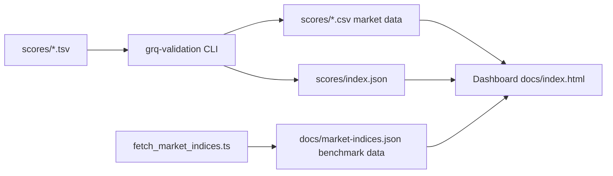
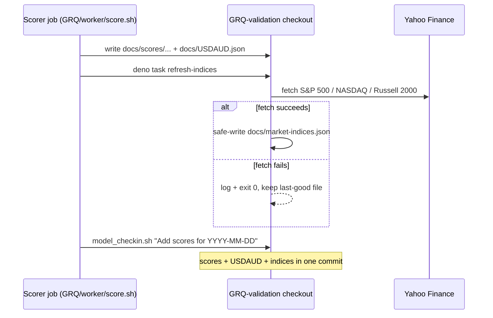
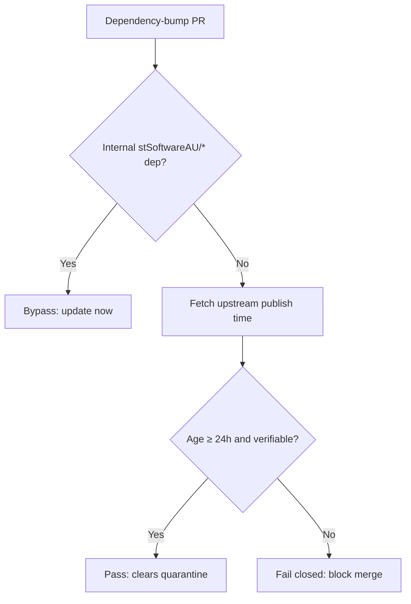

# GRQ Validation

A Rust-based system for validating AI predictions against 90-day targets and a
10% annual cost of capital, paired with a static dashboard published via GitHub
Pages.

## Features

- **Performance Tracking** — calculate 90-day and annualised performance for
  stock portfolios.
- **Market Data Integration** — fetch and process historical stock data into
  per-score-file CSVs.
- **Benchmark Comparison** — S&P 500, NASDAQ and Russell 2000 index data is
  fetched first-party (server-side, directly from Yahoo Finance — no public CORS
  proxy) by `scripts/fetch_market_indices.ts` and published as the same-origin
  static file `docs/market-indices.json`, which the dashboard reads directly.
  Refresh it with `deno task fetch-indices`; the write is safe for unattended
  daily runs (fails fast on an empty response, refuses to overwrite committed
  history with a regressed payload, and skips the write when nothing changed).
  The external daily scorer job refreshes it in lockstep with the scores via
  the non-blocking `deno task refresh-indices` wrapper (see _Daily benchmark
  refresh_ below).
- **Dividend Tracking** — calculate dividend income and total returns.
- **Web Dashboard** — interactive charts and tables for performance analysis,
  served as a static site from `docs/`.
- **Hybrid Projection** — for score files less than 90 days old, project
  performance from the current actual prices.
- **Automated Processing** — batch process score files with inline performance
  calculation.

## Architecture at a glance



The dashboard reads every input from its own origin: per-score market CSVs, the
score index, and the benchmark-index file. Benchmark data is fetched
server-side and committed, so a visitor's browser never calls an untrusted
third-party relay (issue #93).

### Daily benchmark refresh (in lockstep with the scores)

The actuals stay current because an external daily **scorer** job
(`stSoftwareAU/GRQ`, `worker/score.sh`) checks out this repo and commits new
`docs/scores/...` and `docs/USDAUD.json` with a message like
`Add scores for 2026-06-20`. To stop the benchmark indices drifting behind the
actuals (issue #238), that same job now refreshes `docs/market-indices.json`
immediately before the daily commit, by invoking the stable wrapper entry point:

```bash
deno task refresh-indices
# (raw form: deno run --allow-net --allow-read --allow-write \
#   scripts/refresh_market_indices.ts)
```

The wrapper runs the first-party fetcher but **never blocks the scores/USDAUD
commit**: a Yahoo Finance outage or partial fetch is logged and swallowed (it
still exits 0), and the safe-write guard in `scripts/fetch_market_indices.ts`
leaves the committed file at its last-good content rather than a stale/partial
payload. The scorer's check-in then stages whatever changed (the scores, the
USDAUD file, and the refreshed indices) into the **same** daily commit, so the
indices reach the last trading day in lockstep with the actuals.



## Quick Start

### Prerequisites

- Rust (latest stable)
- Deno (for the dashboard and TypeScript tests)
- Git

### Installation

```bash
git clone <repository-url>
cd GRQ-validation
cargo build --release
```

### Usage

```bash
# Process recent score files (within 100 days)
./run.sh

# Process all score files (including those older than 100 days)
./run.sh --process-all
# (alias: ./run.sh --full-reload)

# Process a specific date
./target/release/grq-validation --docs-path docs --date 2025-01-15
```

### Web Interface

```bash
# Start a static server in the docs directory
cd docs
python3 -m http.server 8000
# Or use any other static file server (e.g. ../helpers/server.sh)
```

Visit `http://localhost:8000` to access the dashboard.

## CI/CD Pipeline

This repository ships a set of GitHub Actions workflows in
`.github/workflows/` covering continuous integration, security scanning, and
dependency hygiene.

### Workflows

1. **CI** (`ci.yml`) — main continuous integration: build, test, formatting,
   linting, and artifact upload.
2. **Cargo Audit** (`cargo-audit.yml`) — runs `cargo audit` on every pull
   request and on a weekly schedule to catch newly disclosed advisories.
3. **Deno Outdated** (`deno-outdated.yml`) — checks for outdated JSR/npm
   imports used by the TypeScript dashboard tests.
4. **Deno Quality** (`deno-quality.yml`) — runs `deno fmt`, `deno lint`,
   `deno check`, `deno audit`, and `deno test` against `tests/` on every
   pull request and on a weekly schedule. `deno audit` scans the resolved
   JSR/`@std` dependency graph for known vulnerabilities — the Deno-side
   counterpart to `cargo audit`.
5. **Dependency Review** (`dependency-review.yml`) — reviews dependency
   changes on pull requests for known vulnerabilities and licence issues.
6. **Gitleaks** (`gitleaks.yml`) — scans the repository for accidentally
   committed secrets.
7. **Markdown Lint** (`markdown-lint.yml`) — enforces the rules in
   `.markdownlint-cli2.jsonc` against every Markdown file.
8. **Semgrep** (`semgrep.yml`) — runs Semgrep static analysis for security
   and correctness issues.
9. **Shellcheck** (`shellcheck.yml`) — lints every `*.sh` script in the
   repository.
10. **Accessibility** (`a11y.yml`) — runs `pa11y-ci` against the rendered
    `docs/` dashboard on every pull request that touches `docs/`, failing the
    build on WCAG 2.1 AA violations so accessibility regressions are caught on
    the PR that introduces them.
11. **Dependency Quarantine Gate** (`bump-quarantine-gate.yml`) — deterministic
    supply-chain backstop that, on every pull request, blocks an external
    Cargo crate or GitHub Action bump whose upstream release is younger than
    24 hours (see _Automated dependency updates_ below).

### Automated dependency updates

[`.github/dependabot.yml`](.github/dependabot.yml) configures Dependabot to open
reviewable update PRs for the **Cargo** crate ecosystem (`Cargo.toml` /
`Cargo.lock`) and the **GitHub Actions** ecosystem on a weekly schedule. Each
ecosystem applies a 24-hour `cooldown` (release-age quarantine) so a
freshly-published — possibly hijacked — crate or action is held back rather than
auto-bumped within the same window. Internal `stSoftwareAU/*` dependencies are
excluded from the cooldown so they update immediately, mirroring the
`minimumDependencyAge` policy that `deno.json` applies to the Deno ecosystem.

Because Dependabot's `cooldown` keyword is an in-preview, non-native age gate,
the **Dependency Quarantine Gate** workflow (`bump-quarantine-gate.yml`) backs
it with a deterministic, native check (`helpers/bump_quarantine_gate.ts`). On
every pull request the gate computes which external crates and Actions changed
against the base branch, fetches each one's upstream publish time (crates.io
`created_at` / the Action commit date), and **fails closed** when a bump is
younger than `VIBE_BUMP_QUARANTINE_HOURS` (default 24h) or its age cannot be
verified. Internal `stSoftwareAU/*` dependencies bypass the gate and update
immediately. This mirrors the Deno ecosystem's `--minimum-dependency-age=P1D`
gate so the Cargo and Actions ecosystems no longer rely on the `cooldown`
keyword alone.



The CI pipeline (`ci.yml`) complements this by building the **committed,
reviewed `Cargo.lock`** rather than floating dependencies: every `cargo`
build/test/check step runs with `--locked`, so a stale lockfile fails the
build instead of silently resolving (and executing the `build.rs` /
proc-macros of) a freshly-published, unquarantined crate. CI tool installs
(`cargo-tarpaulin`, `cargo-cyclonedx`, `cargo-audit`) are pinned to explicit
versions with `--locked` so they do not compile an arbitrary newest
tool-dependency tree on each run. Crate bumps therefore arrive only through
the quarantined Dependabot PRs above, never inline on a PR build.

### Setup

1. Enable GitHub Actions in your repository.
2. Configure GitHub Pages (Settings → Pages → Source: GitHub Actions).
3. Set up branch protection rules (recommended).

See [CI_CD_SETUP.md](docs/fixes/CI_CD_SETUP.md) for detailed setup instructions.

## Project Structure

```text
GRQ-validation/
├── src/                    # Rust source code
│   ├── main.rs             # CLI entry point
│   ├── lib.rs              # Library interface
│   ├── models.rs           # Data structures
│   └── utils.rs            # Utility functions
├── docs/                   # Static dashboard (published via GitHub Pages)
│   ├── index.html          # Main dashboard
│   ├── list.html           # Score files list
│   ├── app.js              # Main dashboard logic
│   ├── list.js             # List page logic
│   ├── styles.css          # Main dashboard styling
│   ├── list.css            # List page styling
│   ├── market-indices.json # First-party benchmark index data (same-origin)
│   └── scores/             # Score files and generated market data
├── tests/                  # Rust and Deno tests
├── helpers/                # Local development helpers (e.g. static server)
├── scripts/                # Git hooks and utility scripts
│   ├── fetch_market_indices.ts    # Server-side benchmark-index fetcher
│   └── refresh_market_indices.ts  # Non-blocking daily-scorer wrapper (#238)
├── .github/workflows/      # GitHub Actions workflows
├── run.sh                  # Build-and-run wrapper for the CLI
├── quality.sh              # Local quality gate (fmt, clippy, tests, deno)
└── Cargo.toml              # Rust dependencies and crate metadata
```

## Development

### Local Development

```bash
# Format code
cargo fmt

# Run linter
cargo clippy --all-targets --all-features -- -D warnings

# Run tests
cargo test

# Build release
cargo build --release

# Run the full quality gate (mirrors CI)
./quality.sh
```

### Testing

```bash
# Run all Rust tests
cargo test

# Run a specific Rust test
cargo test test_name

# Run the Deno test suite (dashboard / workflow tests)
deno test --allow-read tests/
```

## Configuration

### Environment Variables

- `RUST_LOG` — logging level (default: `info`).
- `CARGO_TERM_COLOR` — terminal colour output.

### Command Line Options

- `--docs-path` — path to the docs directory (default: `docs`).
- `--process-all` — process every score file, not just recent ones.
- `--calculate-performance` — calculate performance metrics for score files.
- `--date` — process a specific date in `YYYY-MM-DD` format.
- `--verbose` — enable verbose logging.

## Contributing

1. Fork the repository.
2. Create a feature branch.
3. Make your changes.
4. Run `./quality.sh` and ensure it passes cleanly.
5. Submit a pull request.

## License

Licensed under the Apache License, Version 2.0. See [LICENSE](LICENSE) for the
full text.

## Support

For issues and questions:

1. Check [CI_CD_SETUP.md](docs/fixes/CI_CD_SETUP.md) for workflow issues.
2. Review existing issues.
3. Create a new issue with detailed information.
