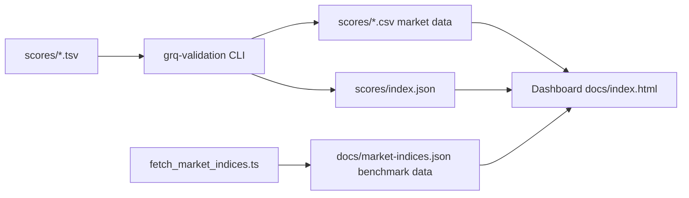
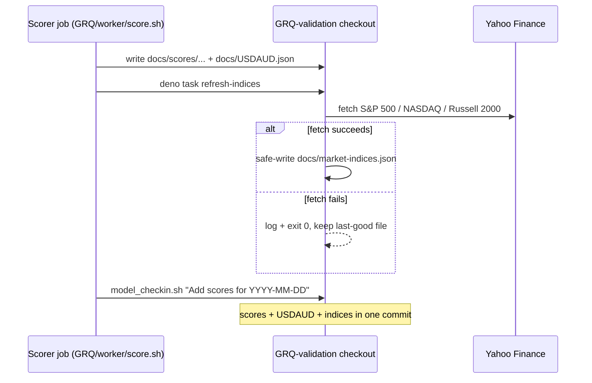
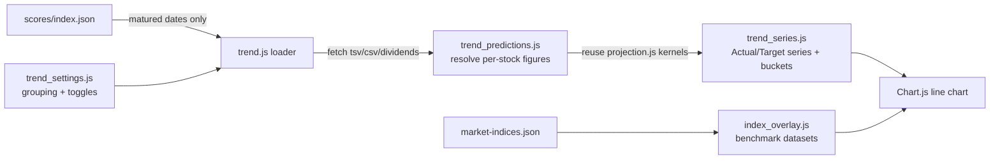
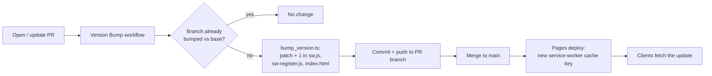
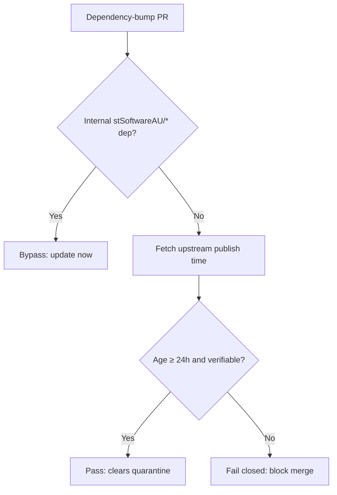

# GRQ Validation

A Rust-based system for validating AI predictions against 90-day targets and a
10% annual cost of capital, paired with a static dashboard published via GitHub
Pages.

## Features

- **Performance Tracking** — calculate 90-day and annualised performance for
  stock portfolios.
- **Market Data Integration** — fetch and process historical stock data into
  per-score-file CSVs.
- **Benchmark Comparison** — S&P 500, NASDAQ and Russell 2000 index data is
  fetched first-party (server-side, directly from Yahoo Finance — no public CORS
  proxy) by `scripts/fetch_market_indices.ts` and published as the same-origin
  static file `docs/market-indices.json`, which the dashboard reads directly.
  Refresh it with `deno task fetch-indices`; the write is safe for unattended
  daily runs (fails fast on an empty response, refuses to overwrite committed
  history with a regressed payload, and skips the write when nothing changed).
  The external daily scorer job refreshes it in lockstep with the scores via the
  non-blocking `deno task refresh-indices` wrapper (see _Daily benchmark
  refresh_ below).
- **Split-Aware Returns** — the backend reads each day's `split_coefficient` and
  reconciles any stock split inside the 90-day window. A trustworthy split
  series is corrected (the buy price is restated into current, post-split
  terms); a series that cannot be reconciled (implausible or duplicated
  coefficients, or a coefficient that does not match the observed price drop)
  excludes the stock through the single `is_priceable` gate, dropping it from
  the average, the included count and into `excluded_tickers`. The thresholds
  mirror the frontend so backend and dashboard agree.
- **Dividend Tracking** — calculate dividend income and total returns.
- **Web Dashboard** — interactive charts and tables for performance analysis,
  served as a static site from `docs/`. On mobile, a pop-out control expands the
  performance chart into a full-viewport overlay (dismissed by ✕, Esc or the
  device back-gesture) and presents it in landscape — rotated via CSS on a
  portrait phone so a wide chart fills the screen, with an optional Screen
  Orientation lock where the platform supports it (iOS Safari falls back to the
  CSS rotation). The overlay shows **only the chart** with readable axes and
  scales — the mobile colour key and dashboard chrome stay behind it — and on
  close the dashboard's colour key and native legend are reconciled back to
  their pre-pop-out state. Desktop is unchanged.
- **Hybrid Projection** — for score files less than 90 days old, project
  performance from the current actual prices.
- **Automated Processing** — batch process score files with inline performance
  calculation.

## Architecture at a glance



The dashboard reads every input from its own origin: per-score market CSVs, the
score index, and the benchmark-index file. Benchmark data is fetched server-side
and committed, so a visitor's browser never calls an untrusted third-party relay
(issue #93).

### Daily benchmark refresh (in lockstep with the scores)

The actuals stay current because an external daily **scorer** job
(`stSoftwareAU/GRQ`, `worker/score.sh`) checks out this repo and commits new
`docs/scores/...` and `docs/USDAUD.json` with a message like
`Add scores for 2026-06-20`. To stop the benchmark indices drifting behind the
actuals (issue #238), that same job now refreshes `docs/market-indices.json`
immediately before the daily commit, by invoking the stable wrapper entry point:

```bash
deno task refresh-indices
# (raw form: deno run --allow-net --allow-read --allow-write \
#   scripts/refresh_market_indices.ts)
```

The wrapper runs the first-party fetcher but **never blocks the scores/USDAUD
commit**: a Yahoo Finance outage or partial fetch is logged and swallowed (it
still exits 0), and the safe-write guard in `scripts/fetch_market_indices.ts`
leaves the committed file at its last-good content rather than a stale/partial
payload. The scorer's check-in then stages whatever changed (the scores, the
USDAUD file, and the refreshed indices) into the **same** daily commit, so the
indices reach the last trading day in lockstep with the actuals.



### Freshness guard (issue #239)

Keeping the refresh job running is not enough on its own: when the indices last
drifted (issue #234) the roughly eight-day staleness went **undetected**. A
freshness assertion in `tests/market_indices_test.ts` now compares the newest
date in `docs/market-indices.json` against the newest date in the actuals
(`docs/USDAUD.json`) and fails when the indices lag by more than
`FRESHNESS_TOLERANCE_TRADING_DAYS` (3) trading days. The gap is measured in
trading days (weekends skipped), so the acceptable one-trading-day end-of-day
publishing lag — and an intervening public holiday — never raises a false alarm.
When the guard trips it names both newest dates and the gap, e.g.
`benchmark indices are stale: newest index date 2026-06-08 lags the newest
actuals date 2026-06-18 by 7 trading days (tolerance is 3 trading days)`.

## Quick Start

### Prerequisites

- Rust (latest stable)
- Deno (for the dashboard and TypeScript tests)
- Git

### Installation

```bash
git clone <repository-url>
cd GRQ-validation
cargo build --release
```

### Usage

```bash
# Process recent score files (within 180 days)
./run.sh

# Process every score file, including older ones
./run.sh --process-all
# (alias: ./run.sh --full-reload)

# Rebuild only missing or header-only market CSVs
./run.sh --regenerate-empty

# Process a specific date
./target/release/grq-validation --docs-path docs --date 2025-01-15
```

### Web Interface

```bash
# Start a static server in the docs directory
cd docs
python3 -m http.server 8000
# Or use any other static file server (e.g. ../helpers/server.sh)
```

Visit `http://localhost:8000` to access the dashboard.

#### Deep-link URL parameters

The dashboard reads nine optional query parameters so a specific view can be
linked directly (and so the automated accessibility check can audit each view
deterministically — issue #281):

- `?file=<score-file>` — pre-select a score file, e.g.
  `?file=2026%2FMarch%2F23.tsv`.
- `?date=<YYYY-MM-DD>` — pre-select the score for a date (issue #436), e.g.
  `?date=2026-03-23`. This is the friendlier alternative to `?file=` — no
  URL-encoded path needed. Unpadded month/day (`?date=2026-3-23`) is accepted;
  an unknown or malformed date falls back to the default selection. When both
  `?file=` and `?date=` are present, `?file=` wins. Picking a date in the
  **Score File** dropdown now also writes `?date=` back into the dashboard URL
  (issue #517), so a refresh and copied/shared links reopen on that exact date,
  and the date is carried onto the **📈 Prediction Trend** link so the Trend
  page's **← Dashboard** button returns you to the same date.
- `?stock=<symbol>` — open straight into the single-stock detail view, e.g.
  `?stock=NASDAQ%3AMGRC`. An unknown symbol falls back to the aggregate view.
- `?theme=auto|light|dark` — force a theme for that page load (a transient
  override that is **not** persisted to `localStorage`).
- `?window=90|180` — switch the chart (and aligned Market Performance summary)
  to a 90- or 180-day window for that page load, on **both** desktop and mobile
  (issues #450, #467). Like `?theme=`, this is a **transient** override: it
  wins over the saved per-device choice but is **never** persisted, so a reload
  without the param returns to the saved window (desktop 180 / mobile 90). Both
  windows end on the same date (#367); an absent or invalid value falls back to
  the saved choice, then the device default.
- `?view=portfolio|trend` — deep-link straight to a top-level view (issue #479).
  `?view=trend` routes to the Prediction Trend page (`trend.html`);
  `?view=portfolio` routes back to the aggregate dashboard (`index.html`). Like
  `?theme=`, this is read on page load only (one-way) and is **never** persisted
  to `localStorage`; an absent, blank or unrecognised value (or a value that
  already matches the current page) leaves you where you are.
- `?indices=sp500,nasdaq,russell2000` — on the Trend view, turn the listed
  benchmark-index overlays **on** for this visit; any index **not** listed is
  turned off (issue #480). The keys are the canonical index keys `sp500`,
  `nasdaq` and `russell2000`; unknown keys are ignored and a present-but-empty
  value (`?indices=`) turns every overlay off. A **transient / visit-only**
  override that wins over the saved toggles but is **never** persisted; an
  absent param leaves the saved/default toggles unchanged.
- `?group=day|week|month|quarter` — on the Trend view, set the **Group by**
  granularity for this visit (issue #481). A **transient / visit-only** override
  that wins over the saved `grq.trend.grouping` choice but is **never**
  persisted; an absent or unrecognised value falls back to the saved choice,
  then the **month** default.
- `?fullscreen=1` — **mobile-only**: open the chart pop-out (landscape,
  maximised chart) on page load (issue #482). Only the exact value `1` triggers
  it; it is a **no-op on desktop**, where the expand control is hidden. Like
  `?theme=`, it is read once on load (one-way) and is **never** persisted.

**Worked examples**

- `index.html?date=2026-01-01&window=180&fullscreen=1` — 180 days from
  1 January, landscape (maximised chart) on a phone.
- `trend.html?group=week&indices=sp500,nasdaq` — the Trend view grouped by week
  with the S&P 500 and NASDAQ overlays on (Russell 2000 off) for this visit.
- `index.html?view=trend` — jump straight from the dashboard to the Prediction
  Trend page.

A low-prominence **🔗 Share** button in the page footer does the inverse: it
builds an absolute URL encoding the current selections (score file, stock,
theme, 90/180 window, and the transient mobile pop-out flag) and copies it to
the clipboard (issue #495). It is **read-only** — generating a link never
mutates your saved settings — and degrades to a select-the-text fallback where
the async Clipboard API is unavailable. Pasting the link into a fresh tab
reproduces the same view.

All views meet **WCAG 2 AA** colour contrast in both the light and dark themes;
`pa11yci.json` scans the aggregate, single-stock and Trend views in both themes
on every pull request that touches `docs/`.

#### Prediction Trend view (`docs/trend.html`)

A separate, purely additive page (reached via the **Prediction Trend** link on
the dashboard, and back again) charts the portfolio's **average Actual %**
against its **average Target %** over the matured-prediction history, so you can
see whether predictions are improving — are we consistently over- or
under-predicting, and do Actual and Target converge as training progresses. A
**Group by** control buckets the history by **day / week / month / quarter**
(default **month**), and each benchmark index (SP500 / NASDAQ / Russell 2000)
can be overlaid on/off; both choices are remembered across visits. Only
**matured** predictions appear — a score date joins the trend once its full
90-day window has elapsed.

The view never recomputes the actuals: it reuses the same shared kernels the
dashboard does, so the two always agree.



## CI/CD Pipeline

This repository ships a set of GitHub Actions workflows in `.github/workflows/`
covering continuous integration, security scanning, and dependency hygiene.

### Workflows

1. **CI** (`ci.yml`) — main continuous integration: build, test, formatting,
   linting, and artifact upload. Runs on pushes and pull requests to `main` and
   to `milestone/**` integration branches, so the Rust quality gate
   (`cargo fmt`/`clippy`/`check`/`test`) also guards milestone PRs. The
   `deploy-pages` job stays `main`-only, so milestone branches never publish the
   GitHub Pages dashboard.
2. **Cargo Audit** (`cargo-audit.yml`) — runs `cargo audit` on every pull
   request and on a weekly schedule to catch newly disclosed advisories.
3. **Deno Outdated** (`deno-outdated.yml`) — checks for outdated JSR/npm imports
   used by the TypeScript dashboard tests.
4. **Deno Quality** (`deno-quality.yml`) — runs `deno fmt`, `deno lint`,
   `deno check`, `deno audit`, and `deno test` against `tests/` on every pull
   request and on a weekly schedule. `deno audit` scans the resolved JSR/`@std`
   dependency graph for known vulnerabilities — the Deno-side counterpart to
   `cargo audit`.
5. **Dependency Review** (`dependency-review.yml`) — reviews dependency changes
   on pull requests for known vulnerabilities and licence issues.
6. **Gitleaks** (`gitleaks.yml`) — scans the repository for accidentally
   committed secrets.
7. **Markdown Lint** (`markdown-lint.yml`) — enforces the rules in
   `.markdownlint-cli2.jsonc` against every Markdown file.
8. **Semgrep** (`semgrep.yml`) — runs Semgrep static analysis for security and
   correctness issues.
9. **Shellcheck** (`shellcheck.yml`) — lints every `*.sh` script in the
   repository.
10. **Accessibility** (`a11y.yml`) — runs `pa11y-ci` against the rendered
    `docs/` dashboard on every pull request that touches `docs/`, failing the
    build on WCAG 2.1 AA violations so accessibility regressions are caught on
    the PR that introduces them.
11. **Dependency Quarantine Gate** (`bump-quarantine-gate.yml`) — deterministic
    supply-chain backstop that, on every pull request, blocks an external Cargo
    crate or GitHub Action bump whose upstream release is younger than 24 hours
    (see _Automated dependency updates_ below).
12. **Version Bump** (`version-bump.yml`) — on every pull request, runs
    `scripts/bump_version.ts` to increment the dashboard app version and commits
    the change back to the PR branch (see _Dashboard versioning_ below).

### Dashboard versioning

The dashboard app version is the cache-busting key for the service worker
(`docs/sw.js`), so a deployed change only reaches clients when that version
changes. The version lives in four aligned locations — the `APP_VERSION`
constant in `docs/sw.js`, the `./sw.js?v=` query in `docs/sw-register.js`, and
the `app-version` meta and `sw-register.js?v=` script tag in `docs/index.html`.

The **Version Bump** workflow keeps this automatic and reliable: on every pull
request it runs `scripts/bump_version.ts`, which increments the patch component
across all four locations and commits the result back to the PR branch. The bump
is idempotent — it compares the branch version against the base branch and skips
when the branch has already been bumped — so re-runs do not ratchet the version.
This replaced an unreliable local pre-commit hook that only fired when a
contributor had installed it.



### Automated dependency updates

[`.github/dependabot.yml`](.github/dependabot.yml) configures Dependabot to open
reviewable update PRs for the **Cargo** crate ecosystem (`Cargo.toml` /
`Cargo.lock`) and the **GitHub Actions** ecosystem on a weekly schedule. Each
ecosystem applies a 24-hour `cooldown` (release-age quarantine) so a
freshly-published — possibly hijacked — crate or action is held back rather than
auto-bumped within the same window. Internal `stSoftwareAU/*` dependencies are
excluded from the cooldown so they update immediately, mirroring the
`minimumDependencyAge` policy that `deno.json` applies to the Deno ecosystem.

Because Dependabot's `cooldown` keyword is an in-preview, non-native age gate,
the **Dependency Quarantine Gate** workflow (`bump-quarantine-gate.yml`) backs
it with a deterministic, native check (`helpers/bump_quarantine_gate.ts`). On
every pull request the gate computes which external crates and Actions changed
against the base branch, fetches each one's upstream publish time (crates.io
`created_at` / the Action commit date), and **fails closed** when a bump is
younger than `VIBE_BUMP_QUARANTINE_HOURS` (default 24h) or its age cannot be
verified. Internal `stSoftwareAU/*` dependencies bypass the gate and update
immediately. This mirrors the Deno ecosystem's `--minimum-dependency-age=P1D`
gate so the Cargo and Actions ecosystems no longer rely on the `cooldown`
keyword alone.



The CI pipeline (`ci.yml`) complements this by building the **committed,
reviewed `Cargo.lock`** rather than floating dependencies: every `cargo`
build/test/check step runs with `--locked`, so a stale lockfile fails the build
instead of silently resolving (and executing the `build.rs` / proc-macros of) a
freshly-published, unquarantined crate. CI tool installs (`cargo-tarpaulin`,
`cargo-cyclonedx`, `cargo-audit`) are pinned to explicit versions with
`--locked` so they do not compile an arbitrary newest tool-dependency tree on
each run. Crate bumps therefore arrive only through the quarantined Dependabot
PRs above, never inline on a PR build.

### Setup

1. Enable GitHub Actions in your repository.
2. Configure GitHub Pages (Settings → Pages → Source: GitHub Actions).
3. Set up branch protection rules (recommended).

See [CI_CD_SETUP.md](docs/fixes/CI_CD_SETUP.md) for detailed setup instructions.

## Project Structure

```text
GRQ-validation/
├── src/                    # Rust source code
│   ├── main.rs             # CLI entry point
│   ├── lib.rs              # Library interface
│   ├── models.rs           # Data structures
│   └── utils.rs            # Utility functions
├── docs/                   # Static dashboard (published via GitHub Pages)
│   ├── index.html          # Main dashboard
│   ├── trend.html          # Prediction Trend view (Actual vs Target over time)
│   ├── app.js              # Main dashboard logic
│   ├── chart_popout.js     # Mobile full-screen chart pop-out overlay engine
│   ├── trend.js            # Trend view controller
│   ├── trend_predictions.js # Per-score-date prediction resolver (shared calc)
│   ├── trend_series.js     # Trend data engine (matured series + bucketing)
│   ├── index_overlay.js    # Benchmark-index overlay engine for the Trend view
│   ├── trend_settings.js   # Remembers Trend grouping + index toggles
│   ├── styles.css          # Main dashboard styling
│   ├── market-indices.json # First-party benchmark index data (same-origin)
│   └── scores/             # Score files and generated market data
├── tests/                  # Rust and Deno tests
├── helpers/                # Local development helpers (e.g. static server)
├── scripts/                # Utility scripts
│   ├── bump_version.ts            # CI app-version incrementer (#323)
│   ├── fetch_market_indices.ts    # Server-side benchmark-index fetcher
│   └── refresh_market_indices.ts  # Non-blocking daily-scorer wrapper (#238)
├── .github/workflows/      # GitHub Actions workflows
├── run.sh                  # Build-and-run wrapper for the CLI
├── quality.sh              # Local quality gate (fmt, clippy, tests, deno)
└── Cargo.toml              # Rust dependencies and crate metadata
```

## Development

### Local Development

```bash
# Format code
cargo fmt

# Run linter
cargo clippy --all-targets --all-features -- -D warnings

# Run tests
cargo test

# Build release
cargo build --release

# Run the full quality gate (mirrors CI)
./quality.sh
```

### Testing

```bash
# Run all Rust tests
cargo test

# Run a specific Rust test
cargo test test_name

# Run the Deno test suite (dashboard / workflow tests)
deno test --allow-read tests/
```

## Configuration

### Environment Variables

- `RUST_LOG` — logging level (default: `info`).
- `CARGO_TERM_COLOR` — terminal colour output.

### Command Line Options

- `--docs-path` — path to the docs directory (default: `docs`).
- `--process-all` — process every score file, not just recent ones.
- `--calculate-performance` — calculate performance metrics for score files.
- `--date` — process a specific date in `YYYY-MM-DD` format.
- `--verbose` — enable verbose logging.

## Contributing

1. Fork the repository.
2. Create a feature branch.
3. Make your changes.
4. Run `./quality.sh` and ensure it passes cleanly.
5. Submit a pull request.

## License

Licensed under the Apache License, Version 2.0. See [LICENSE](LICENSE) for the
full text.

## Support

For issues and questions:

1. Check [CI_CD_SETUP.md](docs/fixes/CI_CD_SETUP.md) for workflow issues.
2. Review existing issues.
3. Create a new issue with detailed information.
