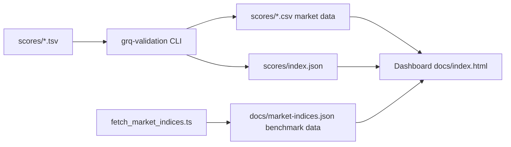
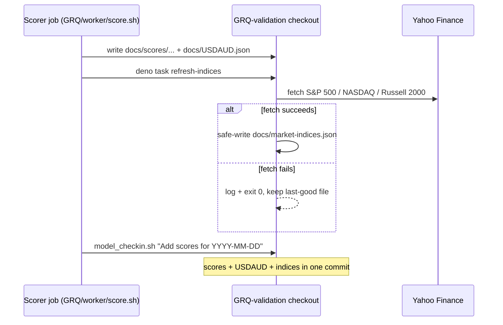
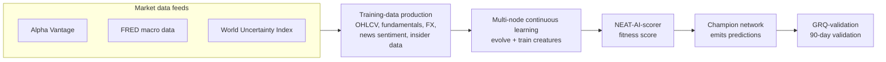
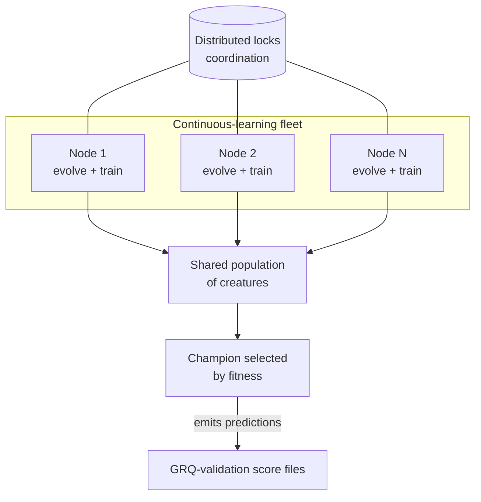
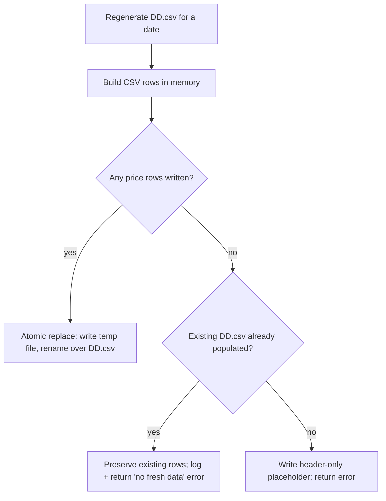
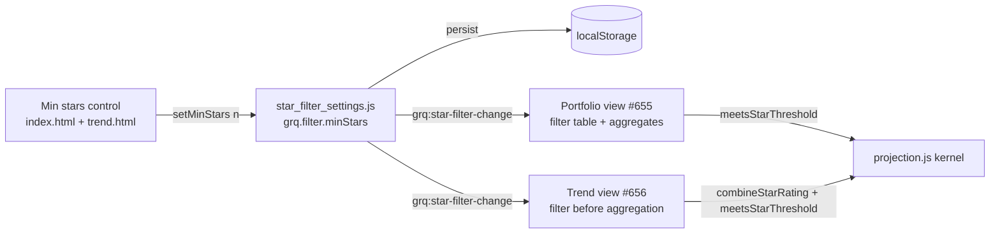
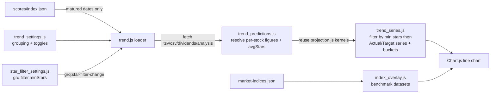
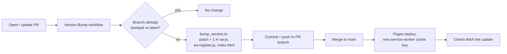
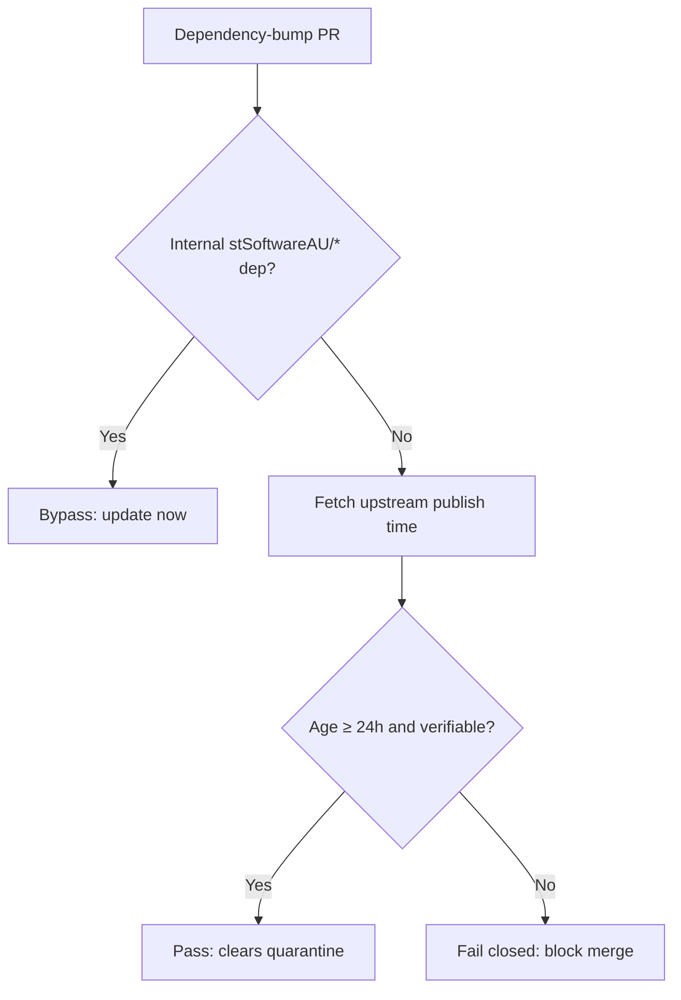
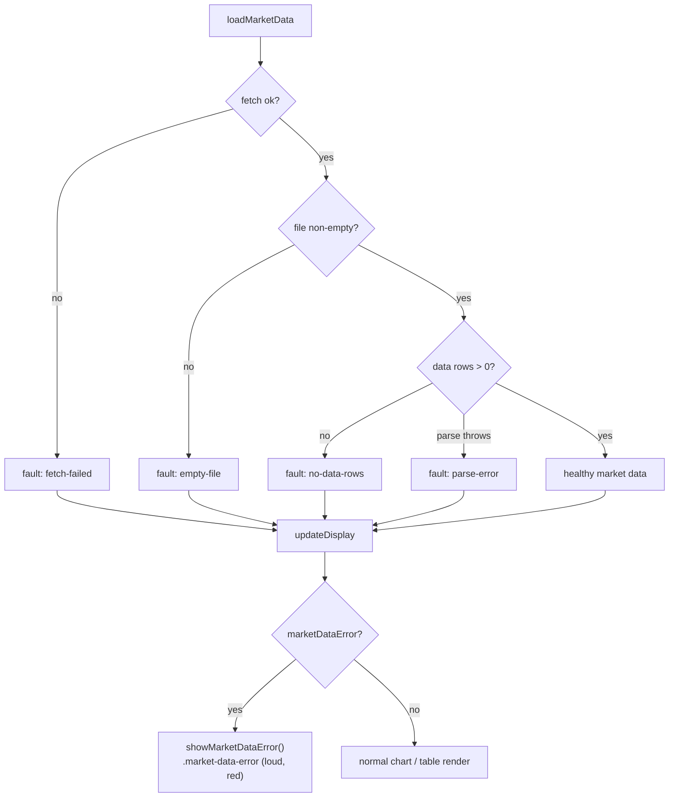

# GRQ Validation

A Rust-based system for validating AI predictions against 90-day targets and a
10% annual cost of capital, paired with a static dashboard published via GitHub
Pages.

> **This is a 90-day prediction-validation tool, not a live stock-price app.**
> Every price the tool reports and compares against is the price at the **90-day
> validation horizon** — the last market-data point on or before 90 days after
> the prediction (score) date, or the latest available point when that 90-day
> window is not yet complete. It deliberately **never** shows today's live price
> beyond the 90-day horizon: a prediction is judged purely on how the stock
> moved within its 90 days. The dashboard therefore labels this figure **"90-Day
> Actual"** (issue #683, formerly "90-Day Price" per #539), not "Current Price",
> so it cannot be mistaken for a live quote. The "show the working" popovers use
> the same human-readable label in their header — e.g. `Field: 90-Day Actual`,
> never the raw `current-price` id (issue #542). A later rally or slump outside
> the window does not change a settled 90-day result.

## Features

- **Performance Tracking** — calculate 90-day and annualised performance for
  stock portfolios.
- **Market Data Integration** — fetch and process historical stock data into
  per-score-file CSVs.
- **Benchmark Comparison** — S&P 500, NASDAQ and Russell 2000 index data is
  fetched first-party (server-side, directly from Yahoo Finance — no public CORS
  proxy) by `scripts/fetch_market_indices.ts` and published as the same-origin
  static file `docs/market-indices.json`, which the dashboard reads directly.
  Refresh it with `deno task fetch-indices`; the write is safe for unattended
  daily runs (fails fast on an empty response, refuses to overwrite committed
  history with a regressed payload, and skips the write when nothing changed).
  The external daily scorer job refreshes it in lockstep with the scores via the
  non-blocking `deno task refresh-indices` wrapper (see _Daily benchmark
  refresh_ below).
- **Split-Aware Returns** — the backend reads each day's `split_coefficient` and
  reconciles any stock split inside the 90-day window. A trustworthy split
  series is corrected (the buy price is restated into current, post-split
  terms); a series that cannot be reconciled (implausible or duplicated
  coefficients, or a coefficient that does not match the observed price drop)
  excludes the stock through the single `is_priceable` gate, dropping it from
  the average, the included count and into `excluded_tickers`. The thresholds
  mirror the frontend so backend and dashboard agree.
- **Low-Volume Exclusion** — illiquid names are flagged and dropped from the
  dashboard portfolio and from every aggregate (equal-weight) figure, so a name
  too thin to trade neither helps nor hurts the "Actual"/Target lines. The
  decision reuses GRQ training's `volumeRecommend` definition as a single source
  of truth (`docs/volume_recommend.js`, issue #576): over a trailing 10-weekday
  window, average daily **dollar** volume (`volume × low price`) below the
  `BUDGET_DOLLARS = 10000` trade budget flags the stock. Flagged rows carry a
  visible **Low volume** badge (issue #577) rather than vanishing silently. A
  flagged name should never occur — it should have been trained out — so the
  badge is rendered in **red** (Bootstrap `bg-danger`) to call it out, and the
  explanatory legend below the table is shown **only** when at least one stock
  in the loaded report is flagged low-volume (issue #599). When volume is
  unknown — older pre-volume-column CSVs — the name is **not** flagged
  (insufficient data ⇒ not flagged), so historical dates are never
  mass-excluded.
- **Negative-Score Exclusion** — a stock whose raw AI model score is **≤ 0**
  (zero or below) is predicted to fall, so we would hold cash rather than buy
  it. Such a name is dropped from the dashboard portfolio and from every
  aggregate (equal-weight) figure, re-weighting the remaining stocks, identical
  to the low-volume treatment (issue #627). The gate keys on the **raw** model
  score, not the volume-capped display score (#578), and is applied through the
  single inclusion predicate shared by the dashboard (`isStockIncluded` in
  `docs/projection.js`) and the Rust backend (`is_priceable` in `src/utils.rs`),
  so backend aggregates and the dashboard agree. The stock stays visible with a
  red **Negative score** badge (its explanatory legend below the table shown
  only when at least one stock is affected) rather than vanishing silently. An
  unknown/missing score never excludes, so historical data without a usable
  score is never mass-dropped. Today the top-20 selection means no negative
  scores occur, so this is a defensive, forward-looking rule.
- **Low-Volume Valuation Cap** — beyond excluding illiquid names from
  aggregates, low volume is folded into the **valuation** of each prediction so
  an illiquid name can never surface as a strong recommendation (issue #578).
  The displayed Score is capped via `min(volumeRecommend, score, 1)` — mirroring
  GRQ training's `Math.min(core.volumeRecommend, priceRecommend, 1)` — using the
  same #576 helper (`docs/volume_recommend.js`, `volumeCappedScore`). A flagged
  name's price-based score is suppressed to a never-recommend value (and the
  detail view shows a **Low volume — not recommended** badge), partial
  illiquidity proportionally down-weights, and unknown volume leaves the score
  unchanged.
- **Dividend Tracking** — calculate dividend income and total returns.
- **Web Dashboard** — interactive charts and tables for performance analysis,
  served as a static site from `docs/`. On mobile, a pop-out control expands the
  performance chart into a full-viewport overlay (dismissed by ✕, Esc or the
  device back-gesture) and presents it in landscape — rotated via CSS on a
  portrait phone so a wide chart fills the screen, with an optional Screen
  Orientation lock where the platform supports it (iOS Safari falls back to the
  CSS rotation). The overlay shows **only the chart** with readable axes and
  scales — the mobile colour key and dashboard chrome stay behind it — and on
  close the dashboard's colour key and native legend are reconciled back to
  their pre-pop-out state. Desktop is unchanged.
- **Hybrid Projection** — for score files less than 90 days old, project
  performance from the current actual prices.
- **Automated Processing** — batch process score files with inline performance
  calculation.

## Architecture at a glance



The dashboard reads every input from its own origin: per-score market CSVs, the
score index, and the benchmark-index file. Benchmark data is fetched server-side
and committed, so a visitor's browser never calls an untrusted third-party relay
(issue #93).

### Daily benchmark refresh (in lockstep with the scores)

The actuals stay current because an external daily **scorer** job
(`stSoftwareAU/GRQ`, `worker/score.sh`) checks out this repo and commits new
`docs/scores/...` and `docs/USDAUD.json` with a message like
`Add scores for 2026-06-20`. To stop the benchmark indices drifting behind the
actuals (issue #238), that same job now refreshes `docs/market-indices.json`
immediately before the daily commit, by invoking the stable wrapper entry point:

```bash
deno task refresh-indices
# (raw form: deno run --allow-net --allow-read --allow-write \
#   scripts/refresh_market_indices.ts)
```

The wrapper runs the first-party fetcher but **never blocks the scores/USDAUD
commit**: a Yahoo Finance outage or partial fetch is logged and swallowed (it
still exits 0), and the safe-write guard in `scripts/fetch_market_indices.ts`
leaves the committed file at its last-good content rather than a stale/partial
payload. The scorer's check-in then stages whatever changed (the scores, the
USDAUD file, and the refreshed indices) into the **same** daily commit, so the
indices reach the last trading day in lockstep with the actuals.



### Freshness guard (issue #239)

Keeping the refresh job running is not enough on its own: when the indices last
drifted (issue #234) the roughly eight-day staleness went **undetected**. A
freshness assertion in `tests/market_indices_test.ts` now compares the newest
date in `docs/market-indices.json` against the newest date in the actuals
(`docs/USDAUD.json`) and fails when the indices lag by more than
`FRESHNESS_TOLERANCE_TRADING_DAYS` (3) trading days. The gap is measured in
trading days (weekends skipped), so the acceptable one-trading-day end-of-day
publishing lag — and an intervening public holiday — never raises a false alarm.
When the guard trips it names both newest dates and the gap, e.g.
`benchmark indices are stale: newest index date 2026-06-08 lags the newest
actuals date 2026-06-18 by 7 trading days (tolerance is 3 trading days)`.

## How the GRQ model is trained

> **High-level overview for general readers.** This section explains, at a
> conceptual level, how the predictions this repository validates are produced.
> It deliberately contains **no** proprietary code, hyper-parameters or private
> endpoints — only the publicly describable shape of the process. The model is
> trained **outside** this repository; `GRQ-validation` only checks the
> resulting predictions against a 90-day horizon.

The GRQ prediction model is an evolved neural network produced by the public
**NEAT-AI** project — a Deno/TypeScript implementation of NeuroEvolution of
Augmenting Topologies (NEAT). Rather than training a fixed-shape network by
gradient descent alone, NEAT-AI **evolves** both the structure and the weights
of many candidate networks ("creatures"), keeping those that predict best and
breeding the next generation from them. The score files this repository ingests
are the matured predictions of the current champion network.



### Training data production — the major market feeds

The training data is assembled from several public and commercial feeds, then
normalised into the time series the network learns from. The full pipeline spans
more than headline prices:

- **Prices / OHLCV** — daily open/high/low/close/volume for each listed
  security, sourced chiefly from **Alpha Vantage**, covering the US exchanges
  (**NYSE**, **NASDAQ**), the Australian exchange (**ASX**), OTC names and a
  range of international markets.
- **Company fundamentals** — company overviews and quarterly **earnings** (also
  via Alpha Vantage), so the model sees each business, not just its chart.
- **Macro indicators** — **Federal Reserve Economic Data (FRED)** series such as
  the VIX volatility index and CPI, giving the model the broader economic
  backdrop.
- **Global risk** — the **World Uncertainty Index**, a published measure of
  worldwide economic and political uncertainty.
- **Foreign exchange** — rates across 50+ currency pairs, so internationally
  listed names and non-USD cash flows are compared on a like-for-like basis.
- **News sentiment** — published sentiment signals (via Alpha Vantage) attached
  to each security.
- **Insider data** — disclosed insider-transaction activity for each company.

Each feed is fetched on a schedule, validated, and folded into a per-security
training set. No raw API keys, private endpoints or proprietary collection code
are described here — only the publicly nameable providers above.

### Key observations

A few observations shape how the data is used:

- **Predict the move, not the price.** The model is trained to anticipate how a
  stock moves over a forward window, which is exactly what this repository then
  validates against the **90-day** horizon.
- **Liquidity matters.** Names too thin to trade are screened out during
  training via the same `volumeRecommend` definition the dashboard reuses (see
  _Low-Volume Exclusion_ above) — a stock whose average daily **dollar** volume
  falls below the trade budget should never surface as a recommendation.
- **Fundamentals and macro context add signal.** Combining per-company
  fundamentals with macro and global-risk indicators lets the network weigh a
  name against its economic backdrop rather than its price history alone.
- **Survivorship and splits are handled at validation time.** Stock splits are
  reconciled inside the 90-day window so a corporate action never masquerades as
  a return (see _Split-Aware Returns_ above).

### Multi-node continuous learning

Training is **continuous**, not a one-off batch. A fleet of machines runs around
the clock, each node evolving and training candidate networks against the latest
market data. Nodes coordinate through distributed locks so they collaborate on a
shared population without standing on each other's work, and the best-performing
creatures propagate across the fleet. As new market data arrives daily, the
population keeps adapting — yesterday's champion is continually challenged by
freshly evolved rivals. The private coordination, health-monitoring and logging
services that run this fleet are intentionally left unnamed.



### How a score is generated

Candidate networks are ranked by the public **NEAT-AI-scorer** CLI (the "scorer
script"). It runs a forward pass over the training data and emits a **fitness**
score in the range 0–1 (higher is better):

```text
fitness = 1 − error − complexityPenalty − versionPenalty
```

The `error` term rewards accurate predictions, the **complexity** penalty
discourages needlessly large networks (favouring simpler, more general models),
and the **version** penalty keeps the champion current. The scorer emits the
result as JSON, which this repository captures for 90-day validation.

### The public NEAT-AI repositories

The training machinery is open source and can be explored directly. The data
that feeds it and the live coordination infrastructure remain private, but the
engine itself is public:

- [`NEAT-AI`](https://github.com/stSoftwareAU/NEAT-AI) — the Deno/TypeScript
  orchestrator: evolution, training and inference.
- [`NEAT-AI-core`](https://github.com/stSoftwareAU/NEAT-AI-core) — Rust/WASM
  numerics and cost functions.
- [`NEAT-AI-Discovery`](https://github.com/stSoftwareAU/NEAT-AI-Discovery) — the
  Rust structural-mutation engine that grows network topologies.
- [`NEAT-AI-scorer`](https://github.com/stSoftwareAU/NEAT-AI-scorer) — the Rust
  scoring CLI that computes the fitness score above.
- [`NEAT-AI-Examples`](https://github.com/stSoftwareAU/NEAT-AI-Examples) —
  worked examples.
- [`NEAT-AI-Explore`](https://github.com/stSoftwareAU/NEAT-AI-Explore) —
  visualisation tools.

## Quick Start

### Prerequisites

- Rust (latest stable)
- Deno (for the dashboard and TypeScript tests)
- Git

### Installation

```bash
git clone <repository-url>
cd GRQ-validation
cargo build --release
```

### Usage

```bash
# Process recent score files (within 180 days)
./run.sh

# Process every score file, including older ones
./run.sh --process-all
# (alias: ./run.sh --full-reload)

# Rebuild only missing or header-only market CSVs
./run.sh --regenerate-empty

# Process a specific date
./target/release/grq-validation --docs-path docs --date 2025-01-15
```

#### Non-destructive market-data writes

Regenerating a date's market-data CSV is **non-destructive**: the generator
builds the new CSV in memory and only replaces the file on disk — atomically,
via a temporary file and rename — when it actually has price rows to write. When
the upstream share-price repository is unavailable for a date, the existing
populated CSV is **left untouched** rather than being truncated to a bare header
row (issue #687). This stops a data-source outage from wiping the dashboard's
market data down to "Limited data mode".



### Web Interface

```bash
# Start a static server in the docs directory
cd docs
python3 -m http.server 8000
# Or use any other static file server (e.g. ../helpers/server.sh)
```

Visit `http://localhost:8000` to access the dashboard.

#### Deep-link URL parameters

The dashboard reads ten optional query parameters so a specific view can be
linked directly (and so the automated accessibility check can audit each view
deterministically — issue #281):

- `?file=<score-file>` — pre-select a score file, e.g.
  `?file=2026%2FMarch%2F23.tsv`.
- `?date=<YYYY-MM-DD>` — pre-select the score for a date (issue #436), e.g.
  `?date=2026-03-23`. This is the friendlier alternative to `?file=` — no
  URL-encoded path needed. Unpadded month/day (`?date=2026-3-23`) is accepted;
  an unknown or malformed date falls back to the default selection. When both
  `?file=` and `?date=` are present, `?file=` wins. Picking a date in the
  **Score File** dropdown now also writes `?date=` back into the dashboard URL
  (issue #517), so a refresh and copied/shared links reopen on that exact date,
  and the date is carried onto the **📈 Prediction Trend** link so the Trend
  page's **← Dashboard** button returns you to the same date.
- `?stock=<symbol>` — open straight into the single-stock detail view, e.g.
  `?stock=NASDAQ%3AMGRC`. An unknown symbol falls back to the aggregate view.
  Drilling into a stock now also writes `?stock=` back into the dashboard URL
  (issue #590, mirroring `?date=`), and the in-app **← Back to Portfolio View**
  button strips it again. The date rides along via `?date=` (#517), so a
  refresh, a copied/shared link, or returning from the bottom-of-card **Confirm
  on Yahoo Finance ↗** pop-out reopens the **same stock on the same day**
  instead of the aggregate dashboard.
- `?theme=auto|light|dark` — force a theme for that page load (a transient
  override that is **not** persisted to `localStorage`).
- `?window=90|180` — switch the **chart** to a 90- or 180-day window for that
  page load, on **both** desktop and mobile (issues #450, #467). This is a
  **display-only** control: it changes how much of each index line the chart
  draws, and **never** the judgement figures. The **Market Performance
  Comparison** cards are always judged over the fixed **90-day** window — the
  same mark the portfolio is judged on — so a 180-day chart does not inflate the
  index gains (issue #705); the cards carry an "as at `<date>`" caption of the
  exact 90-day close date. Like `?theme=`, the window override is **transient**:
  it wins over the saved per-device choice but is **never** persisted, so a reload
  without the param returns to the saved window (180 on every form factor by
  default, issue #711); an absent or invalid value falls back to the saved
  choice, then the device default.
- `?stars=0|1|2|3|4|5` — pre-select the shared minimum-star filter for that page
  load on **both** the portfolio and Trend views (issue #666). `0` means **All**
  (filter off); `1`–`5` keep only holdings whose average rating meets that whole
  star threshold. Unlike `?theme=`/`?window=`, the star filter is the **shared,
  persisted** setting (`grq.filter.minStars`), so a supplied value is applied
  **and** persisted via the normal `setMinStars` path — keeping every view in
  sync. An absent, blank or out-of-range value (e.g. `?stars=6`) leaves the
  saved choice untouched. This is the param the footer **🔗 Share** button emits
  so a shared link reproduces the sharer's filtered view.
- `?view=portfolio|trend` — deep-link straight to a top-level view (issue #479).
  `?view=trend` routes to the Prediction Trend page (`trend.html`);
  `?view=portfolio` routes back to the aggregate dashboard (`index.html`). Like
  `?theme=`, this is read on page load only (one-way) and is **never** persisted
  to `localStorage`; an absent, blank or unrecognised value (or a value that
  already matches the current page) leaves you where you are.
- `?indices=sp500,nasdaq,russell2000` — on the Trend view, turn the listed
  benchmark-index overlays **on** for this visit; any index **not** listed is
  turned off (issue #480). The keys are the canonical index keys `sp500`,
  `nasdaq` and `russell2000`; unknown keys are ignored and a present-but-empty
  value (`?indices=`) turns every overlay off. A **transient / visit-only**
  override that wins over the saved toggles but is **never** persisted; an
  absent param leaves the saved/default toggles unchanged.
- `?group=day|week|month|quarter` — on the Trend view, set the **Group by**
  granularity for this visit (issue #481). A **transient / visit-only** override
  that wins over the saved `grq.trend.grouping` choice but is **never**
  persisted; an absent or unrecognised value falls back to the saved choice,
  then the **month** default.
- `?fullscreen=1` — **mobile-only**: open the chart pop-out (landscape,
  maximised chart) on page load (issue #482). Only the exact value `1` triggers
  it; it is a **no-op on desktop**, where the expand control is hidden. Like
  `?theme=`, it is read once on load (one-way) and is **never** persisted.

**Worked examples**

- `index.html?date=2026-01-01&window=180&fullscreen=1` — 180 days from 1
  January, landscape (maximised chart) on a phone.
- `trend.html?group=week&indices=sp500,nasdaq` — the Trend view grouped by week
  with the S&P 500 and NASDAQ overlays on (Russell 2000 off) for this visit.
- `index.html?view=trend` — jump straight from the dashboard to the Prediction
  Trend page.

A low-prominence **🔗 Share** button in the page footer does the inverse: it
builds an absolute URL encoding the current selections (score file, stock,
theme, 90/180 window, the shared min-star filter, and the transient mobile
pop-out flag) and copies it to
the clipboard (issue #495). It is **read-only** — generating a link never
mutates your saved settings — and degrades to a select-the-text fallback where
the async Clipboard API is unavailable. Pasting the link into a fresh tab
reproduces the same view.

The single-stock detail view ends with a small, understated **Yahoo Finance**
link as its lowest-priority item (issue #570) — a "here are our numbers; if a
figure looks off, confirm it at the source" aid. It opens the stock's Yahoo
quote page in a new standalone external tab (`target="_blank"` +
`rel="noopener noreferrer"`, so it works from the installed PWA). Symbols are
stored `EXCHANGE:TICKER`, so the URL drops the exchange prefix and uses the bare
ticker, e.g. `NASDAQ:UCTT` → `https://au.finance.yahoo.com/quote/UCTT/`. The
prefix-stripping and URL building live in `docs/yahoo_finance.js`
(`GRQYahooFinance.yahooQuoteUrl`), unit-tested in
`tests/yahoo_finance_link_test.ts`.

All views meet **WCAG 2 AA** colour contrast in both the light and dark themes;
`pa11yci.json` scans the aggregate, single-stock and Trend views in both themes
on every pull request that touches `docs/`.

#### Optional minimum-star filter (shared foundation)

A compact **Min stars** control rides on both the portfolio (`index.html`) and
Trend (`trend.html`) controls rows, reading `All / 1★+ … / 5★+`. It reflects and
writes a **single, persisted** whole-star threshold shared by both pages —
backed by `docs/star_filter_settings.js` under the namespaced `localStorage` key
`grq.filter.minStars` (default `0` = **All**, i.e. the filter is off). The
module publishes the accessor contract on `globalThis.GRQStarFilter`:

- `GRQStarFilter.getMinStars()` → the current threshold (`0` for All, else
  `1`–`5`).
- `GRQStarFilter.setMinStars(n)` persists the normalised value and dispatches a
  `grq:star-filter-change` `CustomEvent` on `window`, with
  `event.detail.minStars` carrying the new threshold.

The foundation issue (#654) delivered the control, the persistence, and the
change-event contract — with the control left at **All**, dashboard and Trend
behaviour is byte-for-byte identical to before. As part of that change the
verbose **📈 Prediction Trend** button was renamed to **Trend** so the portfolio
controls row still fits on one line on a 375px-wide (iPhone) viewport.

**Portfolio filtering (#655).** When a threshold is active, the dashboard
restricts both the holdings table and **every** portfolio aggregate (chart
performance line, target dot, trend line, and the totals-row metrics) to stocks
whose combined star rating `avgStars` meets the threshold, then recomputes the
aggregate over that filtered subset. A no-rating stock (`avgStars === null`) is
excluded while the filter is on. The extra gate is folded into the shared
`isStockPriceable()` inclusion check (and the target-dot input builder), so the
table and the numbers are computed from the **same** filtered set and can never
diverge. The pure decision lives in `GRQProjection.meetsStarThreshold(avgStars,
minStars)`. The view subscribes to `grq:star-filter-change` and re-renders the
chart and table without a page reload; at **All** the gate is a no-op and the
view is unchanged.

**Trend filtering (#656).** The Trend pipeline now also loads each matured
date's analysis CSV (`scores/<YYYY>/<Month>/<DD>-analysis.csv`, tolerating a
404 on older dates) and attaches the combined 1–5 `avgStars` to every stock,
derived by the **shared** `GRQProjection.combineStarRating(msStars, tipsStars)`
kernel — the same combination the portfolio view uses, so a stock's effective
rating is identical between the two views. When a threshold is active,
`GRQTrendSeries.buildMaturedTrendSeries` excludes stocks below it (and unrated
stocks) **before** each date's Actual/Target means are computed, so the trend
lines recompute over the qualifying subset. The control change re-filters the
already-loaded predictions in memory and re-renders without a re-fetch; at
**All** the series is byte-for-byte identical to before, and dates lacking an
analysis CSV behave exactly as now.



#### Prediction Trend view (`docs/trend.html`)

A separate, purely additive page (reached via the **Prediction Trend** link on
the dashboard, and back again) charts the portfolio's **average Actual %**
against its **average Target %** over the matured-prediction history, so you can
see whether predictions are improving — are we consistently over- or
under-predicting, and do Actual and Target converge as training progresses. A
**Group by** control buckets the history by **day / week / month / quarter**
(default **month**), and each benchmark index (SP500 / NASDAQ / Russell 2000)
can be overlaid on/off; both choices are remembered across visits. Only
**matured** predictions appear — a score date joins the trend once its full
90-day window has elapsed.

The view never recomputes the actuals: it reuses the same shared kernels the
dashboard does, so the two always agree.



## CI/CD Pipeline

This repository ships a set of GitHub Actions workflows in `.github/workflows/`
covering continuous integration, security scanning, and dependency hygiene.

### Workflows

1. **CI** (`ci.yml`) — main continuous integration: build, test, formatting,
   linting, and artifact upload. Runs on pushes and pull requests to `main` and
   to `milestone/**` integration branches, so the Rust quality gate
   (`cargo fmt`/`clippy`/`check`/`test`) also guards milestone PRs. The
   `deploy-pages` job stays `main`-only, so milestone branches never publish the
   GitHub Pages dashboard.
2. **Cargo Audit** (`cargo-audit.yml`) — runs `cargo audit` on every pull
   request and on a weekly schedule to catch newly disclosed advisories.
3. **Deno Outdated** (`deno-outdated.yml`) — checks for outdated JSR/npm imports
   used by the TypeScript dashboard tests.
4. **Deno Quality** (`deno-quality.yml`) — runs `deno fmt`, `deno lint`,
   `deno check`, `deno audit`, and `deno test` against `tests/` on every pull
   request and on a weekly schedule. `deno audit` scans the resolved JSR/`@std`
   dependency graph for known vulnerabilities — the Deno-side counterpart to
   `cargo audit`.
5. **Dependency Review** (`dependency-review.yml`) — reviews dependency changes
   on pull requests for known vulnerabilities and licence issues.
6. **Gitleaks** (`gitleaks.yml`) — scans the repository for accidentally
   committed secrets.
7. **Markdown Lint** (`markdown-lint.yml`) — enforces the rules in
   `.markdownlint-cli2.jsonc` against every Markdown file.
8. **Semgrep** (`semgrep.yml`) — runs Semgrep static analysis for security and
   correctness issues.
9. **Shellcheck** (`shellcheck.yml`) — lints every `*.sh` script in the
   repository.
10. **Accessibility** (`a11y.yml`) — runs `pa11y-ci` against the rendered
    `docs/` dashboard on every pull request that touches `docs/`, failing the
    build on WCAG 2.1 AA violations so accessibility regressions are caught on
    the PR that introduces them.
11. **Dependency Quarantine Gate** (`bump-quarantine-gate.yml`) — deterministic
    supply-chain backstop that, on every pull request, blocks an external Cargo
    crate or GitHub Action bump whose upstream release is younger than 24 hours
    (see _Automated dependency updates_ below).
12. **Version Bump** (`version-bump.yml`) — on every pull request, runs
    `scripts/bump_version.ts` to increment the dashboard app version and commits
    the change back to the PR branch (see _Dashboard versioning_ below).
13. **Actionlint** (`actionlint.yml`) — lints the workflow YAML itself on every
    pull request with `actionlint`, catching syntax errors, invalid `${{ }}`
    expressions, unknown runner labels, and — via its bundled `shellcheck`
    integration — shell issues inside `run:` blocks, so workflow regressions
    fail the build.

### Dashboard versioning

The dashboard app version is the cache-busting key for the service worker
(`docs/sw.js`), so a deployed change only reaches clients when that version
changes. The version lives in four aligned locations — the `APP_VERSION`
constant in `docs/sw.js`, the `./sw.js?v=` query in `docs/sw-register.js`, and
the `app-version` meta and `sw-register.js?v=` script tag in `docs/index.html`.

The **Version Bump** workflow keeps this automatic and reliable: on every pull
request it runs `scripts/bump_version.ts`, which increments the patch component
across all four locations and commits the result back to the PR branch. The bump
is idempotent — it compares the branch version against the base branch and skips
when the branch has already been bumped — so re-runs do not ratchet the version.
This replaced an unreliable local pre-commit hook that only fired when a
contributor had installed it.



### Automated dependency updates

[`.github/dependabot.yml`](.github/dependabot.yml) configures Dependabot to open
reviewable update PRs for the **Cargo** crate ecosystem (`Cargo.toml` /
`Cargo.lock`) and the **GitHub Actions** ecosystem on a weekly schedule. Each
ecosystem applies a 24-hour `cooldown` (release-age quarantine) so a
freshly-published — possibly hijacked — crate or action is held back rather than
auto-bumped within the same window. Internal `stSoftwareAU/*` dependencies are
excluded from the cooldown so they update immediately, mirroring the
`minimumDependencyAge` policy that `deno.json` applies to the Deno ecosystem.

Because Dependabot's `cooldown` keyword is an in-preview, non-native age gate,
the **Dependency Quarantine Gate** workflow (`bump-quarantine-gate.yml`) backs
it with a deterministic, native check (`helpers/bump_quarantine_gate.ts`). On
every pull request the gate computes which external crates and Actions changed
against the base branch, fetches each one's upstream publish time (crates.io
`created_at` / the Action commit date), and **fails closed** when a bump is
younger than `VIBE_BUMP_QUARANTINE_HOURS` (default 24h) or its age cannot be
verified. Internal `stSoftwareAU/*` dependencies bypass the gate and update
immediately. This mirrors the Deno ecosystem's `--minimum-dependency-age=P1D`
gate so the Cargo and Actions ecosystems no longer rely on the `cooldown`
keyword alone.



The CI pipeline (`ci.yml`) complements this by building the **committed,
reviewed `Cargo.lock`** rather than floating dependencies: every `cargo`
build/test/check step runs with `--locked`, so a stale lockfile fails the build
instead of silently resolving (and executing the `build.rs` / proc-macros of) a
freshly-published, unquarantined crate. CI tool installs (`cargo-tarpaulin`,
`cargo-cyclonedx`, `cargo-audit`) are pinned to explicit versions with
`--locked` so they do not compile an arbitrary newest tool-dependency tree on
each run. Crate bumps therefore arrive only through the quarantined Dependabot
PRs above, never inline on a PR build.

### Setup

1. Enable GitHub Actions in your repository.
2. Configure GitHub Pages (Settings → Pages → Source: GitHub Actions).
3. Set up branch protection rules (recommended).

See [CI_CD_SETUP.md](docs/fixes/CI_CD_SETUP.md) for detailed setup instructions.

## Project Structure

```text
GRQ-validation/
├── src/                    # Rust source code
│   ├── main.rs             # CLI entry point
│   ├── lib.rs              # Library interface
│   ├── models.rs           # Data structures
│   └── utils.rs            # Utility functions
├── docs/                   # Static dashboard (published via GitHub Pages)
│   ├── index.html          # Main dashboard
│   ├── trend.html          # Prediction Trend view (Actual vs Target over time)
│   ├── app.js              # Main dashboard logic
│   ├── chart_popout.js     # Mobile full-screen chart pop-out overlay engine
│   ├── trend.js            # Trend view controller
│   ├── trend_predictions.js # Per-score-date prediction resolver (shared calc)
│   ├── trend_series.js     # Trend data engine (matured series + bucketing)
│   ├── index_overlay.js    # Benchmark-index overlay engine for the Trend view
│   ├── trend_settings.js   # Remembers Trend grouping + index toggles
│   ├── star_filter_settings.js # Shared, persisted min-star filter threshold
│   ├── styles.css          # Main dashboard styling
│   ├── market-indices.json # First-party benchmark index data (same-origin)
│   └── scores/             # Score files and generated market data
├── tests/                  # Rust and Deno tests
├── helpers/                # Local development helpers (e.g. static server)
├── scripts/                # Utility scripts
│   ├── bump_version.ts            # CI app-version incrementer (#323)
│   ├── fetch_market_indices.ts    # Server-side benchmark-index fetcher
│   ├── refresh_market_indices.ts  # Non-blocking daily-scorer wrapper (#238)
│   ├── price_basis_diagnostic.ts  # mid-vs-low basis bias computation (#552)
│   ├── diagnose_price_basis.ts    # CLI report for the basis diagnostic (#552)
│   ├── dividend_basis_diagnostic.ts # flat-1/4-vs-windowed dividend bias (#553)
│   ├── diagnose_dividend_basis.ts # CLI report for the dividend diagnostic (#553)
│   ├── buy_price_denominator_diagnostic.ts # midpoint-vs-close denominator bias (#554)
│   ├── diagnose_buy_price_denominator.ts # CLI report for the denominator diagnostic (#554)
│   ├── horizon_split_parity_diagnostic.ts # horizon as-of split-basis parity (#555)
│   ├── diagnose_horizon_split_parity.ts # CLI report for the timing/split parity audit (#555)
│   ├── score_target_decoding_diagnostic.ts # reverseProfitRecommend round-trip bias (#556)
│   ├── diagnose_score_target_decoding.ts # CLI report for the score→target decode audit (#556)
│   ├── residual_gap_reconciliation.ts # whole-app sweep + residual-gap reconciliation (#557)
│   ├── diagnose_residual_gap.ts      # CLI report for the catch-all sweep / reconciliation (#557)
│   ├── freshness_indicator_diagnostic.ts # fair-value freshness sign port + regression guard (#587, #600)
│   └── diagnose_freshness_indicator.ts # CLI report for the corrected freshness indicator (#587, #600)
├── .github/workflows/      # GitHub Actions workflows
├── run.sh                  # Build-and-run wrapper for the CLI
├── quality.sh              # Local quality gate (fmt, clippy, tests, deno)
└── Cargo.toml              # Rust dependencies and crate metadata
```

## Development

### Local Development

```bash
# Format code
cargo fmt

# Run linter
cargo clippy --all-targets --all-features -- -D warnings

# Run tests
cargo test

# Build release
cargo build --release

# Run the full quality gate (mirrors CI)
./quality.sh
```

### Testing

```bash
# Run all Rust tests
cargo test

# Run a specific Rust test
cargo test test_name

# Run the Deno test suite (dashboard / workflow tests)
deno test --allow-read tests/
```

The Deno suite includes a **dashboard "Limited data mode" smoke test**
(`tests/dashboard_limited_data_smoke_test.ts`). It drives the real
`GRQTrendPredictions.parseMarketCsv` kernel over the published
`docs/scores/**` CSVs and **fails** if a date with full market data would
render the `.limited-data-message` ("Limited data mode") banner — the quality
gate that catches a market-data regression before it ships. It runs on every PR
via `deno-quality.yml` (which already executes `deno test tests/*.ts`).

### Market data fails loudly, not silently (data-fault state)

The dashboard no longer degrades silently when it cannot load real market data.
`GRQValidator.loadMarketData()` (`docs/app.js`) classifies every failure path —
a fetch failure, an empty file, a header-only / zero-data-row CSV, or a parse
error — as a **data fault** and records it on `this.marketDataError`.
`updateDisplay()` then renders a **visible, distinct error state** (the loud red
`#error` alert carrying the `.market-data-error` class and
`data-market-data-state="error"` / `data-market-data-reason="<reason>"` hooks)
instead of the soft amber "Limited data mode" placeholder. This makes a broken
data pipeline impossible to mistake for a normal-but-sparse view, and gives the
smoke test a stable hook to assert on.



The shared kernel `GRQTrendPredictions.classifyMarketLoad()` mirrors this exact
fault classification (just as `parseMarketCsv` mirrors the inline parse) and is
exercised by `tests/market_data_fail_loud_test.ts`.

## Configuration

### Environment Variables

- `RUST_LOG` — logging level (default: `info`).
- `CARGO_TERM_COLOR` — terminal colour output.

### Command Line Options

- `--docs-path` — path to the docs directory (default: `docs`).
- `--process-all` — process every score file, not just recent ones.
- `--calculate-performance` — calculate performance metrics for score files.
- `--date` — process a specific date in `YYYY-MM-DD` format.
- `--verbose` — enable verbose logging.

## Contributing

1. Fork the repository.
2. Create a feature branch.
3. Make your changes.
4. Run `./quality.sh` and ensure it passes cleanly.
5. Submit a pull request.

## License

Licensed under the Apache License, Version 2.0. See [LICENSE](LICENSE) for the
full text.

## Support

For issues and questions:

1. Check [CI_CD_SETUP.md](docs/fixes/CI_CD_SETUP.md) for workflow issues.
2. Review existing issues.
3. Create a new issue with detailed information.
