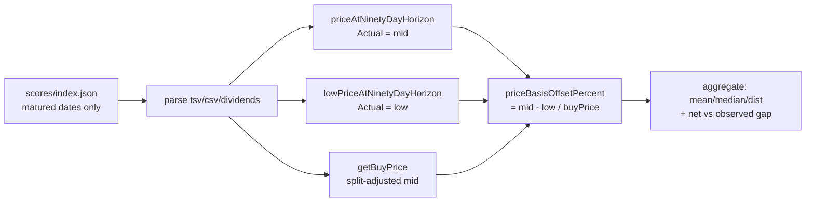

# Price-basis bias: training intraday-low vs dashboard midpoint

_Diagnostic for Issue #552 (sub-issue of #544 — one candidate source of the
systematic Target-over-Actual measurement gap). Measurement lives in
`GRQ-validation`; the root price-basis decision lives upstream in `GRQ`._

## TL;DR

The GRQ model is trained on a return label measured at the **intraday low** of
the trading day 90 days ahead, but the validation dashboard measures **Actual**
at the **midpoint** `(high + low) / 2` of the horizon row. Because `mid >= low`
on every row, the mid basis **lifts** the measured Actual.

Over the matured historical score set (274 score dates, 5 444 included
stock-rows, as-of 2026-06-26) the basis offset `(mid - low) / buyPrice` is:

| Statistic | Value |
| --- | --- |
| Mean | **+2.235 pp** |
| Median | +1.546 pp |
| Min | +0.000 pp |
| Max | +93.273 pp (thin, low-priced outlier) |
| Std dev | 3.216 pp |

**Sign and netting.** The offset is **non-negative on every row** (sign **+**).
Measuring Actual at the higher mid makes Actual larger, which **narrows / masks**
the Target-over-Actual gap — the *opposite* direction to the observed gap. So
this candidate **offsets** the gap rather than causing it:

| Quantity (mean over matured dates) | Value |
| --- | --- |
| Mean Target % | 28.916 % |
| Mean Actual % (mid — current dashboard) | 10.447 % |
| Mean Actual % (low — trained basis) | 8.204 % |
| **Observed gap** (Target − Actual, mid) | **+18.470 pp** |
| Gap on the trained low basis | +20.712 pp |
| **Basis contribution** (low − mid gap) | **+2.242 pp** |

Restating Actual onto the basis the model was trained on (intraday low) would
**widen** the apparent gap by ~**2.24 pp**, from ~18.5 pp to ~20.7 pp. Genuine
model optimism (and the remaining candidates in #544) must therefore explain a
gap that is *larger* than the headline figure, not smaller.

> The per-row equal-weight mean (+2.235 pp) and the per-date portfolio-level
> contribution (+2.242 pp) agree to within rounding, confirming the offset is a
> broad, structural feature rather than an artefact of a few dates.

## Acceptance criteria

1. **Numeric aggregate contribution (pp) with sign** — mean basis offset
   **+2.235 pp** (per row) / **+2.242 pp** (portfolio-level); always `>= 0`.
2. **Widens or narrows the observed gap** — the mid basis **narrows (masks)**
   the gap; switching to the trained low basis **widens** it by ~2.24 pp.
3. **Fix-vs-leave recommendation** — see below.

## Recommendation: confirm the asymmetry, but **leave the dashboard basis as-is**
for now (low-priority hygiene fix only)

A real, structural asymmetry **is** confirmed (a consistent, same-direction
~2.2 pp offset), so a fix is *justifiable* on like-for-like grounds. However:

- Correcting it **does not close** the Target-over-Actual gap — it **widens**
  it. This candidate is therefore **exonerated as a cause** of the reported
  symptom; it was partially *hiding* the gap.
- The mid basis is also the more defensible figure to **show a user** as the
  "Actual" return: the midpoint is an unbiased intraday estimate, whereas the
  intraday low systematically understates what a holder realised. Switching the
  user-facing Actual to the low purely to match a training artefact would make
  the dashboard's headline returns look worse than reality.

**Therefore:** the milestone should keep chasing genuine model optimism and the
other #544 candidates (dividend timing, buy-price denominator, score decoding)
as the real drivers. If a fully like-for-like trend comparison is later wanted,
the cleaner fix is to **restate the model Target onto the midpoint basis**
(upstream in `GRQ`) — i.e. train/evaluate both series on one consistent basis —
rather than degrade the dashboard's user-facing Actual to the intraday low. That
is a separate, low-priority piece of measurement hygiene, not a gap-closing fix.

## How this was measured (reproducible)

Every per-stock figure is delegated to the **shipped** kernels so the diagnostic
measures the dashboard's own basis, not a re-implementation:

- `GRQProjection.getBuyPrice` — split-adjusted midpoint buy price.
- `GRQProjection.priceAtNinetyDayHorizon` — Actual on the **mid** basis.
- `GRQProjection.lowPriceAtNinetyDayHorizon` — Actual on the **low** basis
  (added for this diagnostic; mirrors the mid helper's horizon selection so both
  pick the same row).
- `GRQProjection.priceBasisOffsetPercent` — `(mid - low) / buyPrice * 100`.
- `GRQProjection.isStockIncluded` — restricts to the same included set the
  dashboard aggregates over.

```bash
deno task diagnose-price-basis            # against docs/, as-of today
# raw form (pin an as-of date for a reproducible report):
deno run --allow-read scripts/diagnose_price_basis.ts docs 2026-06-26
```



## Code references

- Training label (intraday low, 90 days ahead): `GRQ/src/LearnUtil.ts`
  (`market.lowPrice(symbol, targetDate)`).
- Dashboard Actual (midpoint): `GRQ-validation/docs/projection.js`
  — `currentPriceFromLatest`, `priceAtNinetyDayHorizon`.
- Matching low basis + offset helper: `GRQ-validation/docs/projection.js`
  — `lowPriceAtNinetyDayHorizon`, `priceBasisOffsetPercent` (this issue).
- Diagnostic: `scripts/diagnose_price_basis.ts`,
  `scripts/price_basis_diagnostic.ts`;
  tests `tests/price_basis_diagnostic_test.ts`.
