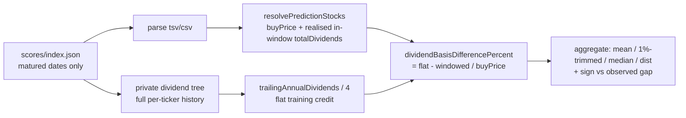

# Dividend-basis bias: flat training quarter vs windowed actual ex-dividends

_Diagnostic for Issue #553 (sub-issue of #544 — one candidate source of the
systematic Target-over-Actual measurement gap). The windowed credit lives in
`GRQ-validation`; the flat training credit lives in the upstream training
repository._

## TL;DR

Upstream training bakes a **flat** quarter of the trailing annual dividend,
`core.yearOfDividends / 4`, into the total-return label for **every** stock —
whether or not a dividend actually lands in the forward window (in the upstream
training code). The
validation dashboard credits only the **actual ex-dividends inside the 90-day
window** (`GRQ-validation/src/utils.rs` `calculate_dividends_for_period`,
mirrored by the shipped JS kernels `filterDividendsWithin90Days` +
`sumDividends`).

Per matured row the diagnostic compares the two credits as a percentage of the
buy price and aggregates the **mean difference and its sign**. Over the matured
historical score set (274 score dates, 5 444 included stock-rows, as-of
2026-06-26), `(flatCredit − windowedCredit) / buyPrice` is:

| Statistic | Value |
| --- | --- |
| Mean (raw) | **+2.827 pp** |
| Mean (1%-trimmed) | **+1.358 pp** |
| Median | +0.000 pp |
| Min | −116.652 pp (special distribution caught in-window, low-priced) |
| Max | +277.778 pp (special distribution missed by the window, low-priced) |
| Std dev | 20.174 pp |
| Rows within ±1 pp | 86.4 % |

| Dividend-return component (mean over included rows) | Value |
| --- | --- |
| Mean flat credit yield (`yearOfDividends / 4` / buy) | 3.656 % |
| Mean realised in-window yield (dashboard Actual) | 0.829 % |
| Included rows with **zero** in-window dividends | 45.2 % |

**Sign and netting.** The mean difference is **positive (sign +)**: the flat
training quarter is, on average, a **consistent over-credit** relative to the
realised in-window dividends. Because the model's Target embeds the flat credit
while the dashboard's Actual credits only realised in-window dividends, this
dividend basis **contributes to (widens)** the Target-over-Actual gap — the
**same** direction as the observed gap, unlike the price-basis candidate (#552),
which _narrowed_ it.

The headline raw mean (+2.83 pp) is **lumpy and tail-driven**: 86.4 % of rows
sit within ±1 pp and the median is exactly 0 (non-payers and quarterly payers
roughly net out), but a handful of **special / liquidating distributions on
low-priced stocks** (EQC, ELME, VISN) dominate both tails. The robust central
estimate is therefore the **1%-trimmed mean ≈ +1.36 pp** (and the median 0).

## Why the two sides diverge

- **Cadence.** 45.2 % of included rows realise **no** dividend in their 90-day
  window — semi-annual and annual payers contribute 0 to Actual in most windows
  yet always receive the flat quarter in training. This is the dominant,
  same-direction driver: their per-row difference is `+flatCredit/buy > 0`.
- **Growth / cuts.** `yearOfDividends` is the trailing year, so it misses
  forward dividend growth or cuts that the realised in-window figure captures.
- **Specials.** One-off special and liquidating distributions are credited
  realised-only on the validation side, but are diluted into (or excluded from)
  the trailing-annual quarter on the training side. On low-priced stocks these
  produce the extreme ± tails above and inflate the raw mean.

## Acceptance criteria

1. **Mean dividend-basis difference (pp) with sign** — **+2.827 pp** raw /
   **+1.358 pp** (1%-trimmed), median 0; **sign +** (flat quarter is a
   consistent over-credit).
2. **Contributes to or offsets the gap** — it **contributes to (widens)** the
   Target-over-Actual gap, because Target carries the larger flat credit while
   Actual carries the smaller realised in-window credit. (Opposite to #552's
   price basis, which masked the gap.)
3. **Fix-vs-leave recommendation** — see below.

## Recommendation: real, same-direction contributor — **fix the basis in the upstream training repository** (align training onto realised forward-window dividends)

Unlike the price-basis candidate (#552, exonerated because it _hid_ the gap),
the dividend basis is a **genuine, same-direction contributor** of roughly
**+1.4 pp (robust) to +2.8 pp (raw)**. It is worth correcting, and the correct
direction is to **align both sides on realised dividends**:

- The dashboard's realised in-window credit is the **defensible** "Actual": it
  reflects the cash a holder actually received in the 90 days. Degrading it to a
  fabricated flat quarter (to match training) would credit dividend income that
  was never realised — strictly worse for a user-facing figure.
- Therefore the clean fix lives **in the upstream training repository**: train/evaluate the label
  on the dividends that actually fall in the forward 90-day window (the same
  basis `calculate_dividends_for_period` uses), instead of a flat
  `yearOfDividends / 4`. That removes the structural over-credit at source and
  makes Target and Actual like-for-like on dividends.
- The root-cause change is a **training-label** decision in the upstream
  training repository, out of scope
  for this `GRQ-validation` diagnostic issue (whose deliverable is the written
  analysis + recommendation). It should be carried as a fix candidate under
  milestone #544.

**Net for the milestone:** keep this candidate as a **confirmed, modest,
same-direction contributor** (~+1.4 to +2.8 pp) alongside genuine model optimism
— but treat the raw +2.83 pp as an upper bound inflated by a few special-dividend
outliers; the robust figure is ~+1.4 pp.

## How this was measured (reproducible)

Every per-stock figure is delegated to the **shipped** kernels so the windowed
credit measured here is the dashboard's own credit, not a re-implementation:

- `GRQTrendPredictions.resolvePredictionStocks` — split-aware `buyPrice`,
  `currentPrice`, inclusion flag and the realised in-window `totalDividends`
  (`sumDividends` ∘ `filterDividendsWithin90Days`) — the dashboard's Actual
  dividend credit.
- `GRQProjection.trailingAnnualDividends` — trailing-365-day dividend total as
  of the score date; `/ 4` reproduces the model's flat training credit (added
  for this diagnostic).
- `GRQProjection.dividendBasisDifferencePercent` —
  `(flatCredit − windowedCredit) / buyPrice * 100`.
- `GRQProjection.isStockIncluded` — restricts to the same included set the
  dashboard aggregates over.

The flat credit is read from the full per-ticker dividend history in the
private dividend-history tree (the same source `src/utils.rs` reads via
`DIVIDEND_DATA_BASE_PATH`); the windowed credit is read from the committed
per-score `*-dividends.csv` files.

```bash
deno task diagnose-dividend-basis              # docs/, today, ../private-dividend-tree
# raw form (pin an as-of date + explicit history root for a reproducible report):
deno run --allow-read scripts/diagnose_dividend_basis.ts docs 2026-06-26 ../private-dividend-tree
```



## Code references

- Flat training credit: the upstream training code
  (`(targetPrice + core.yearOfDividends / 4) / core.monthsAgoPrice`),
  `yearOfDividends` built in the upstream training code.
- Windowed actual credit: `GRQ-validation/src/utils.rs`
  `calculate_dividends_for_period` (invoked at the 90-day window), mirrored by
  `docs/projection.js` `filterDividendsWithin90Days` + `sumDividends`.
- Trailing-annual basis + difference helper: `docs/projection.js`
  `trailingAnnualDividends`, `dividendBasisDifferencePercent` (this issue).
- Diagnostic: `scripts/diagnose_dividend_basis.ts`,
  `scripts/dividend_basis_diagnostic.ts`;
  tests `tests/dividend_basis_diagnostic_test.ts`.
