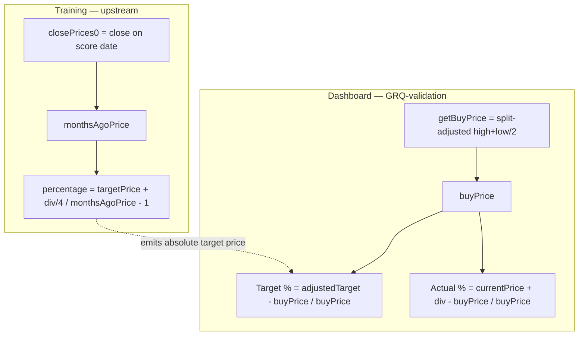
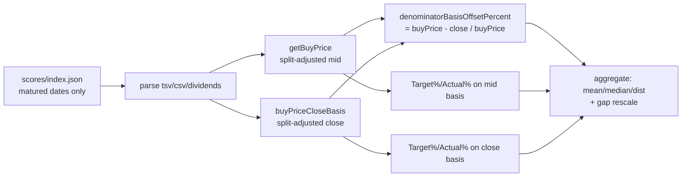

# Buy-price denominator bias: training close vs dashboard midpoint

_Diagnostic for Issue #554 (sub-issue of #544 — one candidate source of the
systematic Target-over-Actual measurement gap). Measurement lives in
`GRQ-validation`; the root denominator decision lives upstream in the training
repository._

## TL;DR

The upstream training model is trained on a 90-day return whose **denominator** is
`monthsAgoPrice` — the **close** on the score date. The validation dashboard
divides **both** Target and Actual by `buyPrice` — the **split-adjusted
midpoint** `(high + low) / 2` of the first usable point. Because the dashboard
applies the _same_ `buyPrice` to Target and Actual, the denominator choice
**cannot desynchronise** them: it only rescales the (Target − Actual) gap by
`buyPrice / close`.

Over the matured historical score set (274 score dates, 5 444 included
stock-rows, as-of 2026-06-26) the denominator offset
`(buyPrice − close) / buyPrice` is:

| Statistic | Value |
| --- | --- |
| Mean | **+0.046 pp** |
| Median | +0.000 pp |
| Min | −11.868 pp |
| Max | +9.886 pp |
| Std dev | 1.418 pp |

**Sign and netting.** Unlike the price-basis offset of #552 (which is `>= 0` on
every row), the midpoint-vs-close offset is **roughly symmetric around zero**
(median 0.000, mean **+0.046 pp**, sign **+** but tiny). The close sits inside
`[low, high]`, so on any given day it may be above or below the midpoint; across
5 444 rows the two nearly cancel, leaving a negligible upward bias in `buyPrice`.

| Quantity (mean over matured dates) | Value |
| --- | --- |
| Mean Target % (mid — current dashboard) | 28.916 % |
| Mean Actual % (mid — current dashboard) | 10.447 % |
| Mean Target % (close — trained basis) | 29.019 % |
| Mean Actual % (close — trained basis) | 10.502 % |
| **Observed gap** (Target − Actual, mid) | **+18.470 pp** |
| Gap on the trained close basis | +18.517 pp |
| **Basis contribution** (close − mid gap) | **+0.048 pp** |

Restating **both** series onto the trained close denominator moves the apparent
gap by ~**0.05 pp**, from ~18.47 pp to ~18.52 pp — three orders of magnitude
smaller than the gap itself.

> The per-row equal-weight mean (+0.046 pp) and the per-date portfolio-level
> contribution (+0.048 pp) agree to within rounding, confirming the offset is a
> broad, structural near-zero rather than an artefact of a few dates.

## Acceptance criteria

1. **Numeric denominator offset (pp) with sign** — mean **+0.046 pp** (per row)
   / **+0.048 pp** (portfolio-level); roughly symmetric (median 0.000 pp).
2. **A clear yes/no on whether Target vs Actual are desynchronised by the
   denominator choice** — **NO.** The dashboard divides **both**
   `calculatePortfolioTargetPercentage` and
   `calculateIncludedPortfolioPerformance` by the **same** per-stock
   `buyPrice`, so the denominator is shared. It rescales any existing gap by
   `buyPrice / close`; it does not split Target and Actual onto different bases.
3. **Fix-vs-leave recommendation** — see below.

## Tracing the denominators (part 2)



- **Training denominator:** the upstream training code sets
  `monthsAgoPrice = closePrices[0]` (the close on the score date);
  the upstream label code divides the labelled return by it, and
  persists it with the train item.
- **Dashboard denominator:** `GRQ-validation/docs/projection.js`
  `getBuyPrice` (lines ~522-546) resolves the split-adjusted midpoint of the
  first usable point; **both** `calculateTargetPercentage` /
  `calculatePortfolioTargetPercentage` and `calculatePerformanceReturn` /
  `calculateIncludedPortfolioPerformance` divide by that **one** `buyPrice`.
- **Mixed basis?** Only at the level of the model's _emitted absolute target
  price_: the network learned that price relative to the close, but the
  dashboard expresses the (target − buyPrice) spread over `buyPrice`. Since
  Actual is expressed over the _same_ `buyPrice`, the choice rescales both
  identically — it never measures Target and Actual on different denominators.

## Aggregate contribution to the gap (part 3)

**+0.048 pp** (portfolio-level), i.e. essentially nil. The denominator is a
second-order rescale of an ~18.5 pp gap, not a driver of it.

## Recommendation: **leave the dashboard denominator as-is** — exonerated

- The denominator offset is **near-zero and symmetric** (mean +0.046 pp), so it
  contributes a negligible **+0.048 pp** to the gap.
- Target and Actual **already share** the denominator, so there is no
  desynchronisation to fix — the property the issue asked us to confirm holds.
- The midpoint `buyPrice` is also the more defensible figure to show a user as
  the cost basis (an unbiased intraday estimate), and it is already split-aware,
  which the raw training close is not.

**Therefore:** this candidate is **exonerated as a cause** of the
Target-over-Actual gap. The milestone (#544) should keep chasing genuine model
optimism and the remaining candidates (price basis #552 — the dominant
~2.2 pp masking term; dividend basis #553; score decoding). If a fully
like-for-like trend comparison is ever wanted, the cleaner fix is to align the
_price basis_ (#552) upstream in the training repository, not to swap the
dashboard's shared denominator for the training close.

## How this was measured (reproducible)

Every per-stock figure is delegated to the **shipped** kernels so the diagnostic
measures the dashboard's own denominator, not a re-implementation:

- `GRQProjection.getBuyPrice` — split-adjusted midpoint buy price (dashboard).
- `GRQProjection.buyPriceCloseBasis` — split-adjusted close of the **same**
  first point (the trained `monthsAgoPrice` basis; added for this diagnostic).
- `GRQProjection.denominatorBasisOffsetPercent` —
  `(buyPrice − close) / buyPrice * 100`.
- `GRQProjection.calculatePortfolioTargetPercentage` /
  `calculateIncludedPortfolioPerformance` — Target % and Actual % on each
  denominator over the same included set.

```bash
deno task diagnose-buy-price-denominator   # against docs/, as-of today
# raw form (pin an as-of date for a reproducible report):
deno run --allow-read scripts/diagnose_buy_price_denominator.ts docs 2026-06-26
```



## Code references

- Training denominator (close on score date): the upstream training code
  (`monthsAgoPrice = closePrices[0]`), the upstream label code (divides
  by it and persists it).
- Dashboard denominator (shared midpoint): `GRQ-validation/docs/projection.js`
  — `getBuyPrice`; consumed by `calculateTargetPercentage` /
  `calculatePortfolioTargetPercentage` and `calculatePerformanceReturn` /
  `calculateIncludedPortfolioPerformance`.
- Matching close basis + offset helper: `GRQ-validation/docs/projection.js`
  — `buyPriceCloseBasis`, `denominatorBasisOffsetPercent` (this issue).
- Diagnostic: `scripts/diagnose_buy_price_denominator.ts`,
  `scripts/buy_price_denominator_diagnostic.ts`;
  tests `tests/buy_price_denominator_diagnostic_test.ts`.
