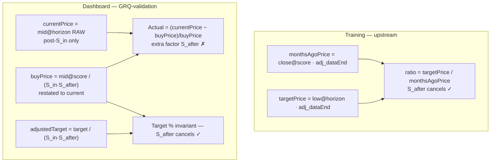
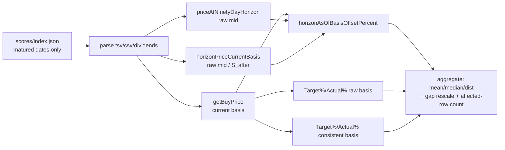

# Market-data timing & corporate-action parity: training vs dashboard

_Parity audit for Issue #555 (sub-issue of #544 — one candidate source of the
systematic Target-over-Actual measurement gap). User-raised candidate. The
training timing/adjustment lives upstream in the training repository; the
dashboard timing/adjustment lives in `GRQ-validation`._

## TL;DR

Of the four timing/corporate-action decisions the issue asked us to confirm,
**three are aligned** between training and the dashboard and **one is
divergent**:

1. **Horizon-date selection — aligned.** Training takes the trading day on or
   before `asOf + 90*DAY`; the dashboard takes the last market-data point on or
   before `scoreDate + 90 days`. On the stock's own daily series these resolve
   to the **same row**.
2. **OHLC field — divergent, but already owned upstream.** Training reads the
   intraday **low** at the horizon and the **close** at the score date; the
   dashboard reads the **midpoint** `(high + low) / 2` at both. These are the
   #552 (horizon field, ~+2.2 pp masking) and #554 (buy-price field, ~+0.05 pp)
   findings — not re-quantified here.
3. **Split/merge adjustment convention — aligned.** Both sides work on
   split-adjusted prices and restate a historical price into current
   (end-of-series) terms by dividing out the cumulative split factor for splits
   **after** that date.
4. **As-of split basis of the Actual horizon price — DIVERGENT (this audit's
   finding).** The dashboard restates the **buy price** and the **model target**
   into current terms, but reads the **Actual horizon price RAW**. When a
   reconcilable split falls **between the 90-day horizon and the end of the data
   series**, the Actual sits on a different split basis than the buy price it is
   divided by.

Measured over the matured historical score set (274 score dates, 5 444 included
stock-rows, as-of 2026-06-26): **123 rows** carry a reconcilable post-horizon
split. Restating their Actual onto the buy price's current basis moves the
portfolio gap by **+0.482 pp** (a forward split inflates Actual, _masking_ the
gap), while the per-row distortion is large and two-sided:

| Statistic (per-row offset `(rawHorizon − currentBasis) / buyPrice`) | Value |
| --- | --- |
| Mean | **+0.565 pp** |
| Median | +0.000 pp |
| Min | −316.116 pp |
| Max | +1395.893 pp |
| Std dev | 51.437 pp |

| Quantity (mean over 274 matured dates) | Value |
| --- | --- |
| Mean Target % | 28.916 % |
| Mean Actual % (raw horizon — current dashboard) | 10.447 % |
| Mean Actual % (split-consistent horizon) | 9.965 % |
| **Observed gap** (Target − Actual, raw) | **+18.470 pp** |
| Gap on the split-consistent basis | +18.952 pp |
| **As-of-basis contribution** (consistent − raw gap) | **+0.482 pp** |

> The mean raw Actual (10.447 %) reproduces the #554 audit's dashboard Actual
> figure exactly, confirming this diagnostic measures the **shipped** Actual,
> not a re-implementation.

## Parity table

Training (upstream) vs dashboard (`GRQ-validation`), each row marked **aligned**
or **divergent**:

| # | Decision | Training (upstream) | Dashboard (GRQ-validation) | Status | Direction if divergent |
| --- | --- | --- | --- | --- | --- |
| 1 | **Horizon-date selection** | `lowPrice` at `rewindToTradingDay(asOf + 90*DAY)` — trading day on/before exactly 90 days out (upstream horizon selection) | last point with `date <= scoreDate + 90 days` (`priceAtNinetyDayHorizon` / `currentPriceWithinWindow`) | **Aligned** | — (same row on the stock's own daily series) |
| 2 | **OHLC field — horizon** | intraday **low** (`market.lowPrice`) | **midpoint** `(high + low) / 2` | **Divergent** | mid ≥ low ⇒ Actual lifted ⇒ **masks** the gap; ~+2.2 pp — **owned by #552** |
| 3 | **OHLC field — buy/score point** | **close** (`monthsAgoPrice = closePrices[0]`, upstream close basis) | **midpoint** `(high + low) / 2` (`getBuyPrice`) | **Divergent** | symmetric ~+0.05 pp — **owned by #554** |
| 4 | **Split/merge adjustment convention** | adjusted series; cumulative factor from each date to the data end (upstream split-adjusted series accumulates `adj /= split` backwards) | on-the-fly restate-to-current via `computeSplitAdjustment` / `adjustHistoricalPriceToCurrent`, reconciliation-gated (`docs/projection.js:433-520`) | **Aligned** | — (same convention; reconciliation only _excludes_ a stock, it does not skew an included one) |
| 5 | **As-of split basis of the Actual horizon price** | both `monthsAgoPrice` (score close) and `targetPrice` (horizon low) carry the data-end `adj`; the post-horizon factor **cancels** in `targetPrice / monthsAgoPrice` | **buy price** & **target** restated to current terms, but the **Actual horizon price read RAW** (`getStockReturnBreakdown` app.js:4458, `currentPriceWithinWindow`) | **Divergent** | forward post-horizon split inflates Actual ⇒ **masks** (+0.482 pp portfolio); reverse split widens; ±extreme per-row (−316 → +1396 pp on 123/5 444 rows) |

## Why row 5 diverges (the mechanics)

Let `S_in` be the cumulative split factor for splits **between** the score date
and the horizon, and `S_after` for splits **between** the horizon and the end of
the data series.

- **Training** restates both the score close and the horizon low onto the
  data-end basis. The return ratio `targetPrice / monthsAgoPrice` reduces to
  `raw_low_horizon · S_in / raw_close_score` — the post-horizon factor `S_after`
  appears in both numerator and denominator and **cancels**. Economically
  correct: a split after the horizon does not change wealth.
- **Dashboard** computes `buyPrice = raw_mid_score / (S_in · S_after)` (restated
  to current terms by `getBuyPrice`) but `currentPrice = raw_mid_horizon`
  (**unadjusted**, already post-`S_in` because the split actually happened by the
  horizon). The Actual ratio becomes `raw_mid_horizon · S_in · S_after /
  raw_mid_score` — an **extra factor of `S_after`**. A 2:1 forward split after
  the horizon roughly **doubles** the displayed Actual for that stock; a reverse
  split deflates it.

**Target % is unaffected.** `calculateTargetPercentage` divides both
`adjustedTarget` and `buyPrice` by the same `S_in · S_after`, so the split
cancels: `(adjustedTarget − buyPrice) / buyPrice` is invariant to the
post-horizon split. The divergence therefore shifts **only** the Actual side.



## Fix recommendations & ruled-out notes

- **Row 1 — Horizon-date selection: ruled out.** The dashboard's "last point on
  or before `scoreDate + 90 days`" and training's `rewindToTradingDay(asOf +
  90*DAY)` pick the same trading day on the stock's own daily series. The only
  residual is training's `lowPrice` scan-back not crossing a **year boundary**
  (a rare exclusion, not a directional skew). **No change recommended.**
- **Row 2 / Row 3 — OHLC field: ruled out here; tracked in #552 / #554.** The
  field mismatch is real but already enumerated and quantified by the sibling
  audits. **No new action in this issue.**
- **Row 4 — Split/merge convention: ruled out.** Both sides use the same
  restate-to-current convention; the dashboard's reconciliation gate only drops
  a stock it cannot trust (`reliable === false`), it never skews an included
  row's adjustment relative to training. **No change recommended.**
- **Row 5 — As-of split basis of the Actual horizon price: FIX RECOMMENDED.**
  Read the Actual horizon price on the **same** current basis as the buy price,
  i.e. divide the raw horizon midpoint by `postHorizonSplitFactor` (the new
  `GRQProjection.horizonPriceCurrentBasis` helper). This removes the spurious
  `S_after` factor, brings Actual onto the buy price's basis, and matches
  training's cancellation. The portfolio-level effect is modest (**+0.482 pp**,
  a _masking_ term that means genuine model optimism must exceed the raw gap by
  this much), but the **per-row** distortion is large (up to +1 396 pp), so the
  fix is primarily a **correctness** improvement for individual stocks that split
  after their horizon. This is a behaviour change to the displayed Actual and
  should land as its own focused PR (with UI evidence), not inside this audit.

## Aggregate contribution to the gap

**+0.482 pp** (portfolio-level), a _masking_ term: forward post-horizon splits
dominate, so the shipped raw Actual is slightly **inflated**, and restating onto
the split-consistent basis would **widen** the observed Target-over-Actual gap
from 18.470 pp to 18.952 pp. Like #552 and #554, this candidate _offsets_
rather than causes the gap — but unlike them it also flags a genuine per-row
correctness bug worth fixing on its own merits.

## How this was measured (reproducible)

Every per-stock figure is delegated to the **shipped** kernels so the diagnostic
measures the dashboard's own basis, not a re-implementation:

- `GRQProjection.getBuyPrice` — split-adjusted midpoint buy price (current basis).
- `GRQProjection.priceAtNinetyDayHorizon` — raw midpoint Actual (shipped basis).
- `GRQProjection.horizonPointDate` — the date of the row the Actual is read from.
- `GRQProjection.postHorizonSplitFactor` — `S_after` (reliable splits after the
  horizon), added for this diagnostic.
- `GRQProjection.horizonPriceCurrentBasis` — the horizon midpoint restated onto
  the buy price's current basis.
- `GRQProjection.horizonAsOfBasisOffsetPercent` —
  `(rawHorizon − currentBasis) / buyPrice * 100`.
- `GRQProjection.calculatePortfolioTargetPercentage` /
  `calculateIncludedPortfolioPerformance` — Target % and Actual % on each basis
  over the same included set.

```bash
deno task diagnose-horizon-split-parity            # against docs/, as-of today
# raw form (pin an as-of date for a reproducible report):
deno run --allow-read scripts/diagnose_horizon_split_parity.ts docs 2026-06-26
```



## Code references

- Training horizon & adjustment: the upstream horizon-selection code
  (`rewindToTradingDay`, `lowPrice`, `restrictHistoryTo`), the upstream market
  code (`lowPrice`, `rewindToTradingDay`), the upstream close basis
  (`monthsAgoPrice = closePrices[0]`) and the upstream split-adjusted load.
- Dashboard horizon & adjustment: `GRQ-validation/docs/projection.js` —
  `priceAtNinetyDayHorizon`, `getBuyPrice`, `computeSplitAdjustment`,
  `adjustHistoricalPriceToCurrent`; `docs/app.js:4443-4490`
  (`getStockReturnBreakdown`, raw horizon price); `docs/trend_predictions.js`
  (`currentPriceWithinWindow`, `resolvePredictionStocks`).
- New parity helpers: `GRQ-validation/docs/projection.js` — `horizonPointDate`,
  `postHorizonSplitFactor`, `horizonPriceCurrentBasis`,
  `horizonAsOfBasisOffsetPercent` (this issue).
- Diagnostic: `scripts/diagnose_horizon_split_parity.ts`,
  `scripts/horizon_split_parity_diagnostic.ts`;
  tests `tests/horizon_split_parity_diagnostic_test.ts`.
