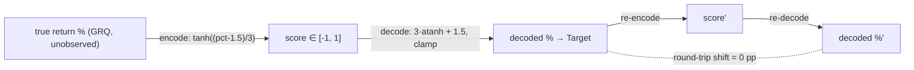

# Score→target decoding (`reverseProfitRecommend`): does decoding add bias?

_Diagnostic for Issue #556 (sub-issue of #544 — one candidate source of the
systematic Target-over-Actual measurement gap). User-raised candidate. The
score→target decode lives upstream in `GRQ`
(`GRQ/src/LearnUtilTypes.ts`, called at `GRQ/src/portfolio/ScoreApp.ts:473`);
this repo holds only the already-decoded Target in each score TSV._

## TL;DR

**Decoding is ruled out as a source of the Target-over-Actual gap.** Over the
realised score distribution the round-trip
`profitRecommend ∘ reverseProfitRecommend` shifts the Target by **0 pp**
(machine epsilon — max |shift| `1.78e-15` pp across all 7 108 stock-rows). The
asymmetric clamps the issue flagged cannot bias the realised data:

- The **+50% cap** (`score >= 1`) fires for a large share of rows but
  round-trips **cleanly** — it is consistent with its own forward mapping.
- The **`0`/-100% floor** (`score <= -1`) **never fires**: there is not a single
  negative score in the history, so the asymmetry that worried the issue is
  **dormant**.

The only residual candidate is **encode-side quantisation** (a saturated
`score == 1` is a fixed +50% point estimate of an unknown true intent ≥ the
saturation threshold). That is information lost in `GRQ` at _encode_ time and is
**not** a `reverseProfitRecommend` round-trip asymmetry — the dashboard decode
cannot recover or distort it. It is flagged below for `GRQ` but is out of scope
for this decode audit.

## The mapping under test

Forward (training encode) and reverse (dashboard decode):

```text
encode:  profitRecommend(pct)  = tanh((pct - 1.5) / 3)            pct → score
decode:  pct = 3 * atanh(score) + 1.5                             score → pct
         target = price * (1 + pct / 100)
clamps:  score >=  1 → +MAX_REVERSE_PERCENT (+50%)
         score <= -1 → target 0            (pct = -100%)
         interior pct capped to ±MAX_REVERSE_PERCENT (±50%)
```

`tanh` and `atanh` are exact inverses, so in the interior the decode reproduces
the encoded percentage exactly. The decode identity is anchored against the real
data: a `score == 1` row (NYSE:DD, Target 68.39) decodes to `1.5 × 45.59 =
68.39`, and an interior row (`score 0.70043`, buy 75.66) decodes to
`75.66 × (1 + 4.105/100) = 78.77` — both reproduce the stored Target.



## What the round-trip measures

The diagnostic feeds each realised score through
`reverseProfitRecommend → profitRecommend → reverseProfitRecommend` and reports
`pct₂ − pct₁` (a price-independent percentage-point shift in the implied
Target). A non-zero mean would mean the decode is _not_ a faithful inverse of
the training encode. It also takes a census of which clamp region each score
lands in, isolating the clamp contribution.

## Results (as-of 2026-06-26)

| Quantity | Matured only | All dates |
| --- | --- | --- |
| Score dates | 274 | 354 |
| Score rows | 5 508 | 7 108 |
| **Round-trip shift — mean** | **+0.000000 pp** | **+0.000000 pp** |
| Round-trip shift — max \|shift\| | `1.78e-15` pp | `1.78e-15` pp |
| Round-trip shift — std dev | 0.000000 pp | 0.000000 pp |

Clamp-region census (matured set; share of 5 508 rows):

| Region | Count | Share | Round-trips? |
| --- | --- | --- | --- |
| `interior` (clean inverse) | 2 976 | 54.03 % | yes (exact) |
| `cap_high` (`score >= 1` → +50%) | 2 532 | 45.97 % | yes (exact) |
| `floor_low` (`score <= -1` → target 0) | 0 | 0.00 % | n/a — never fires |
| `interior_cap_high` (interior pct > +50%) | 0 | 0.00 % | n/a — never fires |
| `interior_cap_low` (interior pct < −50%) | 0 | 0.00 % | n/a — never fires |

Across **all** 354 dates the census is `interior` 4 400 (61.90 %), `cap_high`
2 708 (38.10 %), and every other region 0. The realised scores span
`[0.174, 1.0]` — strictly positive — so the negative floor and both interior
caps are unreachable in practice.

## Acceptance criteria

1. **Quantified round-trip bias (pp, with sign).** **0 pp** (max |shift|
   `1.78e-15` pp — floating-point noise) over the realised score distribution.
   Sign is immaterial at that magnitude.
2. **Clamp + `min(volumeRecommend, …)` isolation.** The **+50% cap** fires for
   45.97 % of matured rows (38.10 % of all rows) and round-trips cleanly; the
   **`0`/-100% floor** fires for **0 %** (no negative scores exist); the interior
   ±50% caps fire for **0 %**. The asymmetry the issue described is real in the
   code but **dormant** in the data. The `min(volumeRecommend, priceRecommend,
   1)` interaction lives entirely upstream in `GRQ` training — it shapes which
   `pct` was encoded, not how the dashboard decodes a given score — and so
   contributes nothing measurable on the decode side. Its only footprint here is
   that 38–46 % of scores **saturate** to exactly 1, which is the encode-side
   point we hand to `GRQ` below.
3. **Whether decoding contributes to the gap → no.** Decoding does **not**
   contribute to the Target-over-Actual gap: it is an exact inverse on every
   realised score, and the asymmetric clamp that could have biased it never
   engages.
4. **Fix recommendation → explicit "ruled out".** No dashboard fix is warranted.
   `reverseProfitRecommend` is decoding faithfully. **Ruled out.**

## Residual (encode-side) candidate — for `GRQ`, not this decode

A `score == 1` is a _saturated_ encode: `tanh` reaches 1.0 (in float) for any
true return above roughly +28 %, so 38–46 % of names that "wanted ≥ ~28 %" all
collapse to the same score and the dashboard decodes every one of them to a
fixed **+50 %**. If the true intent of those saturated names averages **below**
+50 %, the decoded Target over-states them — a _plausibly upward_ contribution to
Target-over-Actual. Crucially this is **information lost at encode time inside
`GRQ`**, not a `reverseProfitRecommend` asymmetry: the dashboard receives only
the saturated score and cannot recover the lost magnitude. Resolving it needs
the _training-side_ distribution of true `pct` for saturated names, which lives
in `GRQ` and is outside this repo's data.

**Recommendation:** keep the dashboard decode as-is (ruled out), and raise a
`GRQ` issue to check whether saturating the score at +50 % on decode is the right
point estimate for the ~38–46 % of names that hit `score == 1` — i.e. whether
the encode should reserve headroom above +50 % or the decode should use a
distribution-aware estimate rather than the cap. Cross-referenced from this
sub-issue of #544.

## Reproduce

```bash
deno task diagnose-score-target-decoding            # matured set, as-of today
deno run --allow-read \
  scripts/diagnose_score_target_decoding.ts docs 2026-06-26 all   # all dates
```

The computation reuses the **shipped** score parser
(`docs/trend_predictions.js → GRQTrendPredictions.parseScoreTsv`), so the scores
it reads are exactly the column the dashboard reads. The `profitRecommend` /
`reverseProfitRecommend` functions are ported faithfully from
`GRQ/src/LearnUtilTypes.ts` (the source of truth lives upstream in `GRQ`).
