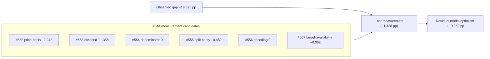

# Whole-application sweep + residual-gap reconciliation

_Catch-all audit for Issue #557 (sub-issue of milestone #544 — the systematic
Target-over-Actual measurement gap). User-raised: "anywhere in this
application". This is the final sub-issue: after the targeted candidates
(#552–#556) were quantified, it sweeps the rest of the validation pipeline for
any other same-direction asymmetry and reconciles the residual gap._

## TL;DR

The aggregation layer is **symmetric**: Target and Actual are aggregated by the
**same equal-weight rule** over the **same `isStockIncluded` gate**, through the
**same shared kernels**. The sweep found exactly one residual aggregation-layer
asymmetry — the **target-availability denominator skew** (priceable stocks with
a missing target are counted in Actual but dropped from Target) — and it is
**immaterial and masking, not inflating** (−0.062 pp over 131 of 5 444 included
rows).

Reconciling the observed gap against every quantified #544 candidate:

| Candidate (sign: + inflates the apparent gap, − masks it) | pp |
| --- | --- |
| #552 price-basis (mid vs low horizon) | **−2.242** |
| #553 dividend-basis (flat quarter vs windowed) | **+1.358** |
| #554 buy-price denominator (mid vs close) | +0.000 |
| #555 horizon as-of split parity | **−0.482** |
| #556 score→target decoding | +0.000 |
| #557 target-availability skew (this sweep) | **−0.062** |
| **Net measurement** | **−1.428** |
| **Observed gap** (mean Target − mean Actual) | **+18.525** |
| **Residual — genuine model optimism** | **+19.952** |

The measurement candidates **roughly cancel and, on balance, slightly mask** the
gap. So the residual genuine model optimism (**+19.95 pp**) is essentially the
whole observed gap (**+18.53 pp**) — in fact a touch larger, because the
dashboard's measurement choices net to a small masking effect. **There is no
hidden measurement asymmetry left to find; the gap is genuine model optimism.**

All figures are computed by the shipped dashboard kernels over the matured
historical score set (274 score dates, 5 444 included stock-rows, as-of
2026-06-26). Reproduce with:

```bash
deno task diagnose-residual-gap docs 2026-06-26
```

## Audited-area checklist

Each area below was checked for an **apples-to-oranges, same-direction**
asymmetry that would push Target over Actual **only in aggregate**.

| # | Area | Verdict | Direction / magnitude |
| --- | --- | --- | --- |
| 1 | **Aggregation weighting** | ✅ Aligned | Both series are an **equal-weight mean** over included stocks. No bias. |
| 2 | **Inclusion / exclusion gate** | ✅ Aligned | Both call the **same `isStockIncluded`** predicate; no tail is dropped asymmetrically by the gate. |
| 3 | **Target-availability (null/NaN target)** | ⚠️ Real but immaterial | Missing-target rows counted in Actual, dropped from Target. **−0.062 pp** (masking), 131/5 444 rows. |
| 4 | **Rounding / truncation** | ✅ Ruled out | Series values are raw floats; `toFixed`/`formatPercentage` affect **display only**, both sides identically. |
| 5 | **NaN / null handling** | ✅ Ruled out (bar #3) | A date with no included stocks drops **both** series together; the only one-sided drop is the target case in #3. |
| 6 | **Currency / FX timing** | ✅ Ruled out | Returns are **price-relative ratios** in each stock's own quote currency; no FX conversion enters the `%` path. |
| 7 | **Divergent code paths** | ✅ Aligned | Dashboard, Trend view and the Rust backend all route Target/Actual through the **same `projection.js` kernels** (and `is_priceable`). |

### 1–2. Aggregation weighting and the inclusion gate — aligned

Both portfolio series are built by the same shared kernels in
`docs/projection.js`:

- **Actual %** — `calculateIncludedPortfolioPerformance(stocks)`: filters by
  `isStockIncluded`, then returns the **mean** of the per-stock total returns
  (`sum / includedReturns.length`).
- **Target %** — `calculatePortfolioTargetPercentage(stocks)`: filters by the
  **same** `isStockIncluded`, then returns the **mean** of the per-stock target
  percentages (`totalTarget / validStocks`).

Both are equal-weight (1/N over the included set), both apply the **identical**
inclusion predicate, and the equal-weight policy is the issue-#429/#288 design.
The `isStockIncluded` gate keys only on **price/split usability** (usable buy
price, usable current price, reliable split) — it is **target-blind and
actual-blind**, so it cannot drop losers or winners preferentially. The backend
mirrors it with `is_priceable` (`src/utils.rs`). **No weighting or gate
asymmetry.**

### 3. Target-availability denominator skew — the one residual asymmetry

The Target kernel has one extra drop the Actual kernel does not: it skips
included stocks whose `adjustedTarget` is `null`/`NaN` (a score row with no
parseable target). The Actual kernel keeps those same rows. So the two portfolio
**means span slightly different subsets** — the only same-direction asymmetry the
sweep surfaced.

It is quantified by re-aggregating **both** series over the matched
(target-present) subset and reading off the gap difference
(`scripts/residual_gap_reconciliation.ts`):

- Dropped-target rows: **131** of **5 444** included rows (2.4 %).
- Observed gap **+18.525 pp**; matched-subset gap **+18.586 pp**.
- Skew = observed − matched = **−0.062 pp**.

The sign is **negative**: the dropped-target rows are, on average, marginal
winners, so excluding them from Target lifts the matched gap slightly — i.e. the
as-shipped skew **masks** (does not inflate) the gap, and by a negligible amount.
It is far too small and the wrong direction to be a cause; left as-is.

### 4. Rounding / truncation — ruled out

The aggregation path is floating-point throughout (`sum / count`, `(t − b) / b`).
The only rounding is in the **display** layer (`formatPercentage`, `toFixed`),
applied **after** the series is computed and **identically** to both Target and
Actual. No directional rounding enters the computed gap.

### 5. NaN / null handling — ruled out (beyond #3)

`buildMaturedTrendSeries` skips a date entirely when its Actual is `null` (no
included stocks), which removes **both** series for that date together — no tail
is lost on one side. Within a date, the only one-sided null drop is the
target-availability case already quantified in #3. (Note: when included stocks
exist but **none** has a target, `calculatePortfolioTargetPercentage` returns the
20.0 % fallback; over the matured set every such date has at least one target, so
the fallback never fires in aggregate.)

### 6. Currency / FX timing — ruled out

Every portfolio figure is a **ratio** — `(currentPrice − buyPrice + dividends) /
buyPrice` and `(target − buyPrice) / buyPrice` — computed from prices in the
stock's own quote currency, with the **same `buyPrice` denominator on both
sides**. No per-stock FX conversion is applied inside the `%` path, so an FX rate
(or its timing) cancels and cannot desynchronise Target from Actual.
`docs/USDAUD.json` feeds currency **display** elsewhere, not the gap maths.

### 7. Divergent code paths — aligned

Target and Actual are never computed by drifting copies:

- The **dashboard** totals (`docs/app.js`) delegate to
  `GRQProjection.calculatePortfolioTargetPercentage` /
  `calculateIncludedPortfolioPerformance`.
- The **Trend view** (`docs/trend_series.js`) delegates to the **same** two
  kernels.
- The **Rust backend** (`src/utils.rs`) shares the `is_priceable` rule and the
  equal-weight average.

The single benign difference: the dashboard's live index uses
`currentPriceFromLatest` while the matured Trend/reconciliation path uses the
midpoint of the last in-window point — these resolve to the **same row** for a
matured prediction, so they agree on the analysis here.

## Reconciliation method and sign convention

Each candidate's contribution is signed by its effect on the **apparent
(dashboard) gap**: **positive** means the measurement choice **inflates** the
apparent gap (correcting it would narrow the gap); **negative** means it
**masks** the gap (correcting it would widen it). The #552–#556 magnitudes are
the values each sub-issue's own diagnostic published over the same matured set;
the #557 target-availability term is computed here. The residual genuine optimism
is `observed gap − net measurement`.



Because the candidates net to a **small masking** effect (−1.428 pp), the
residual optimism (**+19.95 pp**) slightly **exceeds** the observed gap. In other
words, the dashboard's measurement choices, taken together, make the model look
**marginally better** than a strictly like-for-like, trained-basis comparison
would — so none of the gap is an artefact that flatters the model. The full
+18.5 pp (≈ +20 pp like-for-like) is **genuine model optimism**.

## New finding fed back to #544?

No material new same-direction asymmetry was found. The only sweep finding —
the target-availability skew — is **−0.062 pp** and **masking**, so it does not
warrant its own quantification sub-issue. The catch-all is therefore closed with
the reconciliation above rather than a new #544 child.

## Reproducing

```bash
# Full reconciliation over the committed matured score set
deno task diagnose-residual-gap docs 2026-06-26

# Unit tests (real kernels + aggregation, synthetic data)
deno test --allow-read --allow-write tests/residual_gap_reconciliation_test.ts
```
