# Confirm upstream training `volumeRecommend` guard down-ranks low-volume names

_Verification for Issue #579 (sub-issue of #563 — "flag/exclude low-volume
stocks & never recommend"). The guard lives in the upstream training
repository; this document is the written confirmation requested by the
issue's acceptance criteria. **No production code is changed** — the
investigation confirms the existing guard is applied and biting, so no tuning
is warranted._

## TL;DR

The `volumeRecommend` liquidity guard is **applied on the single training-label
path and is biting**: any name whose average daily dollar volume over the last
10 weekdays is below `BUDGET_DOLLARS = 10000` is forced to a training score of
`-1` (strong sell / never-recommend), regardless of how bullish its price
signal is. The `averagePV / 100` cents→dollars conversion is correct for the
current data. **No tuning is required.**

```mermaid
flowchart LR
    A[avg daily $ volume<br/>last 10 weekdays] --> B{averagePV / 100<br/>&lt; $10,000?}
    B -- yes --> C[volumeRecommend = -1]
    B -- no --> D[volumeRecommend =<br/>1 − BUDGET/dollarsPV<br/>capped 0.5 / 1]
    C --> E[recommend = max&#40;min&#40;volumeRecommend, priceRecommend, 1&#41;, -1&#41;]
    D --> E
    E --> F[training output = -1<br/>when volumeRecommend = -1]
```



## 1. The guard is applied on every path (no bypass)

The training label is produced in exactly **one** place. A repo-wide search for
output-array producers in the upstream training code returns a single hit:

- the upstream training-label producer — `output: [recommend]` is the only
  construction of a training item's `output`.

`recommend` is always the capped value computed immediately above it:

```ts
// upstream training code
const recommend = Math.max(
  Math.min(core.volumeRecommend, priceRecommend, 1),
  -1,
);
```

Because `volumeRecommend` enters through `Math.min`, it can only ever **lower**
the score — it can never lift a name. When `volumeRecommend === -1`, the inner
`Math.min(...)` is `-1`, so `recommend` is pinned to `-1` no matter how strong
`priceRecommend` is. There is no alternative code path that builds a training
output without passing through this cap.

## 2. `volumeRecommend` definition (single source of truth)

`volumeRecommend` is computed in the upstream training code from the last
10 weekdays of volume and intraday-low price:

```ts
// upstream training code (abridged)
const averagePV = totalPV / volumes.length;           // Σ(volume × lowPrice) / n, in CENTS·shares
if (averagePV / 100 < BUDGET_DOLLARS) {                // below $10,000/day ⇒ never recommend
  volumeRecommend = -1;
} else {
  const dollarsPV = averagePV / 100;
  const marketPercentOfTrade = 1 - (BUDGET_DOLLARS / dollarsPV);
  // … capped to 0.5 (when < 0.99) or 1
}
```

`BUDGET_DOLLARS = 10000` is defined once in the upstream training code and
is the **only** threshold — this verification deliberately reuses it rather than
inventing a new one.

## 3. Units assumption confirmed — upstream prices are in cents

The `averagePV / 100` conversion assumes upstream stores prices in **cents**. This is
correct for the current data:

- the upstream training code — `dollars[i] = v != null ? v / 100 : null;` converts a
  stored price to dollars by dividing by 100, i.e. stored prices are cents.
- the upstream training code — `totalTradedDollars += v * p / 100;`
  computes dollar volume as `volume × price / 100`, the same cents→dollars rule.

So `totalPV = Σ(volume × lowPriceInCents)` is in cents·shares, and `averagePV /
100` is the average daily dollar volume in **dollars**, directly comparable to
`BUDGET_DOLLARS = 10000` dollars. The dashboard's port in
`docs/volume_recommend.js` documents the mirror-image of this caveat (its CSVs
are already in dollars, so it omits the `/100`), reusing the same definition.

## 4. Empirical confirmation — the guard bites at the $10,000/day cliff

Driving the **real** upstream `profitRecommend` and `BUDGET_DOLLARS` exports with a
sweep of average daily dollar volumes (price fixed at $1.00/share so daily
dollar volume equals the share volume), against a strong BUY price signal
(`priceRecommend(+10% gain) = 0.9931`):

| Avg daily $ volume | `volumeRecommend` | Final training score | Outcome |
| ---: | ---: | ---: | --- |
| $1,000 | −1.0000 | **−1.0000** | suppressed |
| $5,000 | −1.0000 | **−1.0000** | suppressed |
| $9,900 | −1.0000 | **−1.0000** | suppressed |
| $9,999 | −1.0000 | **−1.0000** | suppressed |
| $10,000 | 0.0000 | 0.0000 | at threshold |
| $10,001 | 0.0001 | 0.0001 | passes |
| $11,000 | 0.0909 | 0.0909 | passes |
| $50,000 | 0.5000 | 0.5000 | passes |
| $5,000,000 | 0.9980 | 0.9931 | passes (price-limited) |

Every name below the `$10,000`/day budget is forced to `−1` **despite** the
+0.9931 BUY price signal — the guard overrides bullish price momentum exactly as
intended. Above the budget, `volumeRecommend` ramps up from 0 and stops
constraining the score once it exceeds `priceRecommend` (the $5M row settles at
the price-limited 0.9931).

This reproduces the behaviour of the debug probe in the upstream training code
(`recommend + "(" + core.volumeRecommend + "," + priceRecommend + …`), which
surfaces the same two components on the training path.

## 5. Conclusion — applied, biting, no tuning

- **Applied on all paths:** the sole training-output producer
  (the upstream training-label producer) always passes `volumeRecommend` through
  the `Math.min(…)` cap in the upstream training code. No bypass exists.
- **Biting:** sub-`$10,000`/day names are pinned to `−1` even against a maximal
  BUY price signal (§4).
- **Units correct:** prices are cents; `averagePV / 100` yields dollars,
  matching `BUDGET_DOLLARS` (§3).

The acceptance criteria are met by this written confirmation. Per the issue's
"tune **only if** needed" scope, **no change to `BUDGET_DOLLARS` or the
`volumeRecommend` definition is made** — there is no evidence the guard is
failing to down-rank low-volume names.
