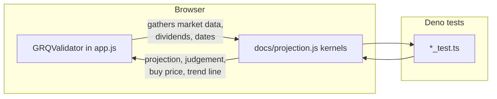

# Convert remaining TS mock-validator tests to the shared projection module

## Summary

Follow-up to #80. The nine remaining test files each defined their own `Mock*`
validator and asserted on a **parallel reimplementation** of the dashboard's
projection/scoring maths rather than on production code — tautologies that stay
green even when `docs/app.js` drifts. Several of those copies had in fact already
drifted from production (the judgement thresholds and the hybrid-projection
fallbacks differed).

This change extends `docs/projection.js` (the shared classic-script module
published on `globalThis`, mirroring `docs/escape.js`) with the remaining pure
kernels, rewires `GRQValidator` to delegate to them, and points every test at
the real functions. The maths now has a single source of truth that both the
browser dashboard and the Deno tests exercise. Behaviour is preserved — the
fixture-based SCHW integration test still passes against the extracted kernels.

Fixes #100.

### New kernels in `docs/projection.js`

- `formatCurrency` — USD formatting with `N/A` guard
- `getSplitAdjustment` / `adjustHistoricalPriceToCurrent` — dilution maths
- `getBuyPrice` — 5-day forward search + split adjustment
- `currentPriceFromLatest` — latest-point midpoint
- `calculateTargetPercentage` — target return vs buy price
- `calculateRSquared` / `computeTrendLine` — linear regression through the origin
- `daysElapsedFromMarketData` — capped day count
- `computeHybridProjection` — the 90-day projection decision tree
- `computeJudgement` — the performance → judgement string mapping

`GRQValidator` methods (`getBuyPrice`, `calculateTrendLine`,
`calculateHybridProjection`, `calculateJudgement`, `getCurrentPrice`,
`calculateTargetPercentage`, the split-adjustment helpers, `formatCurrency`,
`getDaysElapsedFromMarketData`) now gather their inputs (market data, dividends,
buy price) and delegate the maths to these kernels.

### Data flow



## Evidence

Backend/maths change with no web UI to screenshot. Verified by the Deno test
suite: all nine converted files now drive the real kernels, plus a new
`tests/projection_kernels_test.ts` adds direct happy/error/edge coverage. The
fixture-based `schw_projection_test.ts` passing against the extracted kernels is
the key proof the extraction is faithful — its real Apr–Jul 2025 SCHW data still
yields >15% current performance, >19% projection and R² > 0.3.

```
deno test --allow-read tests/*.ts
ok | 137 passed (57 steps) | 0 failed
```

## Test Plan

Converted to exercise the real shared kernels (no behaviour silently dropped;
mock maths replaced, DOM/parse glue retained where out of `projection.js` scope):

- `tests/realistic_projection_test.ts` → `computeHybridProjection`
- `tests/judgement_hybrid_test.ts` → `computeHybridProjection` + `computeJudgement`
- `tests/hybrid_projection_tests.ts` → `computeTrendLine` + `computeHybridProjection`
- `tests/schw_projection_test.ts` (fixtures) → buy price, trend line, projection
- `tests/buy_price_logic_test.ts` → `getBuyPrice`, split adjustment, target %
- `tests/current_price_consistency_test.ts` → `currentPriceFromLatest`, `setDateToMidnight`
- `tests/basic_score_table_test.ts` → `formatCurrency`
- `tests/portfolio_view_consistency_test.ts` → buy price, trend line, day count
- `tests/chart_data_test.ts` → performance return, price adjustment, target %

Added:

- `tests/projection_kernels_test.ts` — 23 direct unit tests covering every new
  kernel across happy paths, error paths and edge cases (null inputs, <3 points,
  -100 floor, [-100, 200] clamp, 90-day day-count cap, confidence gates).

### Notes

- Test market-data dates use local-midnight constructors so they match the
  kernel's local-midnight date comparison regardless of the runner's timezone;
  date assertions use local getters rather than `toISOString` (which shifts
  across the date line in non-UTC offsets).
- Drifted mock judgement/projection thresholds were corrected to match
  production; affected assertions were re-derived from the real kernel output.

### Deno regression avoided

- Extended the existing Deno-native shared module and `deno test` suite; no Node
  tooling, bundler, or `package.json` introduced.
