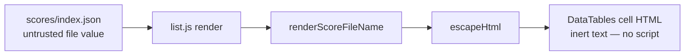

# Fix stored/DOM XSS via unescaped score filename in docs/list.js

## Summary

The score-list page (`docs/list.html` + `docs/list.js`) rendered the `file`
field from the untrusted `docs/scores/index.json` as DataTables cell HTML
without escaping. DataTables inserts a `render` callback's `display` return
value as **HTML**, so a score filename bearing HTML metacharacters (e.g.
`.tsv`) would execute as script in
every visitor's browser.

The fix reuses the existing `escapeHtml` helper (added for issue #63). To keep
the render logic unit-testable without pulling the browser-only `list.js` into
Deno, the file-name render was extracted into a small shared classic-script
helper `docs/list_render.js` that HTML-escapes the value after stripping the
`.tsv` suffix. `docs/list.html` now loads `escape.js` and `list_render.js`
before `list.js`, mirroring `docs/index.html`.

The other `render` callbacks were audited: the numeric columns (`.toFixed`)
and the `encodeURIComponent(row.file)` href are already safe and left
unchanged.

Closes #103.

## Evidence

Headless-Chrome screenshot of a harness that feeds three payloads through the
real shipped `renderScoreFileName` helper and inserts each return value as
`innerHTML` (the same sink DataTables uses). `window.alert` was overridden to
flag any successful XSS — none fired; every payload renders as inert text:

## Test Plan

- Added `tests/list_render_test.ts` exercising the real `docs/list_render.js`
  helper:
  - publishes `renderScoreFileName` on `globalThis`
  - strips the `.tsv` suffix
  - escapes an `` payload so no raw angle brackets survive
  - escapes all HTML metacharacters (`<>&"'`)
  - leaves an ordinary filename untouched
  - returns an empty string for `null`/`undefined`
- Full Deno suite passes: `deno test --allow-read tests/*.ts` → 233 passed.
- `deno fmt --check`, `deno lint`, and `deno check` all clean.
- No Rust sources were changed, so the Cargo portions of `quality.sh` are
  unaffected.
