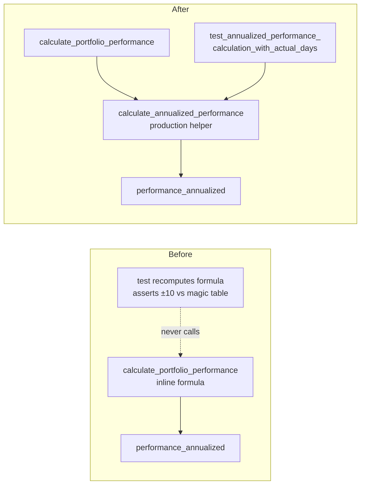

# PR Summary — Issue #104

## Summary

The annualised-performance formula was "tested" by re-deriving it inside the
tests and asserting on that local copy — the production code path was never
called. This PR makes the Rust test a genuine **WHAT-test against production**
and removes the redundant recompute-only TypeScript cases. Closes #104.

Specifically:

- **Rust (`src/utils.rs`)** — extracted the inline annualisation formula from
  `calculate_portfolio_performance` into a small public production helper,
  `calculate_annualized_performance(performance_pct, days_elapsed)`. Production
  now calls this helper to fill `performance_annualized`, and the test
  `test_annualized_performance_calculation_with_actual_days` now calls the
  **same** helper instead of recomputing the formula. The expected-value table
  is justified from the spec formula
  (`ANNUALIZED_PERFORMANCE_CALCULATION.md`) in comments, and the tolerance was
  tightened from a sloppy ±10 to ±0.1.

- **TypeScript (`tests/annualized_performance_test.ts`)** — deleted the
  recompute-only tests that redefined the formula as local arrow functions
  (`calculateAnnualized`, `calculateAnnualizedWithActualDays`,
  `calculateAnnualizedWithFixed90Days`) and asserted on their own output. The
  dashboard does **not** annualise in JS — it reads the Rust-computed
  `performance_annualized` from `index.json` — so there is no shipped JS helper
  for these tests to drive, and adding one would be dead production code
  (`docs/projection.js` helpers are all genuinely consumed by `docs/app.js`).
  Per issue #104 option (b), deletion is the correct outcome. A documentation
  comment records exactly which cases were removed and why.

### Why this is now a real test

A mutation check confirms the fix. Changing the production exponent
(`365.25` → `300.0`) in `calculate_annualized_performance` makes the Rust test
**fail**:

```
Performance 2% over 5 days: Expected 324.9%, got 228.1031%, difference: 96.7969%
test result: FAILED.
```

Before this change the test recomputed its own copy of the formula, so the same
mutation would have left it green.

## Evidence

This is a backend/test-only change — no web UI was modified, so there is no
screenshot. Evidence is the test runs below and the mutation check above.



- `cargo test` — 25 Rust tests pass (including the rewritten WHAT-test).
- `deno test --allow-read tests/*.ts` — 137 Deno tests pass.
- `cargo clippy` (all targets + tests), `cargo fmt --check`, `deno fmt`,
  `deno lint`, `deno check`, and `./quality.sh` all pass cleanly.

## Test Plan

- **Modified** `src/utils.rs::tests::test_annualized_performance_calculation_with_actual_days`
  to call the production helper `calculate_annualized_performance` instead of
  recomputing the formula; tolerance tightened to ±0.1 with spec-derived
  expected values.
- **Added** production helper `calculate_annualized_performance` (used by
  `calculate_portfolio_performance` and the test — single source of truth).
- **Removed** the following recompute-only TypeScript tests (they re-derived the
  Rust formula in JS and verified their own copy; no JS production path exists):
  `Annualized Performance Formula Verification`,
  `Annualized Performance Edge Cases`,
  `Annualized Performance - Actual Days vs Fixed 90 Days`,
  `Annualized Performance - Market Data Days vs Calendar Days`,
  `Annualized Performance - Early Stage Scenarios`,
  `Annualized Performance - Edge Cases and Error Handling`,
  `Annualized Performance - Zero Bug Investigation`.
- **Retained** TypeScript tests covering distinct concerns:
  `Annualized Performance Calculation - Compound Interest` (compound-vs-simple
  guard, cross-checked against the documented real-data table in
  `ANNUALIZED_PERFORMANCE_CALCULATION.md`),
  `Average Annualized Performance Calculation` (index.json averaging), and
  `Hybrid Projection - Realistic Annualized Performance` (dampening algorithm).

### Note on test removal

Per the repository convention of not silently removing tests, the deletions are
documented here and in an in-file comment. They are the explicit option (b)
resolution offered by issue #104: recompute-only cases that re-derive the
formula and check it against themselves add no signal beyond `deno check`, and
the formula's production home (Rust) is now covered by a real WHAT-test.
