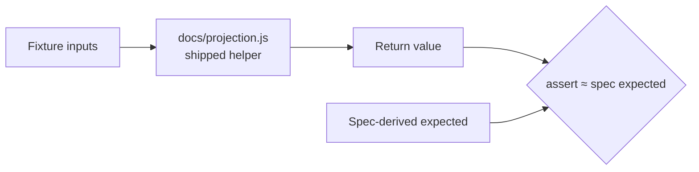

# PR Summary — Issue #109

## Summary

`tests/target_percentage_tests.ts` and `tests/portfolio_target_tests.ts`
imported nothing from the shipped code. Each test recomputed the
target-percentage / split-adjustment / portfolio-return formula **inline** and
asserted the result against a hand-evaluation of the same arithmetic — and
`portfolio_target_tests.ts` even asserted the literal `20.0` against itself.
These were tautologies: they exercised zero production code, so a genuine
regression in the real maths left every assertion green.

This PR rewrites both suites as WHAT-tests (resolution (a) from the issue): they
now `import "../docs/projection.js"` and drive the shipped helpers
(`calculateTargetPercentage`, `getSplitAdjustment`,
`adjustHistoricalPriceToCurrent`, `calculatePerformanceReturn`) with the fixture
inputs, asserting on the helpers' **return values** against spec-derived expected
numbers. The inline formula recomputation and the literal-versus-itself check are
gone. `portfolio_target_tests.ts` fixtures were corrected so each stock models a
genuine ~20% target spread (`buyPrice` below `target`) instead of the previous
`buyPrice == target`, which produced a 0% target the tautological test masked.

Closes #109.

## Evidence

This is a test-only change (TypeScript) with no web interface, so no screenshot
applies. The fix is verified by behaviour:

- Full Deno suite green: `233 passed (57 steps) | 0 failed`.
- **Regression check** — temporarily breaking `calculateTargetPercentage` in
  `docs/projection.js` (returning `* 90` instead of `* 100`) now turns **7 steps
  red** across both files; the unmodified production code keeps them green. The
  former tests stayed green under the same break.

Before: the test computed the formula itself and compared against its own
hand-evaluation — production code (`P`) was never on the path.

## Test Plan

- `tests/target_percentage_tests.ts` — rewrote every arithmetic step to call
  `GRQProjection.calculateTargetPercentage`, plus `getSplitAdjustment` /
  `adjustHistoricalPriceToCurrent` for the split-adjustment steps; added a
  null-guard edge case.
- `tests/portfolio_target_tests.ts` — replaced the `20.0 ≈ 20.0` literal check
  and the inline portfolio-return recomputation with calls to
  `calculateTargetPercentage` and `calculatePerformanceReturn`; corrected
  fixtures to a real 20% target spread.
- Verified with `deno test --allow-read tests/*.ts` and the full `./quality.sh`.
