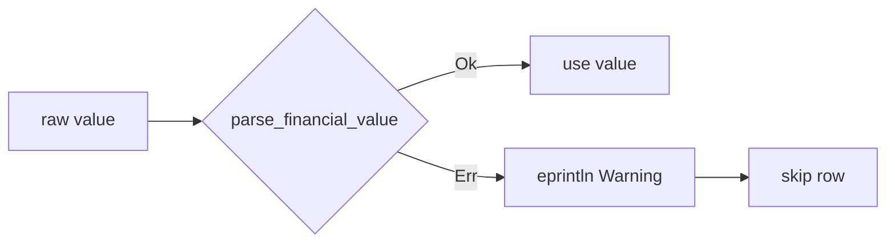

# Surface silent numeric parse failures in `src/utils.rs`

## Summary

Three library functions in `src/utils.rs` silently swallowed failed numeric
parses of financial values — coercing a bad close price to `0.0` (then dropping
it via the `> 0.0` guard) or quietly omitting an unparseable price/dividend from
the result. A single malformed upstream value therefore disappeared from
portfolio averages and total-return figures with no warning, producing a
plausible-but-wrong number that was hard to trace.

This change routes all three parse sites through a new `parse_financial_value`
helper that logs a `Warning:` line to stderr (matching the existing warning
convention) identifying the offending value and its context, then skips the row.
Bad data is now visible to the operator instead of being silently coerced or
dropped.

Sites fixed:

- `read_market_data_from_csv` — non-numeric close column was `unwrap_or(0.0)`;
  now logged and skipped.
- `filter_market_data_by_date_range` — unparseable close silently omitted;
  now logged and skipped.
- `filter_dividend_data_by_date_range` — unparseable dividend amount silently
  dropped; now logged and skipped.

Closes #110.

## Evidence

This is a backend/CLI library change with no web interface to screenshot. It is
verified by the new unit tests below; the full `./quality.sh` gate (fmt, clippy,
type checks, Rust tests, Deno tests/lint/check) passes cleanly.

## Test Plan

Added to the `#[cfg(test)]` module in `src/utils.rs`:

- `test_parse_financial_value_valid` — helper returns `Some` for valid numerics
  (including `0` and negatives).
- `test_parse_financial_value_invalid` — helper returns `None` for non-numeric,
  empty, and garbage input rather than coercing to `0.0`.
- `test_filter_market_data_skips_unparseable_close` — an unparseable close is
  dropped while valid rows survive.
- `test_filter_dividend_data_skips_unparseable_amount` — an unparseable dividend
  amount is dropped while valid rows survive.
- `test_read_market_data_from_csv_skips_unparseable_close` — a CSV row with a
  non-numeric close is skipped while valid rows are retained.

All existing tests remain unchanged and pass.
