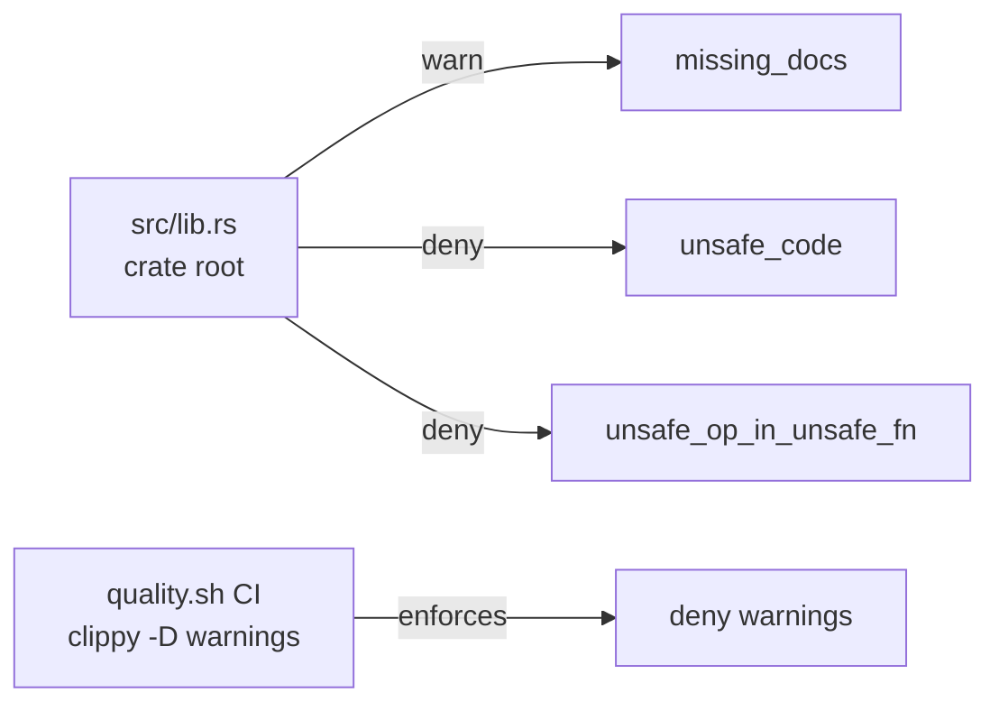

# Add a crate-root lint posture to the library crate

## Summary

The library crate root (`src/lib.rs`) previously declared only
`#![warn(missing_docs)]` (added in #97) and no other lint posture. This PR
adds explicit per-lint denies at the crate root so hygiene is enforced at
compile time rather than discovered later. Closes #116.

Changes to `src/lib.rs`:

```diff
 #![warn(missing_docs)]
+#![deny(unsafe_code)]
+#![deny(unsafe_op_in_unsafe_fn)]
```

- `deny(unsafe_code)` — the crate is pure safe Rust (no `unsafe` blocks or
  functions), so denying unsafe at the root makes any future `unsafe` an
  explicit, reviewed decision.
- `deny(unsafe_op_in_unsafe_fn)` — future-proofs the crate so unsafe
  operations inside any future `unsafe fn` require their own `unsafe` block.

### Why not `#![deny(warnings)]` in source?

The issue notes `#![deny(warnings)]` is often too strict for day-to-day
builds and suggests scoping it to CI. The repo already does exactly this:
`quality.sh` runs `cargo clippy --all-targets --all-features -- -D warnings`,
so warnings already fail CI. Hard-coding `#![deny(warnings)]` into the source
would break local builds on compiler upgrades, so it is deliberately left to
CI.

## Evidence

Backend/library-only change — no web interface to screenshot.

- `cargo clippy --lib --all-features -- -D warnings` passes with the new
  posture (no warnings surfaced).
- Full `./quality.sh` passes: `cargo fmt --check`, clippy (`-D warnings`),
  `cargo check`, `cargo test` (Rust), and the Deno test/lint/check suite —
  `233 passed | 0 failed`.



## Test Plan

Added `tests/crate_lint_posture_test.rs` (TDD — written before the source
change; the two new assertions failed first, then passed after editing
`src/lib.rs`):

- `crate_root_warns_on_missing_docs` — guards the existing `missing_docs`
  warning against removal.
- `crate_root_denies_unsafe_code` — asserts the new `deny(unsafe_code)`.
- `crate_root_denies_unsafe_op_in_unsafe_fn` — asserts the new
  `deny(unsafe_op_in_unsafe_fn)`.

A lint posture is compile-time configuration with no runtime surface, so the
tests assert on the committed crate root — mirroring the existing
`license_metadata_test.rs`, which verifies the committed LICENSE against the
manifest. They fail loudly if the posture is later removed or weakened, which
is the regression the issue describes.
