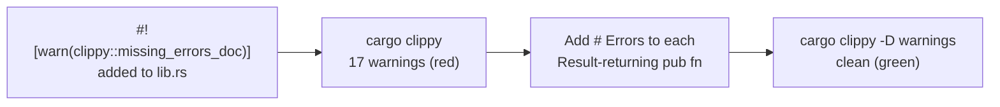

# PR Summary — Document failure modes on public utils functions

## Summary

`src/utils.rs` already carried a one-line `///` summary on every public item
(enforced by the existing `#![warn(missing_docs)]`), but none of its
`Result`-returning functions documented their failure modes. This left the
Rust API Guidelines C-FAILURE gap called out in the issue.

This PR adds a `# Errors` section to all 17 `Result`-returning public functions
in `src/utils.rs`, describing the conditions under which each returns an error
(missing/invalid files, malformed JSON, invalid dates, path-traversal guards,
etc.). It also enables `#![warn(clippy::missing_errors_doc)]` at the crate root
so the compiler enforces this coverage going forward, complementing the
existing `#![warn(missing_docs)]` posture.

Closes #117.

## Approach

Functions documented: `read_index_json`, `build_score_file_path`,
`read_tsv_score_file`, `extract_ticker_codes_from_score_file`,
`read_market_data`, `read_market_data_from_csv`,
`filter_market_data_by_date_range`, `create_market_data_csv_for_score_file`,
`create_market_data_csv`, `create_market_data_long_csv`,
`create_market_data_long_csv_for_score_file`, `read_dividend_data`,
`filter_dividend_data_by_date_range`, `create_dividend_csv`,
`create_dividend_csv_for_score_file`, `calculate_portfolio_performance`,
`calculate_hybrid_projection`, `update_index_with_performance`.

## Evidence

Backend/CLI documentation change — no web interface to screenshot.

The change is compiler-verifiable rather than runtime behaviour:

- **Before:** `cargo clippy --lib` reported 17 `docs for function returning
  Result missing # Errors section` warnings once the lint was enabled.
- **After:** `cargo clippy --all-targets --all-features -- -D warnings` passes
  with zero warnings.
- `cargo test --doc` — 3 doctests pass (existing examples still compile).
- `./quality.sh` — completed successfully (fmt, clippy `-D warnings`, type
  checks, Rust tests + coverage, Deno tests/lint/check all green).

## Test Plan

This is a documentation-only change; correctness is enforced by the compiler:

- `#![warn(clippy::missing_errors_doc)]` + `#![warn(missing_docs)]` at the crate
  root, combined with quality.sh's `cargo clippy ... -D warnings`, fail the
  build if any public item lacks a doc summary or any `Result`-returning public
  function lacks a `# Errors` section. This is the regression guard going
  forward.
- `cargo test --doc` continues to pass, confirming the existing runnable
  examples still compile.
- No existing tests were modified or removed.

## Deno regression avoided

`quality.sh` continues to drive the Deno test/lint/check steps via `deno`; no
Node tooling was introduced.
