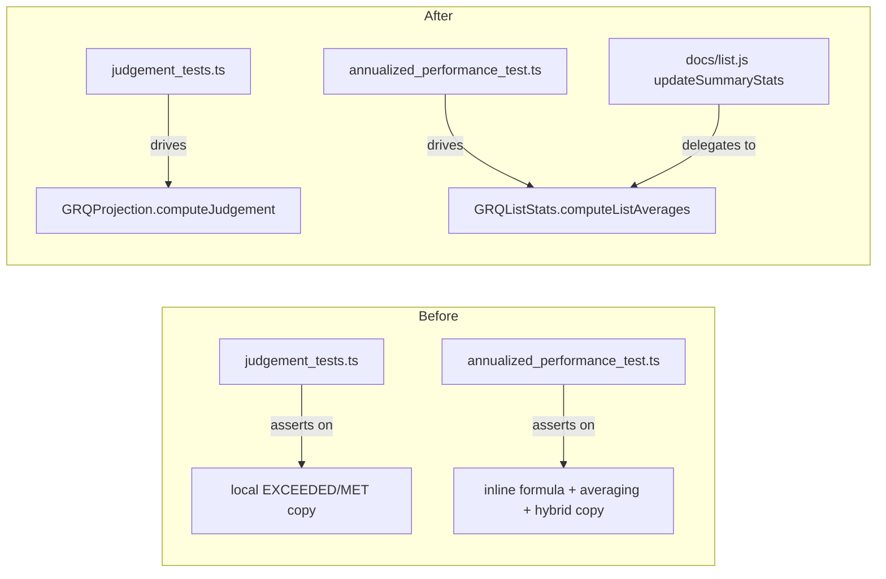

# Replace tautological judgement / annualised tests with WHAT-tests

## Summary

`tests/judgement_tests.ts` and `tests/annualized_performance_test.ts` imported
nothing from the shipped dashboard code (only `@std/assert`). Each reimplemented
production logic as a local copy and then asserted on that copy — tautologies
that stayed green even if the real code drifted, and in the judgement case the
local copy asserted on a string mapping (`EXCEEDED`/`MET`/`BELOW`,
`ABOVE`/`AT`/`BELOW`) that the shipped code never produces.

This change resolves the third tautology cluster called out in the issue
(distinct from #102 and #109), using the issue's two sanctioned resolutions:

- **`tests/judgement_tests.ts`** — rewritten (option a) to drive the REAL
  exported `GRQProjection.computeJudgement` (`docs/projection.js`) and assert on
  the shipped judgement strings (`Hit Target`, `Partial Success`,
  `Missed Target`, `Early Days`, `Pending`). A regression in the production
  mapping at `docs/projection.js:385` now fails. The fictional cost-of-capital
  `ABOVE/AT/BELOW` cases and the local `Date`-arithmetic "boundary" steps were
  deleted (option b): no shipped code produced those strings, and the real
  cost-of-capital figure is an excess-return *number*, not a string bucket.

- **`tests/annualized_performance_test.ts`** — the recompute-only "Compound
  Interest" guard (covered in production by Rust `calculate_annualized_performance`,
  WHAT-tested in `src/utils.rs`) and the local `calculateHybridProjection` copy
  (covered by `GRQProjection.computeHybridProjection` via
  `tests/projection_kernels_test.ts`) were deleted (option b). The index.json
  averaging case was the only genuinely uncovered production logic, so it is now
  a WHAT-test (option a): the averaging maths was extracted from
  `docs/list.js::updateSummaryStats` into a pure, shipped helper
  `GRQListStats.computeListAverages` (`docs/list_stats.js`) that the list page
  delegates to and the test drives directly.

These removed tests were tautological by design and verified no shipped
behaviour; their real-module equivalents either already exist or were added
here, so no genuine coverage is lost.

Closes #121.

## Change shape

## Evidence

Backend/JS-logic change — no rendered UI change (the list page's summary cards
display the same figures; the averaging maths is unchanged, only relocated to a
shared kernel). Playwright MCP was unavailable in this environment, so
verification was via the test suite:

- `deno test --allow-read tests/*.ts` → **234 passed, 0 failed**.
- The new `computeListAverages` tests assert spec-derived expected values
  (`avg90Day = 23.705`, `avgAnnualized = 68.5475`, counts `2`/`4`/`2`) against
  the **shipped** kernel, so a regression in the averaging path now fails.
- `docs/list.js::updateSummaryStats` was refactored to call the extracted
  kernel; the accumulation logic is byte-for-byte the same loop, and
  `visibleData.toArray()` yields the same row objects the previous
  `visibleData.each(...)` iterated — behaviour-preserving.
- `deno fmt`, `deno lint`, `deno check` all clean.

## Test Plan

- `tests/judgement_tests.ts` — `computeJudgement` realised-outcome mapping
  (Hit Target / Partial Success / Missed Target at day 90), Pending for null,
  and early-stage reporting; all against the real `GRQProjection` helper.
- `tests/annualized_performance_test.ts` — `computeListAverages` happy path
  (mixed populated/null rows), negative/zero handling (positive-count edge
  case), and the empty / all-null edge cases; all against the real
  `GRQListStats` helper.
- Existing `tests/projection_kernels_test.ts` continues to cover
  `computeJudgement` and `computeHybridProjection` (no regression).
