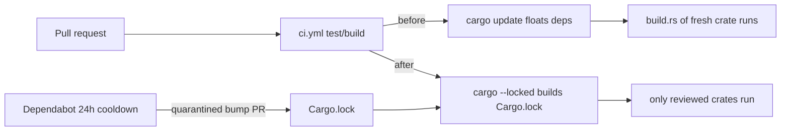

## Summary

Bring the **Cargo** ecosystem under the same supply-chain quarantine the Deno
ecosystem already enjoys by closing the remaining CI gaps. The Dependabot 24h
`cooldown` for Cargo crates already existed (Issue #75); this change removes the
two ways CI still floated unquarantined code:

1. **Removed the unconditional `cargo update` step** from `ci.yml`. It ran on
   every pull request and resolved every crate to the newest in-range version,
   executing freshly-published `build.rs` / proc-macros with zero age gate. CI
   now builds the **committed, reviewed `Cargo.lock`**: every `cargo`
   clippy/check/test/build step runs with `--locked`, so a stale lockfile fails
   the build instead of silently pulling a newer crate. Crate bumps now arrive
   only through the quarantined Dependabot PRs.
2. **Pinned the CI tool installs** to explicit versions with `--locked` so they
   no longer compile and run an arbitrary newest tool-dependency tree:
   - `cargo install cargo-tarpaulin --locked --version 0.35.4` (`ci.yml`)
   - `cargo install cargo-cyclonedx --locked --version 0.5.9` (`ci.yml`)
   - `cargo install cargo-audit --locked --version 0.22.2` (`cargo-audit.yml`)

Closes #124.

### Deno regression avoided

This is a Deno repo (`deno.json`, `deno.lock`). The new tests are Deno tests
(`deno test`) and reuse the existing `@std/yaml` parser — no Node tooling,
`package.json`, or `tsconfig.json` introduced.

## Evidence

Backend/CI-config change with no web interface to screenshot. Verified via the
Deno test suite below and a full `./quality.sh` run, which completed with
"✅ Quality checks completed successfully!".

## Test Plan

New `tests/cargo_supply_chain_quarantine_test.ts` (parses the workflow YAML and
asserts behaviour, not source text):

- `ci.yml` test job no longer runs `cargo update`.
- `ci.yml` build job does not run `cargo update`.
- `ci.yml` test job runs `cargo check` / `cargo test` with `--locked`.
- `ci.yml` release build runs `cargo build --locked`.
- `ci.yml` pins `cargo-tarpaulin` / `cargo-cyclonedx` with `--locked --version`.
- `cargo-audit.yml` pins `cargo-audit` with `--locked --version`.

Existing `ci_workflow_test.ts`, `cargo_audit_workflow_test.ts`, and
`dependabot_config_test.ts` continue to pass unchanged (27 tests green).
