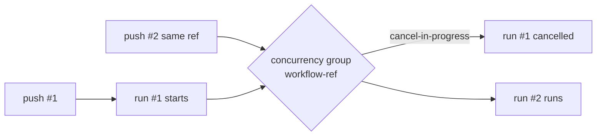

# Add concurrency cancellation to seven PR-triggered workflows

## Summary

Seven pull-request-triggered workflows in `.github/workflows/` ran without a
`concurrency:` group, so rapid pushes to the same PR queued redundant,
overlapping runs that each held a runner and wasted CI minutes on results that
were immediately superseded. Only `ci.yml` declared a concurrency group.

This change adds a top-level `concurrency:` block — identical to the canonical
pattern proven in `ci.yml` — to each of the seven workflows, immediately after
the `on:` block:

```yaml
concurrency:
  group: ${{ github.workflow }}-${{ github.ref }}
  cancel-in-progress: true
```

Keying on `${{ github.workflow }}-${{ github.ref }}`
scopes cancellation per-workflow-per-ref, so distinct workflows and distinct branches never cancel
one another, while repeated pushes to the same ref keep only the latest run
alive. `deno-outdated.yml` is intentionally excluded — it runs only on
`schedule`/`workflow_dispatch` and is not pile-up-prone.

Workflows updated:

- `cargo-audit.yml`
- `deno-quality.yml`
- `dependency-review.yml`
- `gitleaks.yml`
- `markdown-lint.yml`
- `semgrep.yml`
- `shellcheck.yml`

Closes #139.

## Evidence

This is a CI-configuration change with no web interface to screenshot.
Verification is via the Deno test suite, which parses each workflow's YAML and
asserts the concurrency group is present and correctly keyed. Full suite:
`254 passed | 0 failed`.



## Test Plan

Followed TDD — added a failing concurrency assertion per workflow first, then
added the workflow blocks to make them pass.

- Added `... workflow declares a concurrency group that cancels superseded runs`
  test to each of:
  - `tests/cargo_audit_workflow_test.ts`
  - `tests/deno_quality_workflow_test.ts`
  - `tests/dependency_review_workflow_test.ts`
  - `tests/semgrep_workflow_test.ts`
  - `tests/markdown_lint_workflow_test.ts`
- Added new test files `tests/gitleaks_workflow_test.ts` and
  `tests/shellcheck_workflow_test.ts` (these workflows had no test file),
  covering existence, YAML parse, `pull_request` trigger, read-only contents
  permission, and the concurrency group.

Each test parses the workflow YAML and asserts
`concurrency.group === "${{ github.workflow }}-${{ github.ref }}"`
and `concurrency["cancel-in-progress"] === true`.

Verified red before the workflow change (7 failures), then green after
(`47 passed`); full suite `254 passed | 0 failed`. `deno fmt --check`,
`deno lint`, and `deno check` all pass.
