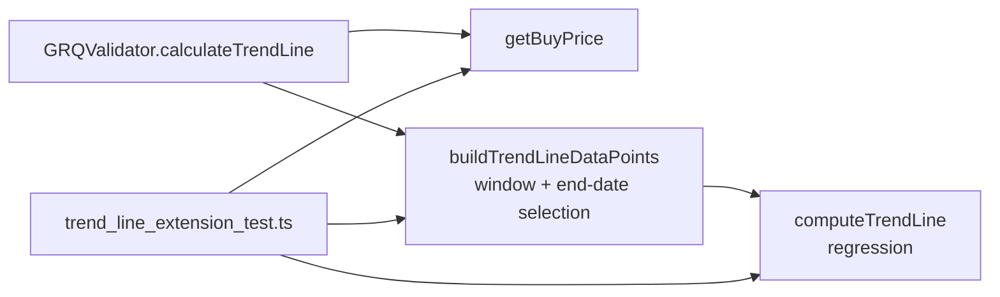

# PR Summary — Issue #144

## Summary

Completed the partial migration of `tests/trend_line_extension_test.ts`. The
final test (`"Trend Line Uses Latest Market Data Date"`) still built a local
`validator` object whose `calculateTrendLine` was a ~150-line inline
reimplementation of the production regression pipeline, then asserted on that
copy — a HOW-test that could never catch a regression in the shipped code.

This PR applies resolution **(a)** from the issue: extract the remaining
data-window / end-date selection out of `GRQValidator.calculateTrendLine` into
the shared `docs/projection.js` module as `buildTrendLineDataPoints`, refactor
production to delegate to it, and rewrite the test to drive the REAL shipped
helpers (`getBuyPrice` → `buildTrendLineDataPoints` → `computeTrendLine`). The
inline copy is deleted; the assertions now exercise shipped code, so a
regression in the trend-window selection ("use latest market data date, not
today") actually fails the suite.

Closes #144.

## What changed

- **`docs/projection.js`** — new pure helper `buildTrendLineDataPoints(marketData, scoreDate, buyPrice, dividends, endDate)`.
  It performs the window selection (score date → latest market-data date when
  `endDate` is omitted, never today) and builds the
  `{ x: daysSinceScore, y: totalReturn }` regression points, combining the
  split-adjusted price move with dividends paid up to each point. Published on
  `globalThis.GRQProjection`.
- **`docs/app.js`** — `GRQValidator.calculateTrendLine` now delegates the
  windowing to `GRQProjection.buildTrendLineDataPoints` instead of building the
  points inline. Behaviour is preserved; production and the Deno tests share one
  implementation (the same pattern already used for `computeTrendLine`).
- **`tests/trend_line_extension_test.ts`** — replaced the inline-mirror test
  with three WHAT-tests against the real helpers.

## Data flow

The test now drives the exact shared kernels production delegates to — no inline
copy of the algorithm remains.

## Evidence

Backend/JS change with no web UI to screenshot. Verified via the Deno test
suite driving the real shipped helpers:

- `Real buildTrendLineDataPoints - Window extends to latest market data date` —
  with no `endDate`, the window runs to the latest market-data point (~77 days),
  starting at zero on the score date.
- `Real buildTrendLineDataPoints - Explicit endDate truncates the window` — an
  explicit earlier `endDate` excludes the later point, proving the end-date
  selection is the real windowing logic, not a fixed default.
- `Real computeTrendLine - Projection reflects SCHW growth pattern` — the
  shipped regression produces a 90-day projection between 15% and 25% (forced
  through the origin) for the SCHW growth fixture.

Full suite: `257 passed | 0 failed`.

## Test Plan

- Rewrote `tests/trend_line_extension_test.ts` to drive `GRQProjection.getBuyPrice`,
  `GRQProjection.buildTrendLineDataPoints`, and `GRQProjection.computeTrendLine`.
- Confirmed the new tests fail before the `buildTrendLineDataPoints` extraction
  exists and pass after.
- Ran `deno test --allow-read tests/*.ts` (257 passed), plus `deno fmt --check`,
  `deno lint`, and `deno check` over the changed files.
