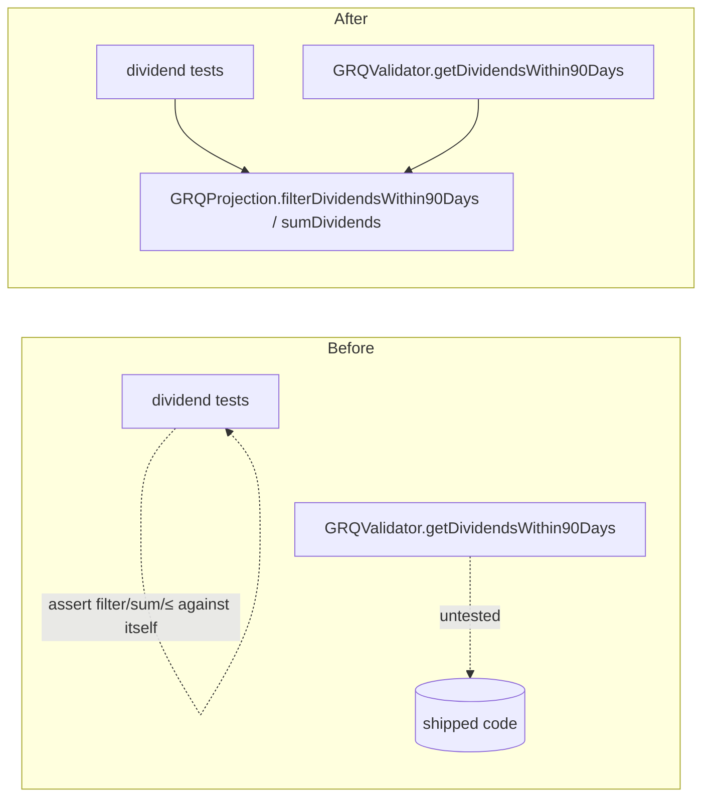

## Summary

`tests/dividend_calculation_tests.ts` imported nothing from the shipped code and
asserted on logic re-authored inside the test: it reimplemented the 90-day
dividend-window `filter`, the `+ 90 days` date arithmetic, the `reduce` sum, and
a bare `exDivDate <= ninetyDayDate` comparison — then asserted each expression
against itself. The shipped `getDividendsWithin90Days` / dividend-summation path
on `GRQValidator` was never called, so a real regression in dividend selection
or summation left every assertion green.

This PR applies resolution (a) from the issue: extract the pure dividend kernels
into the shared projection module so production and tests exercise the same
code, then rewrite the file as a WHAT-test against those kernels.

- Added `filterDividendsWithin90Days(dividends, scoreDate)` and
  `sumDividends(dividends)` to `docs/projection.js` and published them on
  `globalThis.GRQProjection`, mirroring the issue #80/#100 kernel-extraction
  pattern.
- Delegated `GRQValidator.getDividendsWithin90Days` to the shared filter and the
  three dividend-summation sites (`docs/app.js`) to `sumDividends`, removing the
  duplicated inline `filter`/`reduce` copies (DRY — single source of truth).
- Rewrote `tests/dividend_calculation_tests.ts` to drive the real
  `filterDividendsWithin90Days`, `sumDividends`, and `calculatePerformanceReturn`
  kernels against the NYSE:WFG 2024-11-15 fixture and assert on their return
  values. A regression in the shipped window/sum now fails the suite.

Closes #145.

## Evidence

Backend/JS change with no web UI to screenshot. Verified via `deno test` and the
full quality gate.



Test run:

```
running 6 tests from ./tests/dividend_calculation_tests.ts
filterDividendsWithin90Days keeps only in-window payments ... ok
filterDividendsWithin90Days includes a payment on the boundary day ... ok
filterDividendsWithin90Days returns empty for missing or empty input ... ok
sumDividends totals the in-window WFG payments ... ok
sumDividends returns 0 for missing or empty input ... ok
dividend total flows into the shipped performance return ... ok
ok | 6 passed | 0 failed
```

`./quality.sh` passes cleanly (lint, fmt, type-check, full Deno + Rust suite).

## Test Plan

Rewritten `tests/dividend_calculation_tests.ts` (now WHAT-tests against shipped kernels):

- `filterDividendsWithin90Days keeps only in-window payments` — happy path: 2 of
  3 WFG dividends retained.
- `filterDividendsWithin90Days includes a payment on the boundary day` — edge:
  ex-div date exactly on the 90-day edge is inclusive (`<=`).
- `filterDividendsWithin90Days returns empty for missing or empty input` — error
  path: `[]` and `undefined`.
- `sumDividends totals the in-window WFG payments` — happy path: `$0.455`.
- `sumDividends returns 0 for missing or empty input` — error path.
- `dividend total flows into the shipped performance return` — drives
  `calculatePerformanceReturn` to prove the filtered/summed dividends reach
  production output (dividend-return component `(0.455 / buyPrice) * 100`).
