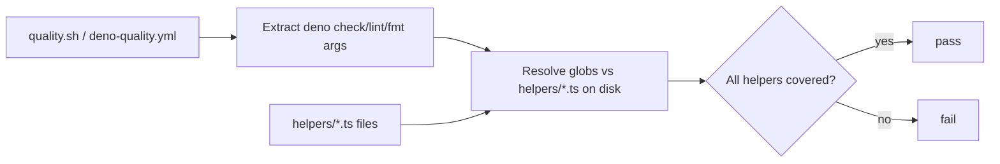

## Summary

The two runner tests in `tests/deno_scope_config_test.ts:87-111` asserted on
the **source text** of `quality.sh` and `.github/workflows/deno-quality.yml`
with whole-file regexes. They matched the *spelling* of each
`deno check`/`lint`/`fmt` command and its `helpers/…ts` argument on a single
line, not the *outcome*. Behaviour-preserving edits — a `helpers/**/*.ts`
glob, a line split with `\`, a `$HELPERS` variable, or a loop over a file list
— broke them with no real regression, while a commented-out command would
still pass as long as the text appeared.

Rewrote both tests to assert the genuine behavioural intent: *the local gate
and CI actually cover the real `helpers/` TypeScript files*. The tests now
resolve each invocation's path arguments as globs against the helper files on
disk, and parse the workflow as structured YAML (via `@std/yaml`) to inspect
the `deno check` step's `run` text rather than regex-matching the whole file.

The good structural `deno.json` tests (`:37-85`, `parseJsonc` + `include`
arrays) are left untouched as the issue requested.

Closes #150.

## Evidence

Backend/test-only change — no UI to screenshot. Verified by running the
Deno gate locally:

- `deno test --allow-read tests/*.ts` → `ok | 260 passed | 0 failed`
- `deno lint helpers/*.ts tests/*.ts` → clean
- `deno check helpers/*.ts tests/*.ts` → clean
- `deno fmt helpers/*.ts tests/*.ts` → no changes

**Red/robustness verification** of the new resolver logic (same regex/glob
helpers used in the tests):

| Input to `deno check` | Covers `helpers/server.ts`? |
| --- | --- |
| `helpers/*.ts tests/*.ts` | ✅ true |
| `helpers/**/*.ts tests/*.ts` (glob change) | ✅ true |
| `deno check \ helpers/*.ts …` (backslash line continuation) | ✅ true |
| `tests/*.ts` only (coverage dropped) | ❌ false — test fails |

## Test Plan

Modified `tests/deno_scope_config_test.ts`:

- Replaced `quality.sh type-checks and lints the helpers directory` with
  `quality.sh checks, lints and formats the real helpers files` — resolves the
  `deno check`/`lint`/`fmt` path arguments against the real `helpers/*.ts`
  files and asserts every helper is covered.
- Replaced `deno-quality.yml type-checks the helpers directory` with
  `deno-quality.yml type-checks the real helpers files` — parses the workflow
  YAML structurally, finds the `deno check` step, and asserts its arguments
  cover every real helper file.
- Unchanged: the four structural `deno.json` `parseJsonc`/`include` tests.

All 260 Deno tests pass.
