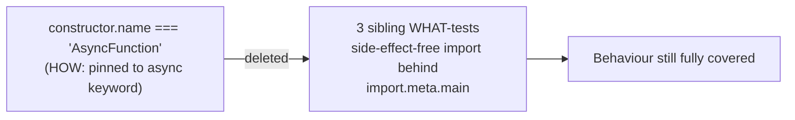

# PR Summary — Issue #151

## Summary

Removed the HOW-assertion in `tests/floating_promises_guard_test.ts`. The
`"entry functions are async (return a promise)"` test asserted on
`checkSyntax.constructor.name === "AsyncFunction"` — a structural check pinned
to the `async` keyword rather than the observable contract the test name claims.
A behaviour-preserving refactor (e.g. `function checkSyntax() { return (async () => {…})() }`)
or a bundler/minifier that wraps the function still returns a promise the guard
can `.catch`, but its `constructor.name` becomes `"Function"` and the assertion
breaks for no real reason.

Following the issue's **option (b)**, the test was deleted. The behaviour that
actually matters — importing each debug module is side-effect-free, so the entry
point stays guarded behind `import.meta.main` — is already covered by the three
sibling WHAT-tests (`:16-29`), which were left untouched. The now-unused `assert`
import was dropped to keep the lint clean.

**Why not option (a)?** Rewriting the test to call `checkSyntax()` and assert the
return value is a thenable was unsafe here: the function body reads files and calls
`Deno.exit(1)` on duplicate declarations or errors, which would terminate the
`deno test` runner mid-suite. Deletion is the safe, issue-endorsed outcome.

Closes #151.

## Evidence

Backend/test-only change — no web interface to screenshot. Verified via the Deno
test suite and quality checks:

- `deno test --allow-read tests/*.ts` → `256 passed | 0 failed`
- `deno fmt`, `deno lint`, `deno check` on the modified file → all clean

## Test Plan

- Modified `tests/floating_promises_guard_test.ts`: removed the
  `"entry functions are async (return a promise)"` test and the unused `assert`
  import.
- Confirmed the three remaining guard tests
  (`check_syntax.ts`, `debug_schw_current_price.ts`, `test_page_load.ts` import
  without running) still pass.
- Full Deno suite: `256 passed | 0 failed`.
