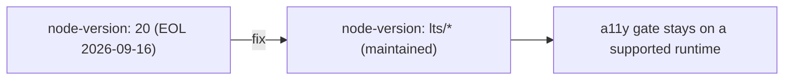

# PR Summary — Issue #171

## Summary

The accessibility workflow `.github/workflows/a11y.yml` pinned its
`actions/setup-node` step to `node-version: "20"`, an end-of-life-soon major.
Node 20 is scheduled for force-upgrade and removal on GitHub-hosted runners
(removal 2026-09-16), so pinning it runs the Node-only toolchain
(`http-server`, `pa11y-ci`) on an unsupported interpreter that no longer
receives security fixes.

The step drives Node-only tooling, so a full Deno migration is not practical.
The pragmatic fix tracks a maintained LTS — `node-version: "lts/*"` — matching
what `markdown-lint.yml` already does, keeping the a11y gate on a supported
runtime through and beyond the September 2026 Node 20 removal.

Closes #171.

### Deno regression avoided

This is a Deno repo. The changed step runs Node-only tooling (`http-server`,
`pa11y-ci`) that has no Deno equivalent here, so the existing
`actions/setup-node` step is retained and simply re-pointed at `lts/*` — no new
Node tooling, dependencies, or config were introduced.

## Evidence

Backend/CI change — no web UI to screenshot. Verified via the Deno test suite.



Test run after the fix:

```
a11y workflow tracks a maintained Node runtime, not an EOL major (Issue #171) ... ok
ok | 10 passed | 0 failed
```

Full suite: `ok | 257 passed (55 steps) | 0 failed`.

## Test Plan

- Added `tests/a11y_workflow_test.ts::"a11y workflow tracks a maintained Node
  runtime, not an EOL major (Issue #171)"` — parses the workflow, locates the
  `setup-node` step, and asserts `node-version` is not an EOL/EOL-soon major
  (`18`/`19`/`20`/`21`). This test fails against the old `"20"` pin and passes
  after the change to `"lts/*"`.
- All existing `a11y_workflow_test.ts` cases remain unchanged and pass.
