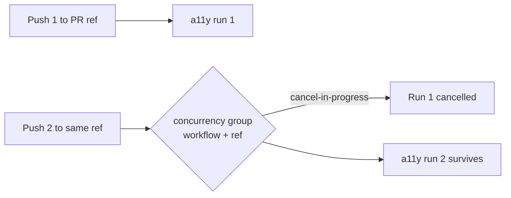

## Summary

Added a top-level `concurrency:` group to `.github/workflows/a11y.yml` so rapid
pushes or force-pushes to the same pull-request ref cancel superseded
accessibility scans instead of queueing redundant full runs. The accessibility
gate was the lone PR-triggered workflow in this repo without a concurrency
group; it now matches the canonical pattern already used by `ci.yml`,
`semgrep.yml`, and the other sibling workflows. Closes #172.

The block is keyed on `${{ github.workflow }}-${{ github.ref }}` with
`cancel-in-progress: true`, so only the latest run for a given ref survives —
saving runner minutes and avoiding races on the shared static-server port.



## Evidence

This is a CI/workflow configuration change with no web interface to screenshot.
Verification is via the unit tests for the workflow file:

```
running 10 tests from ./tests/a11y_workflow_test.ts
...
a11y workflow declares a concurrency group that cancels superseded runs ... ok
ok | 10 passed | 0 failed
```

`./quality.sh` passes cleanly with the new test in place.

## Test Plan

- Added `tests/a11y_workflow_test.ts::a11y workflow declares a concurrency group that cancels superseded runs`,
  which parses the workflow YAML and asserts the `concurrency` block exists, is
  keyed on workflow + ref, and sets `cancel-in-progress: true`. This test fails
  against the unmodified workflow and passes after the fix.
- All pre-existing a11y workflow tests continue to pass unchanged.
