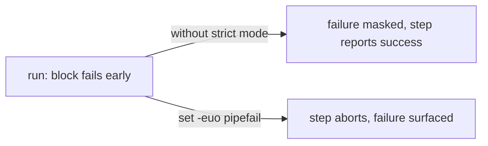

## Summary

Two multi-line bash `run:` blocks in the workflows did not begin with
`set -euo pipefail`, so a failing command mid-script was silently ignored and
could surface later as a confusing error (or be masked entirely). This PR
prefixes both blocks with the strict-mode preamble, matching the convention
already used by the more careful steps in `ci.yml` (`check-changes`, SBOM).

Changed call sites:

- `.github/workflows/a11y.yml` — "Serve docs/ dashboard and wait for it to
  come up" (backgrounds `npx http-server`, then a readiness loop).
- `.github/workflows/ci.yml` — job `build`, "Check Bash Script Syntax"
  (`find ... -exec bash -n`).

Closes #173.

## Evidence

Backend/CI-only change — no web interface to screenshot. Verified via the Deno
workflow tests, which parse the YAML and assert the first executable line of
each multi-line `run:` block is `set -euo pipefail`.

## Test Plan

- Extended `tests/ci_workflow_test.ts::multi-line bash run blocks begin with
  set -euo pipefail` to also cover the `build` job's "Check Bash Script Syntax"
  step.
- Added `tests/a11y_workflow_test.ts::a11y multi-line bash run blocks begin
  with set -euo pipefail`, asserting every multi-line `run:` block in
  `a11y.yml` starts with the strict-mode preamble.
- Both tests fail against the unfixed workflows and pass after the fix.
  `deno test --allow-read tests/ci_workflow_test.ts tests/a11y_workflow_test.ts`
  → 20 passed, 0 failed.
