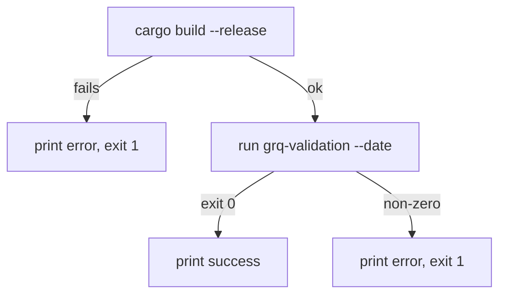

# Fix pre-existing ShellCheck findings in process_date.sh (Issue #176)

## Summary

Cleared the three carried-over ShellCheck findings against `process_date.sh`
tracked by the baseline-carryover issue. The script now checks command exit
status directly instead of inspecting `$?`, and quotes the date argument
passed to the processor. Closes #176.

Findings fixed:

- **SC2181** (`process_date.sh:28`) — replaced `cargo build --release` followed
  by `if [ $? -ne 0 ]` with `if ! cargo build --release; then`.
- **SC2086** (`process_date.sh:35`) — quoted the argument: `--date "$DATE"`.
- **SC2181** (`process_date.sh:37`) — folded the processor run into the `if`
  condition directly (`if ./target/release/grq-validation ...; then`) instead
  of checking `$?` afterwards.

Behaviour is unchanged: the same build-fail and processor-fail paths exit with
status `1`, and the success path prints the same messages.



## Evidence

Backend/CLI shell-script change — no web interface to screenshot.

`shellcheck process_date.sh` (default severity) now reports no findings, and
`bash -n process_date.sh` parses cleanly:

```
$ bash -n process_date.sh && shellcheck process_date.sh && echo CLEAN
CLEAN
```

## Test Plan

- Added `tests/process_date_lint_test.ts`:
  - `process_date.sh checks exit codes directly, not via $? (SC2181)` —
    fails against the unfixed `if [ $? ...]` antipattern.
  - `process_date.sh double-quotes the $DATE argument (SC2086)` — fails
    against an unquoted `--date $DATE`.
- Both tests pass under the repo's `deno test --allow-read tests/*.ts` gate
  and reproduce the baseline findings when run against the pre-fix script.
