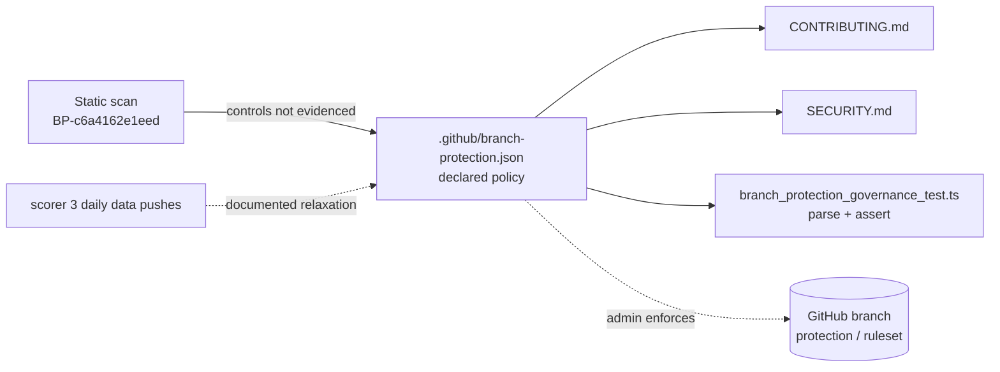

# Document branch-protection and commit-signing posture for `main`

## Summary

Branch-protection rules and commit-signature requirements are repository
settings that do not live in the committed tree, so a static scan cannot confirm
them and flags them as a gap (finding `BP-c6a4162e1eed`). This repository also
pushes daily score data straight to `main` under the automated `scorer 3`
identity, so a blanket "require a reviewed pull request for every commit" rule
is a **deliberately relaxed** control rather than an oversight.

Enabling required-review protection and per-identity commit signing are
administrator/infrastructure actions that cannot be performed through committed
files — and enabling required reviews unconditionally would break the autonomous
daily-score automation. Following the route the issue itself offers, this PR
**records the governance decision** as static, machine-readable evidence so
future scans treat the posture as documented:

- Adds `.github/branch-protection.json` — a machine-readable declaration of the
  intended controls for `main` (require PR + at least one approving review,
  require review from Code Owners, block force-pushes/deletions, require linear
  history, require signed commits) **and** the deliberately relaxed controls
  (direct data-only pushes by `scorer 3`; unsigned automation commits pending
  signing-key provisioning), each with a rationale. The file documents that an
  administrator must enforce the controls via Settings → Branches or a ruleset;
  it is not auto-applied.
- Documents the decision in `CONTRIBUTING.md` (the file named in the issue) and
  `SECURITY.md`, including which controls are intentionally relaxed and why.
- Records the change in `CHANGELOG.md`.

Closes #180.

## Evidence

This is a governance/documentation change with no web interface to screenshot.
It is verified by the new Deno test suite, the full existing suite, and
markdownlint.

```text
deno test --allow-read tests/*.ts
ok | 267 passed (55 steps) | 0 failed (3s)

npx markdownlint-cli2 CONTRIBUTING.md SECURITY.md CHANGELOG.md
Summary: 0 error(s)
```

How the pieces relate:



## Test Plan

Added `tests/branch_protection_governance_test.ts`, which parses
`.github/branch-protection.json` and asserts on its structure (the
parse-and-assert pattern used by `codeowners_test.ts`, not the prose greps
removed under Issues #81/#149):

- descriptor exists and is valid JSON.
- descriptor targets the `main` default branch.
- every required control is declared enabled (require PR, code-owner review,
  block force-pushes, block deletions, linear history, signed commits).
- at least one approving review is required.
- the enforcement note is present.
- the deliberately relaxed controls are documented with identities and reasons.
- every relaxation references a declared control (consistency check).
- the direct-push relaxation names the automated scorer identity.

All eight tests fail against the unfixed tree (no descriptor) and pass after it
is added. The full Deno suite (267 tests) and markdownlint pass.
