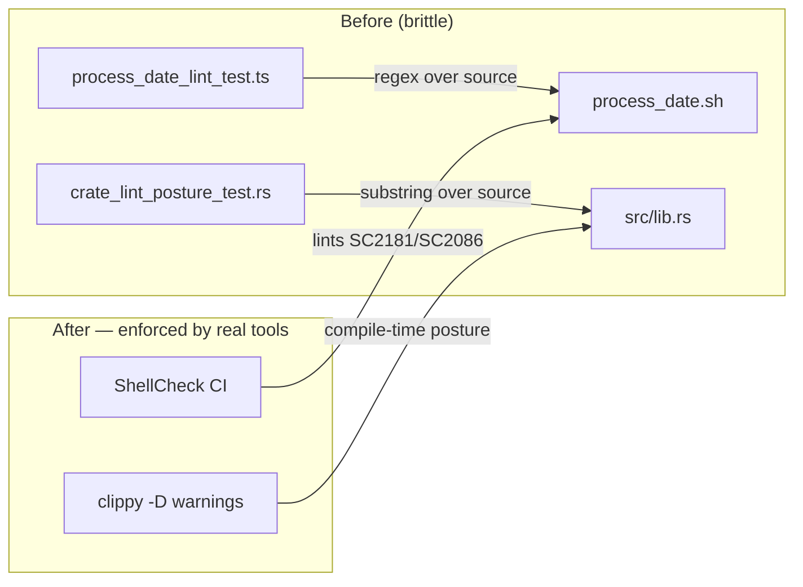

## Summary

Removed two tests that asserted on **source text** rather than observable
behaviour — the *source-text-grep-as-assertion* anti-pattern. Both files read a
committed source file and ran regex/substring checks over its contents, so they
verified that a *string appears in the source*, not that any code *behaves* a
particular way. A behaviour-preserving refactor (renaming `$DATE`, switching to
an `if ! cmd; then` idiom, or moving the Rust lint posture into Cargo.toml's
`[lints]` table) would break them despite zero behavioural regression. Closes #181.

Deleted:

- `tests/process_date_lint_test.ts` — re-implemented ShellCheck rules SC2181 and
  SC2086 as regexes (`/\bif\s+\[\[?\s+\$\?/`, `/--date\s+"\$DATE"/`) against the
  `process_date.sh` source.
- `tests/crate_lint_posture_test.rs` — grepped `src/lib.rs` for the literal
  attribute strings `#![warn(missing_docs)]`, `#![deny(unsafe_code)]` and
  `#![deny(unsafe_op_in_unsafe_fn)]`.

This is resolution **(b)** from the issue ("delete the tests"), which the issue
explicitly endorses as a legitimate outcome. Per the repo guideline against
removing tests, this removal is documented here as an explicit, intended change:
deleting a counter-productive test that adds brittleness without verifying
behaviour is the point of the issue.

### No coverage lost

Both postures remain enforced by tools that check the *whole codebase* across
*every* rule, not just the two strings these tests grepped:

- **`process_date.sh`** is linted by the ShellCheck CI workflow
  (`.github/workflows/shellcheck.yml`, `scandir: .`), which enforces SC2181 and
  SC2086 (and all other rules) on the real script.
- **The Rust lint posture** stays declared in `src/lib.rs` (`#![warn(missing_docs)]`,
  `#![deny(unsafe_code)]`, `#![deny(unsafe_op_in_unsafe_fn)]`) and is enforced at
  compile time by `cargo clippy --all-targets --all-features -- -D warnings` in
  `quality.sh` / CI.

Same class of defect the repo already retired in issues #81 and #149 (prose-grep
removals).

## Evidence

Backend/CLI and test-suite change only — no web interface to screenshot.

Verification after deletion:

- `deno test --allow-read tests/*.ts` → `257 passed | 0 failed`.
- `cargo test --all-targets --all-features` → all suites pass.
- `cargo clippy --all-targets --all-features -- -D warnings` → clean (lint
  posture in `src/lib.rs` still compiled and enforced).

## Test Plan

- Removed `tests/process_date_lint_test.ts` and `tests/crate_lint_posture_test.rs`
  (the two source-text-grep tests).
- Confirmed the remaining Deno and Rust suites pass unchanged.
- Confirmed ShellCheck workflow and `clippy -D warnings` still gate the two
  postures, so no behavioural coverage is lost.
