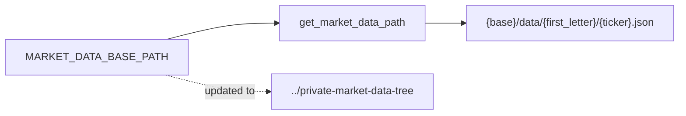

## Summary

Pointed the share-price data repository at the new quarter's private
market-data tree. The `MARKET_DATA_BASE_PATH` constant in
`src/utils.rs` previously referenced the prior-quarter market-data tree; it now
references the current-quarter private market-data tree as requested. Closes #183.

All market-data paths are derived from this single constant, so the
change propagates everywhere without further edits.

## Evidence

Backend/CLI change only — no web interface to screenshot. Verified via
the test suite and the full `./quality.sh` gate, which passed cleanly.

## Test Plan

- Added `src/utils.rs::tests::test_market_data_base_path_points_to_current_quarter`,
  which pins `MARKET_DATA_BASE_PATH` to the current-quarter private
  market-data tree. It failed against the old value (the prior-quarter
  market-data tree) and passes
  after the change — a direct regression guard for this issue.
- Existing path-construction tests (`test_get_market_data_path`) continue
  to pass, confirming downstream path building still works.
- Full `./quality.sh` gate passes (fmt, clippy, cargo tests, Deno tests).
