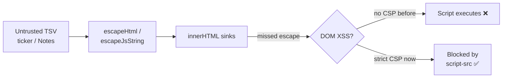

# Add Content-Security-Policy to dashboard pages (issue #189)

## Summary

The dashboard pages `docs/index.html` and `docs/list.html` render untrusted,
TSV-derived contributor data (stock tickers and the free-text `Notes` field)
into `innerHTML`. `escapeHtml`/`escapeJsString` (issue #63) remain the primary
control, but the pages shipped **no second layer** — a single missed escape at
any sink would become immediate DOM XSS in the `stsoftwareau.github.io` origin.

This change adds a `<meta http-equiv="Content-Security-Policy">` tag to both
pages (the only header-delivery mechanism available on GitHub Pages) as
defence-in-depth, and — crucially — makes the policy **strict**: `script-src`
does **not** allow `'unsafe-inline'`. To get there, all previously-inline
JavaScript was moved to external files so the policy actually contains the
stated attack (injected inline event handlers and `javascript:` URLs), rather
than weakening it with `'unsafe-inline'`.

Closes #189.

### Policy applied

`docs/index.html`:

```
default-src 'self';
script-src 'self' https://cdn.jsdelivr.net;
style-src 'self' https://cdn.jsdelivr.net 'unsafe-inline';
img-src 'self' data:;
font-src 'self';
connect-src 'self';
object-src 'none';
base-uri 'none';
form-action 'none'
```

`docs/list.html` additionally permits the CDNs that page loads (jQuery,
DataTables, Font Awesome): `script-src` adds `https://code.jquery.com` and
`https://cdn.datatables.net`; `style-src`/`font-src` add
`https://cdnjs.cloudflare.com`.

`style-src` keeps `'unsafe-inline'` because Bootstrap and the dashboard's
generated `style=` attributes rely on inline styles; style injection is far
lower risk than script injection and this is the standard trade-off.

### Migrations to make the strict policy possible

| Was (inline) | Now (external / CSP-safe) |
|---|---|
| `<script>const VERSION=…; document.title=…</script>` in both pages | `<meta name="app-version">` + `<meta name="app-title">` read by new `docs/version.js` |
| Inline loader + debug block at end of `index.html` | new `docs/dashboard_boot.js` |
| Inline `version.textContent` in `list.html` | handled by `docs/version.js` on `DOMContentLoaded` |
| `<td … onclick="validator.showStockDetails('…')">` in `app.js` | `<td … data-stock="…">` + delegated `click` listener on `#stockTableBody` |



## Evidence

Served locally via `deno run --allow-net --allow-read helpers/server.ts`. Both
pages render correctly under their strict policies — Chart.js, Bootstrap,
jQuery, DataTables and Font Awesome all load (proving the CSP permits every
required origin), and the rendered DOM contains no inline `onclick` handlers.

Dashboard (`index.html`) — Chart.js renders, drill-down cells use `data-stock`:


Score files list (`list.html`) — DataTables + jQuery + Font Awesome load:


A headless DOM dump confirmed `0` inline `onclick=` attributes in the rendered
output and the browser logged no CSP violations.

## Test Plan

New `tests/csp_test.ts` (all calls exercise real parsing helpers and the real
HTML artefacts):

- `extractCsp` / `parseCsp` / `externalOrigins` unit tests with crafted inputs.
- Per page (`index.html`, `list.html`):
  - ships a Content-Security-Policy meta tag;
  - `script-src` is strict — allows `'self'`, forbids `'unsafe-inline'` and
    `'unsafe-eval'`;
  - locks down `default-src 'self'`, `object-src 'none'`, `base-uri`;
  - **permits every external CDN origin the page actually loads** (regression
    guard so the policy can never silently break the page);
  - contains no inline `<script>` blocks.
- `docs/app.js` emits no inline event handlers (delegated-listener guard).

Full suite: `deno test --allow-read tests/*.ts` → **280 passed, 0 failed**
(plus 12 new CSP cases). `deno fmt`, `deno lint`, and `deno check` all clean.

## Security self-check

- Input validation: data attributes read back via `dataset` are HTML-decoded by
  the browser; the value still flows through the same `escapeHtml` render path.
- No secrets staged. No new dependencies. CSP tightens, never loosens, the
  script execution surface.
