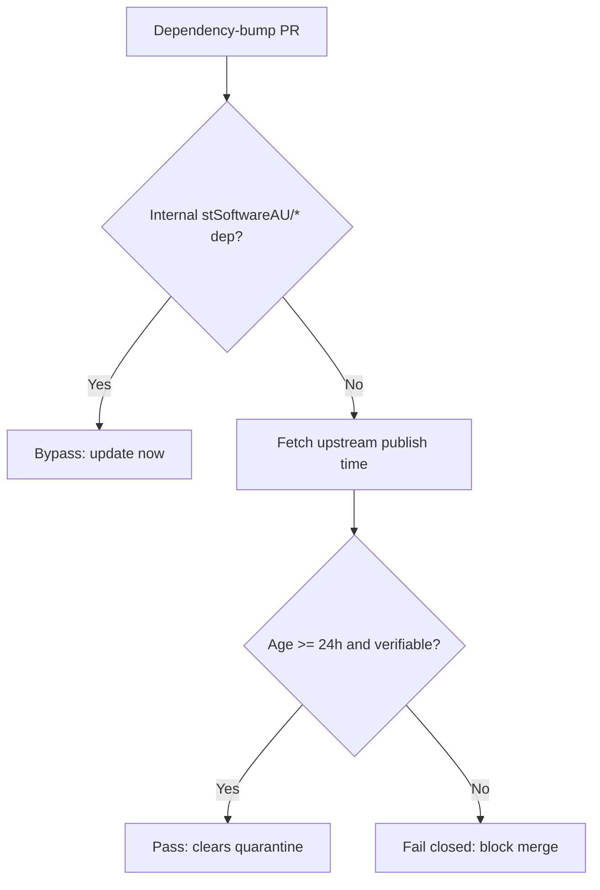

# Cargo & Actions dependency quarantine — deterministic CI gate

## Summary

The Cargo and GitHub Actions ecosystems previously relied **solely** on
Dependabot's in-preview, non-native `cooldown` keyword for their 24-hour
supply-chain quarantine. If that keyword is silently ignored, renamed, or its
behaviour changes, a freshly-hijacked crate or Action release could be
auto-proposed inside the window the project intends to enforce — exactly the
dormant-republish / hijacked-publish attack the quarantine exists to blunt.

This change adds a deterministic, attacker-unbypassable backstop that mirrors
the Deno ecosystem's existing `--minimum-dependency-age=P1D` gate:

- **`helpers/bump_quarantine_gate.ts`** — a native Deno gate. On a
  dependency-bump PR it computes which external Cargo crates (via `Cargo.lock`)
  and GitHub Actions (via `uses:` refs) changed against the base branch,
  fetches each one's upstream publish time (crates.io `created_at` / the
  GitHub commit date), and **fails closed** when a bump is younger than
  `VIBE_BUMP_QUARANTINE_HOURS` (default 24h) or its age cannot be verified.
  Internal `stSoftwareAU/*` dependencies bypass the quarantine and update
  immediately.
- **`.github/workflows/bump-quarantine-gate.yml`** — runs the gate on every
  pull request with a 24h window, actions pinned to 40-char SHAs.
- **`.github/dependabot.yml`** & **`README.md`** — the `cooldown` block is
  retained as defence in depth, with both now documenting the CI gate as the
  primary, native quarantine.

Closes #193.

## Evidence

This is a backend/CI change with no web interface, so no screenshot applies.
Verified via unit tests over the pure decision logic and a smoke run of the
gate against `origin/main` (no bumps detected → exit 0).

## Test Plan

- **`tests/bump_quarantine_gate_test.ts`** (19 cases) — exercises the pure
  decision logic with deterministic inputs (no network):
  - `parseQuarantineHours` default/override/rejection of bad input.
  - `isInternal` for Cargo crates and Action owners.
  - `ageInHours` whole-hour and unparseable-timestamp paths.
  - `evaluateBump` ok / quarantined / internal-bypass / fail-closed /
    exactly-at-threshold verdicts.
  - `violations` collecting only blocking verdicts; empty-input case.
  - `parseCargoLock` / `diffCargoLock` upgrade + add + unchanged paths.
  - `parseUses` extraction and ignore-non-uses paths.
- **`tests/bump_quarantine_gate_workflow_test.ts`** (5 cases) — the workflow
  exists, triggers on `pull_request`, invokes the gate with a 24h window,
  grants the required Deno permissions, and pins actions to 40-char SHAs.
- Full `./quality.sh` passes (Cargo build/clippy/test + Deno fmt/lint/check/test,
  303 Deno tests).
