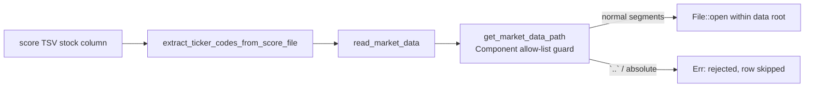

## Summary

Fixed a path-traversal weakness in `src/utils.rs` where a TSV-derived stock
`symbol` was interpolated straight into a filesystem path with no sanitisation.
A crafted `symbol` such as `../../../../etc/hosts` could escape the intended
`MARKET_DATA_BASE_PATH/data/` root when reading market-data JSON. Closes #195.

The fix applies the same `std::path::Component` allow-list guard already used by
the sibling builders `build_score_file_path` (issue #182) and
`get_dividend_data_path`:

- `get_market_data_path` now returns `Result<String>` and builds the path with
  `Path::join` over validated components, rejecting any `ParentDir` (`..`),
  `RootDir`, or `Prefix` segment.
- `read_market_data` now delegates to `get_market_data_path(symbol)?` instead of
  raw `format!` string interpolation, so the guard runs on every production read.
  The three call sites (`create_market_data_csv`, `create_market_data_long_csv`)
  already handle the `Result`, logging/skipping on error, so a malicious row is
  skipped rather than escaping the data root.

Legitimate tickers (including exchange-prefixed ones like `NYSE:SEM`) resolve to
exactly the same path as before — only traversal attempts are rejected.

## Data flow

## Evidence

Backend/CLI change with no web interface to screenshot. Verified via `cargo test`
and the full `./quality.sh` gate (fmt, clippy `-D warnings`, type check, tests,
coverage, release build, and Deno checks) — all pass cleanly.

## Test Plan

Added regression tests in `src/utils.rs` (mirroring the dividend/score-path
traversal tests):

- `test_get_market_data_path_rejects_parent_dir_traversal` — `..` segment is rejected.
- `test_get_market_data_path_rejects_absolute_symbol` — absolute symbol is rejected.
- `test_get_market_data_path_allows_plain_ticker_with_exchange_prefix` — `NYSE:SEM` still resolves.
- `test_read_market_data_rejects_traversal_symbol` — `read_market_data` errors on a traversal symbol rather than opening an out-of-tree file.

Updated the existing `test_get_market_data_path` for the new `Result<String>`
signature (behaviour unchanged for legitimate tickers; documented inline).
