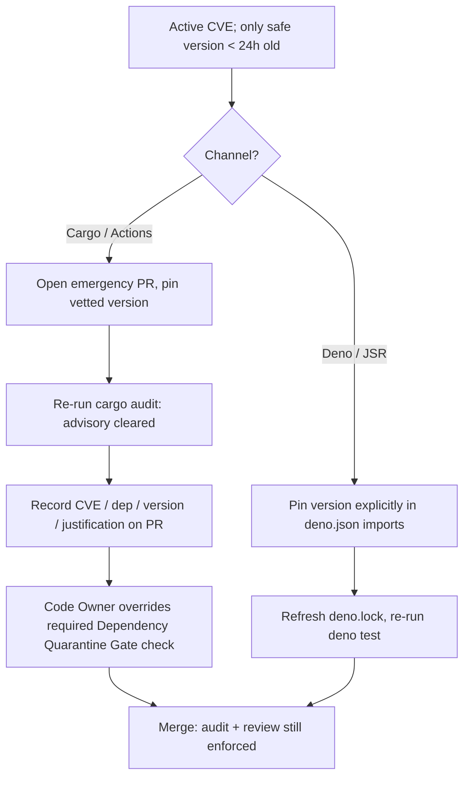

## Summary

`SCR-QUARANTINE-OVERRIDE` posture finding (`severity:low`): the repository
enforces a deliberate 24-hour dependency-age quarantine across its
external-dependency channels but documented **no emergency override** for the
case where the only known-safe version of an actively-exploited dependency is
itself younger than that window. Under incident pressure a responder was left
either waiting out the quarantine while exposed, or improvising an undocumented
bypass — exactly the ad-hoc change the posture is meant to avoid.

This PR adds an **"Overriding the quarantine window"** subsection to
`SECURITY.md`, under the existing *Emergency dependency-bump procedure*, that
documents a single concrete, reviewable path per channel:

- **Cargo / GitHub Actions** — a **Code-Owner** dismisses/overrides the failing
  **Dependency Quarantine Gate** required check on the single emergency PR,
  after re-running `cargo audit` and recording the advisory ID, dependency,
  version, and justification. The gate stays deliberately fail-closed with no
  `emergency_bypass` input — the override is per-PR, logged, and Code-Owner
  gated, not a new control.
- **Deno (JSR / `@std`)** — pin the patched version explicitly in the
  `deno.json` `imports` map (an explicit pin is honoured even when younger than
  `minimumDependencyAge`), refresh `deno.lock`, and re-run the Deno tests.

No production gate behaviour changed — the gate workflow, `helpers/`, and
`deno.json` are untouched. This is the *missing override path* only, not a
change to the 24h window itself.

Closes #197.

## Evidence

This is a documentation + test change with no web interface to screenshot.
Verification is by the Deno test suite below.

The new tests assert *derivable relationships* (per the Issue #81
anti-brittleness lesson) rather than brittle prose greps: the override steer
must reference the same `VIBE_BUMP_QUARANTINE_HOURS` window configured in the
gate workflow and the same `minimumDependencyAge.age` token configured in
`deno.json`, so the runbook cannot silently drift from the controls it
describes.



Test run:

```text
deno test --allow-read tests/security_md_quarantine_override_test.ts
SECURITY.md documents overriding the quarantine window ... ok
quarantine override references the configured Cargo/Action window ... ok
quarantine override addresses the Deno minimumDependencyAge channel ... ok
ok | 3 passed | 0 failed

deno test --allow-read tests/*.ts
ok | 307 passed (55 steps) | 0 failed
```

`deno fmt`, `deno lint`, `deno check`, and `markdownlint-cli2` all pass clean.

## Test Plan

Added `tests/security_md_quarantine_override_test.ts`:

- `SECURITY.md documents overriding the quarantine window` — asserts the
  "Overriding the quarantine window" subsection exists under the emergency
  dependency-bump procedure.
- `quarantine override references the configured Cargo/Action window` — parses
  `VIBE_BUMP_QUARANTINE_HOURS` from `.github/workflows/bump-quarantine-gate.yml`
  and asserts the override subsection references that window value.
- `quarantine override addresses the Deno minimumDependencyAge channel` —
  parses `minimumDependencyAge.age` from `deno.json` and asserts the subsection
  names the `minimumDependencyAge` control and references the configured age
  token.

These fail against the pre-change `SECURITY.md` (no subsection) and pass after
the documentation is added.
