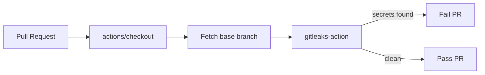

## Summary

Added the **Gitleaks Secrets Detection** GitHub Actions workflow at
`.github/workflows/gitleaks.yml`. The workflow runs on every pull
request, scans the PR diff for accidentally committed secrets, and
fails the build if any are found. Third-party actions are pinned to
40-character commit SHAs to guard against hijacked tags.

Also repaired a malformed line in `.gitignore` (`!.github!.gitattributes`)
that prevented any new file inside `.github/` from being added. The
replacement (`!.github/` plus `!.github/**`) restores the intent of the
original `!`-rules so workflow YAML files can be tracked.

Closes #20.

## Evidence

This is a CI/workflow-only change — no UI or runtime behaviour is
affected, so there is no screenshot. Verification performed:

- `python3 -c "import yaml; yaml.safe_load(open('.github/workflows/gitleaks.yml'))"`
  confirms the YAML is syntactically valid.
- `git check-ignore -v .github/workflows/gitleaks.yml` returns exit 0
  before the `.gitignore` fix (file ignored) and exit 1 after, proving
  the negation now works.

## Test Plan

- [x] `.github/workflows/gitleaks.yml` parses as valid YAML.
- [x] Both `actions/checkout` and `gitleaks/gitleaks-action` are pinned
      to 40-character commit SHAs (no floating tags).
- [x] `permissions:` is scoped to `contents: read` only.
- [x] `.gitignore` no longer blocks new files inside `.github/`.
- [ ] On the first PR after merge, the `Gitleaks` check appears in the
      PR's status list. Requires the `GITLEAKS_LICENSE` secret to be
      configured at repo or org level for a full scan.
