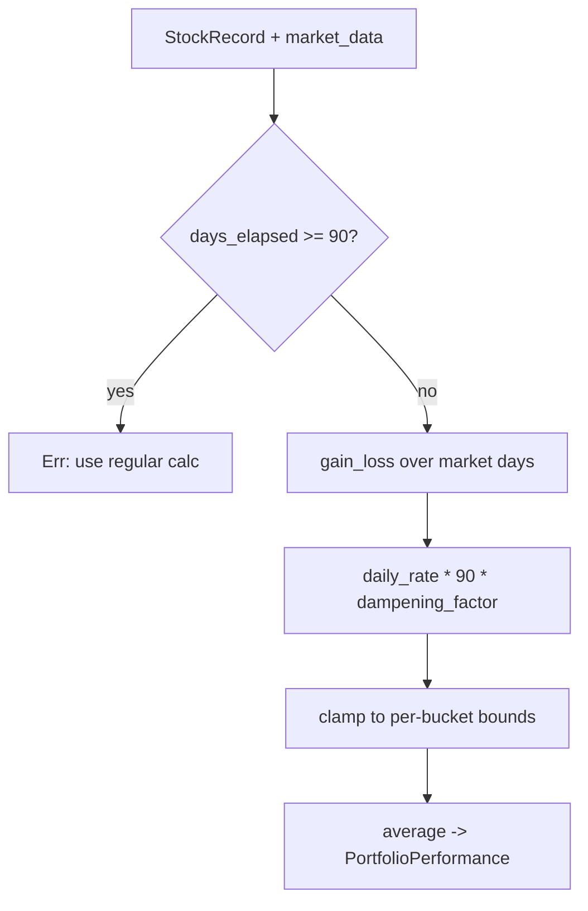

## Summary

Added WHAT-tests for the previously untested public function
`calculate_hybrid_projection` (`src/utils.rs`). This is a load-bearing
projection routine — it produces the headline projected-90-day-performance
figure for scores under 90 days old — yet no Rust test referenced it, so a
refactor of its dampening factors, slope maths, or clamping bounds could
silently change every projection with no test failure. The new tests pin the
function's observable behaviour against controlled, spec-derived inputs.

No production logic changed — this is a coverage-gap fix only. Closes #200.

## Evidence

This is a backend/CLI change with no web interface, so no screenshot applies.
Verification is via the new unit tests and the full quality gate.

All six new tests pass and `./quality.sh` completes cleanly (cargo
fmt/clippy/check/test/tarpaulin + Deno tests/lint/check: `307 passed | 0
failed`):

```
running 6 tests
test utils::tests::test_calculate_hybrid_projection_no_market_data_yields_zero ... ok
test utils::tests::test_calculate_hybrid_projection_rejects_old_score ... ok
test utils::tests::test_calculate_hybrid_projection_clamps_to_upper_bound ... ok
test utils::tests::test_calculate_hybrid_projection_clamps_to_lower_bound ... ok
test utils::tests::test_calculate_hybrid_projection_dampens_moderate_trend ... ok
test utils::tests::test_calculate_hybrid_projection_uses_next_trading_day_buy_price ... ok
```

Each expected value is derived by hand from the documented formula
(`daily_rate * 90 * dampening_factor`, then clamped to the per-bucket bounds),
not copied from current output. A deliberately fake ticker is used so no
dividend file exists, keeping `dividends_total` at `0.0` and the total return
equal to the projected 90-day figure. Dates are built relative to "today" so
each score stays within the function's under-90-days window.



## Test Plan

Added to the inline `#[cfg(test)]` module in `src/utils.rs`:

- `test_calculate_hybrid_projection_dampens_moderate_trend` — 10% gain over 40
  market days dampens to the spec value 11.25% and annualises to ~53.18%
  (quarterly compounding).
- `test_calculate_hybrid_projection_uses_next_trading_day_buy_price` — weak-fit
  fallback: no price on the score date, so the buy price uses the next trading
  day (50.0) and the projection is 18%.
- `test_calculate_hybrid_projection_clamps_to_upper_bound` — a steep doubling
  clamps to the 7–14-day upper bound of +20%.
- `test_calculate_hybrid_projection_clamps_to_lower_bound` — a steep crash
  clamps to the 7–14-day lower bound of -10%.
- `test_calculate_hybrid_projection_rejects_old_score` — a 100-day-old score is
  rejected with an error.
- `test_calculate_hybrid_projection_no_market_data_yields_zero` — no market data
  yields a zero projection with `total_stocks = 1` and no per-stock entries.

No existing tests were modified or removed.
