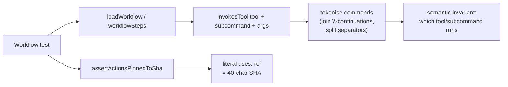

# Replace source-text command greps in workflow tests with structured assertions

## Summary

The GitHub Actions workflow tests asserted behaviour by regex-matching the
command **text** inside `.github/workflows/*.yml` — e.g.
`/\bdeno\s+fmt\s+--check\b/` against a joined blob of every step's `run`
script. That is the grep-as-assertion anti-pattern (a HOW-test): a
behaviour-preserving edit — reordering flags, splitting a step, continuing a
line with `\`, or appending a flag like `--minimum-dependency-age` — breaks the
test even though CI does exactly the same thing.

This PR introduces a shared helper module, `tests/workflow_assertions.ts`, and
rewrites the command greps to assert the **parsed, structured invariant**
instead: load the YAML once, look at steps as data, and decide whether a step
*invokes a tool/subcommand* by tokenising the command rather than matching its
exact spelling. The duplicated SHA-pinning check — repeated verbatim across nine
test files — is deduplicated into a single `assertActionsPinnedToSha` helper, so
the supply-chain guard now lands in one place.

SHA pinning is the one genuine source-text invariant (the literal `uses:` ref is
what runs), so it is kept as a parsed-line check; everything else moves to
token-level matching that tolerates the behaviour-preserving changes the issue
calls out.

Closes #202.

## Evidence

Backend/test-only change — no UI. Verified by the Deno test suite (337 tests
pass) and the new unit tests for the helper, which prove the matcher tolerates
flag reordering, line continuation, extra flags, and `npx` prefixes while still
failing when a tool is genuinely absent.



Before — couples to exact source text (breaks on flag reorder / line split):

```ts
const runs = job.steps.map((s) => s.run ?? "").join("\n");
assert(/\bdeno\s+fmt\s+--check\b/.test(runs), "job must run `deno fmt --check`");
```

After — asserts the parsed invariant (tolerates behaviour-preserving edits):

```ts
assert(
  invokesTool(job.steps, "deno", { subcommand: "fmt", args: ["--check"] }),
  "job must run `deno fmt --check`",
);
```

## Test Plan

- **New** `tests/workflow_assertions.ts` — shared helpers: `loadWorkflow`,
  `workflowTriggers`, `workflowSteps`, `commandSegments`, `invokesTool`,
  `stepIndexInvoking`, `stepIndexUsing`, `assertActionsPinnedToSha`.
- **New** `tests/workflow_assertions_test.ts` — 18 unit tests exercising the
  helpers with synthetic inputs: happy paths, flag reordering, `name=value`
  flags, line continuation, `npx`-prefixed tools, absent tool / subcommand
  mismatch / missing arg, per-step isolation, and the SHA-pin pass/throw cases.
- **Rewritten** command-grep assertions to `invokesTool` in
  `deno_quality_workflow_test.ts`, `cargo_audit_workflow_test.ts`,
  `deno_outdated_workflow_test.ts`, `semgrep_workflow_test.ts`,
  `bump_quarantine_gate_workflow_test.ts`, `a11y_workflow_test.ts`, and
  `sbom_workflow_test.ts` (the SBOM ordering test now uses parsed step indices
  via `stepIndexInvoking`/`stepIndexUsing`).
- The `bump_quarantine_gate` test now also asserts the referenced gate script
  exists on disk (a derived relationship) rather than grepping the run text.
- **Deduplicated** the SHA-pin check to `assertActionsPinnedToSha` across all
  nine workflow test files (`ci`, `markdown_lint`, `dependency_review`, plus the
  seven above).
- No existing tests were removed or commented out; all assertions retain their
  original intent. Full suite: `deno test --allow-read tests/*.ts` → 337 passed.

### Deno regression avoided

This is a Deno repo; all new code uses Deno-native APIs (`Deno.readTextFile`,
`@std/yaml`, `@std/assert`) and `deno test` — no Node tooling introduced.
