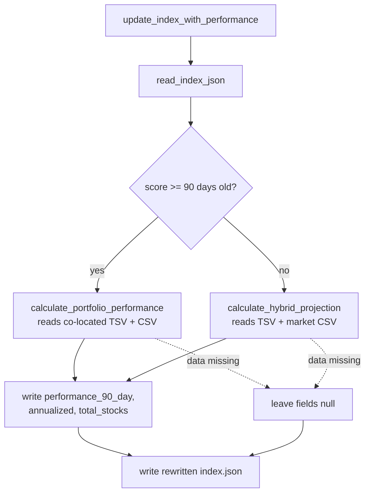

## Summary

Closes #203.

The public function `update_index_with_performance` (`src/utils.rs:1155`) is
the write path that persists every performance and projection figure into
`docs/scores/index.json`, yet no test referenced it — a coverage gap
(anti-pattern 7). A refactor that mis-mapped an entry, dropped a field, or
mis-handled a still-open (null 90-day) score could silently corrupt the
published index while the suite stayed green.

This PR adds a behaviour ("WHAT") test that runs the real function against a
temporary `docs` fixture and asserts on the **persisted output** (the rewritten
index JSON), never on internals — so it keeps working when the orchestration is
refactored. No production code was changed; the function already behaves
correctly, it simply had no safety net.

Expected values are derived from the spec:

- A **settled** entry (`2025-01-15`, well over 90 days old) takes the regular
  performance branch. Its single stock buys at `100.0` on the score date and
  closes at `110.0` on the exact 90-day end date (`2025-04-15`) — a clean 10%
  price gain, no dividends for the synthetic ticker — so the persisted
  `performance_90_day` is `10.0`, `total_stocks` is `1`, and the annualised
  figure compounds above the 90-day return.
- A **still-open** entry (dated 10 days ago, so always under 90 days) takes the
  hybrid-projection branch. Its source files are deliberately absent, so no
  projection can be computed and the persisted `performance_90_day` must remain
  `null` rather than fabricating a figure.



## Evidence

Backend/CLI change with no web interface to screenshot. Verified via the new
Rust integration test and the full quality gate.

```
running 1 test
test update_index_with_performance_writes_settled_and_open_entries ... ok

test result: ok. 1 passed; 0 failed; 0 ignored; 0 measured; 0 filtered out
```

`./quality.sh` passes cleanly (cargo fmt/clippy/check/test + tarpaulin coverage
+ release build + Deno test/lint/check: `337 passed | 0 failed`).

## Test Plan

- Added `tests/update_index_with_performance_test.rs::update_index_with_performance_writes_settled_and_open_entries`,
  which:
  - builds a temp `docs/scores` fixture (index JSON + score TSV + long-format
    market CSV);
  - calls the real `update_index_with_performance`;
  - re-reads the rewritten `index.json` via `read_index_json` and locates
    entries by `file` (not position);
  - asserts the settled entry persists `performance_90_day == 10.0`,
    `total_stocks == Some(1)`, and an annualised return greater than the 90-day
    return;
  - asserts the still-open entry keeps `performance_90_day` and
    `performance_annualized` as `null`.
- No existing tests were modified or removed.
