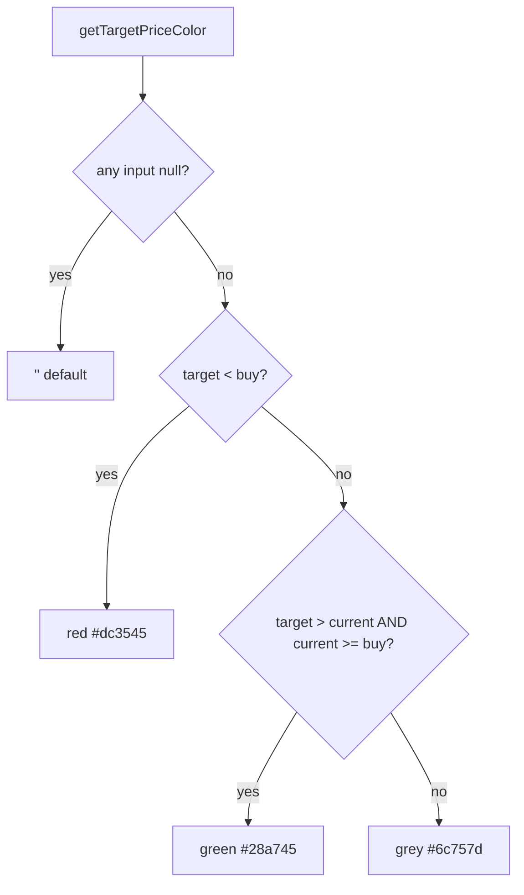

# Test the fair-value band & target-price colour rules (Issue #204)

## Summary

`getFairValueRange` and `getTargetPriceColor` were pure-logic branch trees
living inside the `GRQValidator` class in `docs/app.js`, with **no test
references anywhere** — `docs/**` is excluded from the Deno test config and the
functions could not be imported because `app.js` instantiates the validator and
touches the DOM at module load.

Rather than copy the logic into a test (a "tautology" the existing
`docs/projection.js` header explicitly warns against), this PR follows the
established kernel-extraction pattern used for `formatCurrency`, `getBuyPrice`
etc.:

- Extracted both functions as pure helpers into `docs/projection.js` and
  published them on `globalThis.GRQProjection`.
- `GRQValidator.getFairValueRange` / `getTargetPriceColor` now **delegate** to
  the shared kernels, so the browser dashboard and the Deno tests exercise the
  exact same code. Behaviour is unchanged.
- Added `tests/fair_value_color_test.ts` with WHAT-tests covering every branch.

Expected values were derived from the documented display spec, **not** the
current output (the issue's example sketch values were intentionally
illustrative — e.g. `getTargetPriceColor(50, 60, 55)` is actually red because
`50 < 55`, not green).

Closes #204.

## Display rules under test



## Evidence

Pure-logic / non-UI change (the functions return data and CSS strings; no
visual rendering changed). Verified via the new unit tests:

```
running 12 tests from ./tests/fair_value_color_test.ts
ok | 12 passed | 0 failed
```

Full Deno suite remains green: `ok | 319 passed | 0 failed`. The
`js_syntax_test.ts` guard confirms `docs/app.js` still parses cleanly after the
delegation refactor.

## Test Plan

`tests/fair_value_color_test.ts` — imports `../docs/projection.js` and asserts
on the real kernels:

- `getFairValueRange`: both values → sorted `range`; sort holds regardless of
  input order; only MS → single `MS Fair Value`; only Tips → single
  `Tips Target`; neither → `null`; missing/`undefined`/`null` analysis → `null`.
- `getTargetPriceColor`: any null input → `''`; target below buy → red; target
  above current while in profit → green; target at/below current → grey (incl.
  `target == current` boundary); target above buy but in loss → grey;
  `target == buy` boundary → grey (not red).
