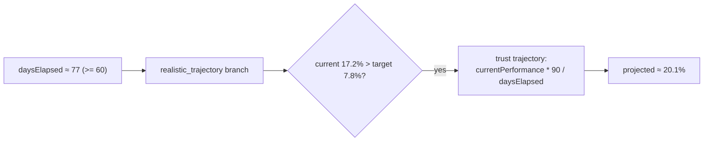

## Summary

`tests/schw_projection_test.ts` asserted the 90-day projection against two
undocumented magic lower bounds — `projected90DayPerformance > 17` (line 305)
and `> 19` (line 311). The first was strictly redundant with the second, and
both read as empirical numbers copied from a run against the frozen SCHW
fixture rather than a spec-derived expectation (magic-value anti-pattern).

Replaced both with a single documented `assertAlmostEquals` whose expected
value is computed from the documented projection formula over the fixture.
The SCHW snapshot spans ~77 days, so `computeHybridProjection` takes the
long-term (`daysElapsed >= 60`) `realistic_trajectory` branch; with a known
target and the stock already trading above it (current ~17.2% > target ~7.8%),
the kernel trusts the realised trajectory and extrapolates the current daily
rate to the full 90-day horizon:

```
projected = currentPerformance * 90 / daysElapsed   ≈ 20.1%
```

A comment in the test shows this derivation. The assertion now also confirms
the `realistic_trajectory` branch is taken, so if the projection maths is
retuned the test fails with a meaningful expected-vs-actual diff instead of a
stale threshold.

Closes #205.

## Evidence

Backend/test-only change — no web interface to screenshot.

Derivation of the expected figure, confirmed against the committed fixture:



Test run after the change:

```
running 1 test from ./tests/schw_projection_test.ts
NYSE:SCHW Projection Test - Using Real App Functions ...
  should calculate correct current performance ... ok
  should calculate correct 90-day projection ... ok
  should have strong trend line fit ... ok
ok | 1 passed (3 steps) | 0 failed
```

`./quality.sh` passes cleanly.

## Test Plan

- Modified `tests/schw_projection_test.ts` —
  `NYSE:SCHW Projection Test › should calculate correct 90-day projection`:
  removed the redundant `> 17`/`> 19` magic bounds and added an
  `assertAlmostEquals` against the spec-derived expectation plus a
  `projectionMethod === "realistic_trajectory"` branch check.
- Verified the step still passes against the frozen fixture via
  `deno test --allow-read tests/schw_projection_test.ts`.
- Ran the full `./quality.sh` gate; all Rust and Deno checks pass.
