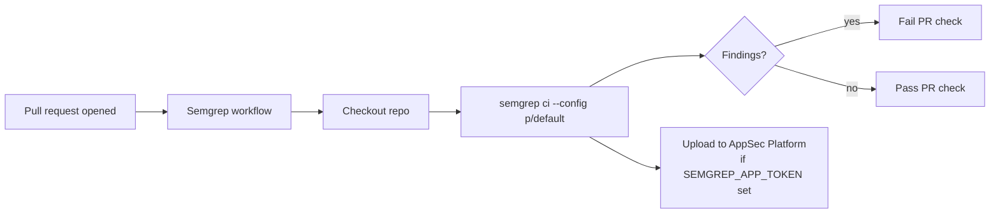

## Summary

Added the Semgrep SAST Scanning GitHub Actions workflow at
`.github/workflows/semgrep.yml`. The workflow runs `semgrep ci --config
p/default` inside the official `semgrep/semgrep` container on every
pull request, surfacing static-analysis findings before merge. Closes
#21.

Supply-chain hardening per the repo's existing pattern (gitleaks,
cargo-audit): `actions/checkout` is pinned to a 40-character commit
SHA rather than a floating tag. `SEMGREP_APP_TOKEN` is passed through
from repo/org secrets so findings can also be uploaded to Semgrep
AppSec Platform when configured; when the secret is absent the scan
still runs locally and fails the build on findings.

## Evidence

Backend/CI-only change — no UI to screenshot. Evidence is the new
test suite plus the workflow file itself.

## Test Plan

- Added `tests/semgrep_workflow_test.ts` with six TDD tests that
  verify the new workflow file:
  - exists at `.github/workflows/semgrep.yml`;
  - parses as valid YAML with `name: Semgrep`;
  - triggers on `pull_request`;
  - declares top-level read-only `contents` permission;
  - defines a `semgrep` job that runs in the `semgrep/semgrep`
    container and invokes `semgrep ci`;
  - pins every `uses:` reference to a 40-character commit SHA.
- All 6 new tests pass under `deno test --allow-read
  tests/semgrep_workflow_test.ts`.
- The 2 pre-existing failures (`schw_projection_test`,
  `markdown_lint_workflow_test`) are unrelated to this change and were
  confirmed present on `main` before this branch.
