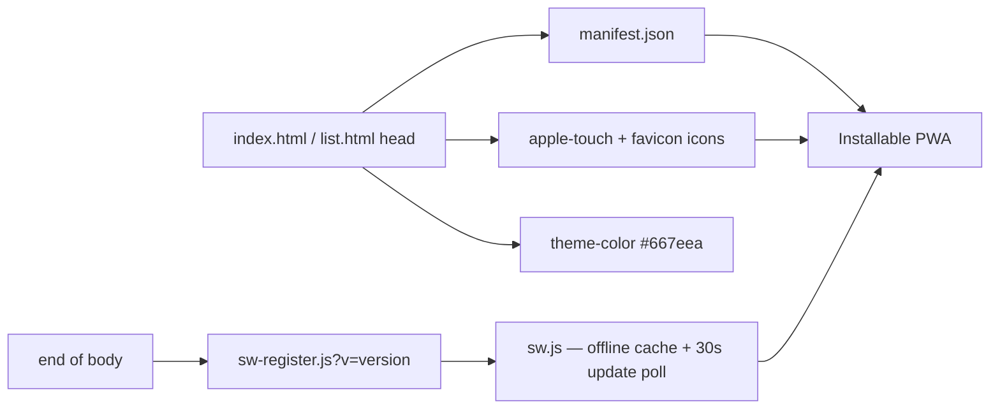

# PWA: wire index.html and list.html `<head>` for installability

## Summary

Wires both dashboard pages into an installable PWA, mirroring
`stSoftwareAU/GRQ-FX-validation`. Applied identically to `docs/index.html`
and `docs/list.html` (PWA scope covers the whole site). The icons, manifest
(`manifest.json`), `browserconfig.xml` and service worker (`sw.js` +
`sw-register.js`) already existed from the sibling sub-issues of #218 — this is
the integration step that ties them together. Closes #224.

Changes per page:

- **PWA meta tags** — `application-name`, `apple-mobile-web-app-capable`,
  `apple-mobile-web-app-status-bar-style`, `apple-mobile-web-app-title`,
  `apple-touch-fullscreen`, `mobile-web-app-capable`, `format-detection`,
  `msapplication-config`, `msapplication-TileColor`, `msapplication-tap-highlight`
  and `theme-color=#667eea`. (`viewport` was already present.)
- **Apple touch icons** — `apple-touch-icon` links for 152, 167 and 180.
- **Favicons** — kept `logo.png`, added 32×32 and 16×16 icon links.
- **Manifest** — `<link rel="manifest" href="manifest.json">`.
- **Service-worker registration** — `sw-register.js` loaded before `</body>`,
  with a `?v=` query aligned to each page's `app-version` meta (index `1.0.186`,
  list `1.0.159`).

### No-cache meta reconciled (decision)

`docs/index.html` and `docs/list.html` previously shipped
`Cache-Control: no-cache, no-store, must-revalidate` + `Pragma: no-cache` +
`Expires: 0`. With a service worker now providing offline caching, a 30s
`registration.update()` poll and force-reload-on-activate, a hard "never store"
meta both defeats offline support and silently contradicts the cache. **These
three meta tags were removed** — the SW update mechanism now owns freshness,
matching FX (which never shipped them). A comment in each `<head>` records the
rationale so the contradiction cannot silently reappear.

### CSP unchanged

No CSP change was required: `sw-register.js`/`sw.js`, the manifest and the
icons are all same-origin (`script-src 'self'` / `default-src 'self'`) or
`data:`. The existing `Content-Security-Policy` meta is left intact, so
`tests/csp_test.ts` keeps passing.

## Evidence

Both pages render correctly with the PWA wiring in place (headless Chrome
against a local static server):

## Test Plan

- Added `tests/pwa_meta_test.ts` (Deno). For **both** pages it asserts:
  `theme-color` is `#667eea`; every required PWA meta tag is present with the
  expected value; `<link rel="manifest" href="manifest.json">` exists;
  apple-touch-icon links for 152/167/180 exist; `logo.png` plus 16×16 and 32×32
  favicons exist; `sw-register.js` is loaded. It reuses `extractCsp`/`parseCsp`
  from `tests/csp_test.ts` to assert the CSP meta is still present and unchanged
  in shape (no new origins introduced).
- Existing `tests/csp_test.ts` continues to pass (CSP untouched).
- `./quality.sh` passes cleanly.
