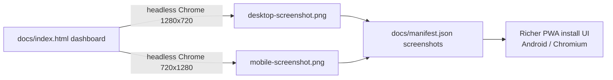

## Summary

Captured the desktop and mobile dashboard screenshots that the PWA manifest's
`screenshots` array references, enabling the richer install UI on
Android/Chromium. Part of #218 (make the GRQ Validation dashboard an
installable PWA), mirroring `stSoftwareAU/GRQ-FX-validation`. Closes #225.

- **Desktop** — `docs/screenshots/desktop-screenshot.png`, 1280×720,
  `form_factor: "wide"`.
- **Mobile** — `docs/screenshots/mobile-screenshot.png`, 720×1280,
  `form_factor: "narrow"`.

Both were captured from the live `docs/index.html` dashboard (served as
GitHub Pages serves it) using headless Chrome at the exact viewport sizes,
so the PNG pixel dimensions match the `sizes` already declared in
`docs/manifest.json`. No manifest change was needed — the manifest sub-issue
(#222) already declared these paths/sizes; this issue supplies the image files.

## Evidence

Desktop (1280×720, wide):

Mobile (720×1280, narrow):

Both files are committed as valid PNGs with the declared dimensions; the new
test reads each IHDR chunk and asserts the width/height match the manifest.

## Test Plan

Added `tests/pwa_screenshots_test.ts` (no external dependencies, mirrors the
existing `tests/pwa_icons_test.ts` approach):

- `pwa screenshots - every manifest screenshot exists` — each manifest
  `screenshots[].src` resolves to a non-empty file under `docs/`.
- `pwa screenshots - each file has the PNG magic bytes` — files begin with the
  8-byte PNG signature.
- `pwa screenshots - pixel dimensions match the manifest sizes` — IHDR
  width/height match the `sizes` string for each entry.
- `pwa screenshots - wide and narrow form factors are present and sized` —
  the wide capture is 1280×720 landscape and the narrow capture is 720×1280
  portrait.

All 389 Deno tests pass (`deno test --allow-read tests/*.ts`), including the
4 new ones. `deno fmt`, `deno lint`, and `deno check` are clean.
