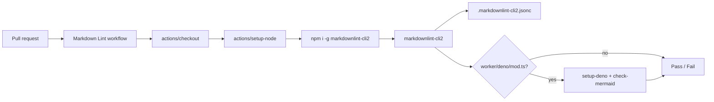

## Summary

Added a Markdown Lint GitHub Actions workflow that runs `markdownlint-cli2`
on every pull request and on pushes to `main`/`master`. The workflow is paired
with a project-level `.markdownlint-cli2.jsonc` configuration tuned to flag
genuinely broken markdown without churning on the stylistic choices already
present in the repository's existing documents. Closes #23.

## Evidence

This is a CI-only change with no user interface. Verification was performed by:

- Running `markdownlint-cli2` locally against the current tree — exits `0`
  with `Summary: 0 error(s)` after the config tuning.
- Running the new Deno test suite (`tests/markdown_lint_workflow_test.ts`)
  — 8/8 passing, including a real invocation of the `markdownlint-cli2`
  binary against the repository's markdown files.
- The third-party actions referenced by the workflow are pinned to 40-character
  commit SHAs (`actions/checkout@v4`, `actions/setup-node@v4`,
  `denoland/setup-deno@v2`) in line with the project's supply-chain guidance.

## Test Plan

- New: `tests/markdown_lint_workflow_test.ts` — asserts the workflow file
  exists, parses as YAML, declares the expected triggers, defines the
  `markdownlint` job on `ubuntu-latest`, installs and runs
  `markdownlint-cli2`, pins every `uses:` action to a 40-character commit
  SHA, ships a valid JSONC config, and that `markdownlint-cli2` exits `0`
  against the repository's existing markdown files.
- Run with `deno test --allow-read --allow-run tests/markdown_lint_workflow_test.ts`.
- The repository-lint assertion gracefully skips when `markdownlint-cli2`
  is not installed on the local machine, so it stays useful in CI without
  blocking developers without the global npm package.

## Notes

- `.markdownlint-cli2.jsonc` is added to the `.gitignore` re-allow list so
  the hidden config file is tracked (it is on the project's allowlist of
  permitted hidden files).
- `deno.json` gains JSR `@std/yaml` and `@std/jsonc` imports used by the
  new test, avoiding the `no-import-prefix` Deno lint rule.
