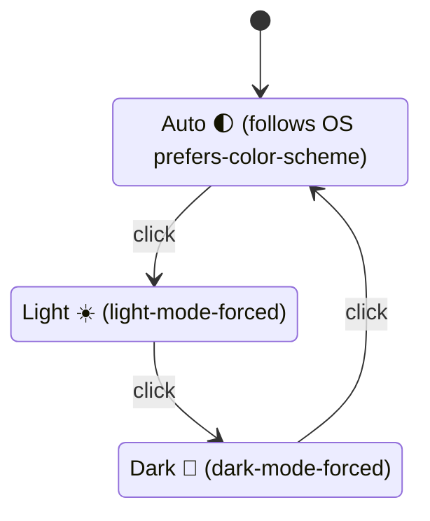

# Add a theme selector to the dashboard (Issue #233)

## Summary

The dashboard had no theme selector, so users could not switch between light
and dark appearances — the reported "I don't see the theme selector". This PR
adds an **Auto / Light / Dark** toggle to the header of both the main dashboard
(`docs/index.html`) and the score-files list (`docs/list.html`), mirroring the
GRQ FX Validation dashboard.

The toggle cycles **Auto → Light → Dark → Auto**, remembers the choice in
`localStorage`, and in **Auto** mode follows the operating system via
`prefers-color-scheme`. The logic lives in a new CSP-safe external module
(`docs/theme.js`) that publishes pure helpers on `globalThis.GRQTheme` and
guards all DOM access, so it is unit-testable under Deno.

Per the issue's reminder that bumping the version is mandatory to ship, the app
version was bumped **1.0.186 → 1.0.187** (main dashboard / service worker) and
**1.0.159 → 1.0.160** (list page), and `theme.js` was added to the service
worker's precached app shell.

Closes #233.

## How it works

- `theme.js` applies `light-mode-forced` / `dark-mode-forced` to `<body>`
  (or no class for Auto). The dark palette in `styles.css` / `list.css` keys
  off those classes, and an `@media (prefers-color-scheme: dark)` block guarded
  by `:not(.light-mode-forced):not(.dark-mode-forced)` covers Auto mode without
  overriding an explicit Light choice.
- The choice survives reloads via `localStorage`; storage failures (privacy
  mode) degrade gracefully to in-memory state.

## Evidence

Captured with headless Chrome against the live dashboard.

Light/Auto — the toggle (🌓) is now visible in the header:

Dark — after toggling to dark mode (🌙):

## Test Plan

- Added `tests/theme_test.ts` — behavioural tests for the real shipped helpers
  in `docs/theme.js`: preference normalisation (incl. junk/empty/null/wrong
  type falling back to `auto`), the Auto→Light→Dark→Auto cycle, the button
  icon/title per state, and the `<body>` / toggle state classes.
- Extended `tests/js_syntax_test.ts` to assert `docs/theme.js` parses cleanly.
- Full Deno suite passes: `deno test --allow-read tests/*.ts` → 399 tests pass.
- `deno fmt --check`, `deno lint`, and `deno check` all clean.

## Deno regression avoided

Drove the screenshot capture with the Deno-native `@astral/astral` headless
browser rather than introducing Node/Playwright tooling into this Deno repo.
