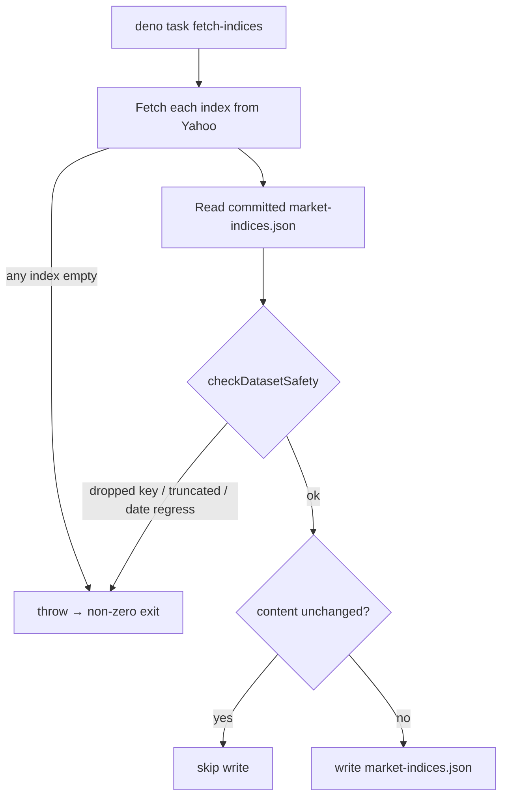

# Make `fetch_market_indices.ts` safe for daily unattended runs

## Summary

The benchmark-index fetcher `scripts/fetch_market_indices.ts` had no stable
invocation entry point and overwrote `docs/market-indices.json` unconditionally,
so a partial or failed Yahoo Finance response could clobber good committed
history. This change makes the in-repo fetcher production-ready for the daily
scorer job and refreshes the committed data to clear the index-line lag on the
dashboard. Closes #237.

Changes:

- **Stable entry point** — added a `tasks` block to `deno.json` with
  `fetch-indices`, wrapping the raw `deno run` invocation so callers don't
  hard-code permission flags.
- **Safe write for unattended runs** — `main()` now reads the committed file
  before writing and:
  - keeps the existing fail-fast behaviour (throw → non-zero exit) when any
    index returns no usable closes;
  - refuses to write (non-zero exit) when the fresh dataset would **drop an
    index key**, **empty an index**, **truncate an index's history**, or let an
    index's **newest date regress** (`checkDatasetSafety`);
  - skips the write entirely when the freshly-fetched payload is byte-for-byte
    identical to the committed file (no empty daily commits).
- **Refreshed data** — ran `deno task fetch-indices`; the committed
  `docs/market-indices.json` newest date moved from **2026-06-11 to 2026-06-18**
  (the last trading day Yahoo serves), clearing the ~8-day lag.

The fetcher gained `--allow-read` (it now reads the committed file before
writing); the `deno task` and the script shebang were updated accordingly.
Serving remains from the committed same-origin file — no in-browser CORS-proxy
fetching is reintroduced (security fix #93).

## Flow

## Evidence

Backend/CLI change — no web UI to screenshot. Verified via:

- `deno task fetch-indices` refreshed the file and logged
  `Wrote docs/market-indices.json`; a second run logged
  `docs/market-indices.json already up to date; skipping write.` (unchanged-skip
  path).
- Committed newest dates: `sp500`, `nasdaq`, `russell2000` all reach
  `2026-06-18` (618 trading days), up from `2026-06-11` (613 days).
- `deno test --allow-read tests/*.ts` → **409 passed, 0 failed**.
- `deno fmt`, `deno lint`, `deno check`, and `markdownlint-cli2` all clean.

## Test Plan

Added unit tests in `tests/market_indices_test.ts` for the new pure helpers
(no network required):

- `checkDatasetSafety - no committed file accepts any fresh dataset`
- `checkDatasetSafety - equal dataset is safe`
- `checkDatasetSafety - extended history (more days) is safe`
- `checkDatasetSafety - dropping an index key is refused`
- `checkDatasetSafety - an emptied index is refused`
- `checkDatasetSafety - truncated history is refused`
- `checkDatasetSafety - a regressed newest date is refused`
- `newestDate - returns the lexically greatest ISO date`
- `serialiseDataset - 2-space indent with a trailing newline`
- `serialiseDataset round-trips through JSON.parse`

The pre-existing tests (kernel + committed-file shape) continue to pass
unchanged.
