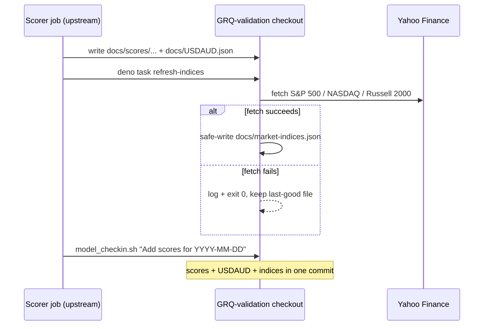

# PR Summary — Fetch & commit docs/market-indices.json from the daily scorer job (#238)

## Summary

The benchmark index lines on the dashboard lagged the actuals by several days
because the external daily **scorer** job (the upstream scorer job
— commits authored by `scorer 3`, messages like `Add scores for 2026-06-20`)
committed new `docs/scores/...` and `docs/USDAUD.json` but never refreshed
`docs/market-indices.json`. This change makes the indices refresh in **lockstep**
with the scores, on the same daily cadence and in the **same commit**, while
keeping the committed same-origin file from #93 (no return to in-browser
CORS-proxy fetching). `Closes #238.`

It has two parts:

1. **This repo (the stable entry point).** A new non-blocking wrapper,
   `scripts/refresh_market_indices.ts`, runs the first-party fetcher and, by
   contract, **never blocks the scores/USDAUD commit**. A Yahoo Finance outage
   or partial fetch is logged and swallowed (the process still exits 0), and the
   safe-write guard in `scripts/fetch_market_indices.ts` (#237) leaves the
   committed file at its last-good content rather than a stale/partial payload.
   Exposed as `deno task refresh-indices`.

2. **The scorer job (root-cause fix, cross-repo — Issue #2942).** A companion PR
   against the upstream prediction repository invokes `deno task refresh-indices` inside the
   existing GRQ-validation checkout immediately before the daily
   `model_checkin.sh GRQ-validation "Add scores for YYYY-MM-DD"`. Because
   `model_checkin.sh` stages all local changes, the refreshed
   `docs/market-indices.json` lands in the **same** daily commit as the scores
   and `USDAUD.json`.

`scripts/fetch_market_indices.ts` was refactored to export its fetch+safe-write
routine as `refreshMarketIndices()` so the wrapper can call it in-process (no
subprocess), which keeps the wrapper unit-testable under the existing
`deno test --allow-read` quality gate.

## Evidence

This is a backend/CLI change with no web interface to screenshot. It is verified
by unit tests that exercise the real `refreshIndicesGraceful` function with an
injected stub refresh + log capturer (no network, no subprocess), asserting the
non-blocking contract directly.

Data-flow of the daily lockstep refresh:

Acceptance criteria coverage:

- **Indices reach the actuals' newest trading day** — the refresh runs in the
  same job, immediately before the same commit, so the indices keep pace (a
  one-trading-day end-of-day lag is acceptable).
- **Runs every day automatically** — it is part of the daily scorer job, not a
  one-off.
- **Yahoo failure degrades gracefully** — the wrapper exits 0 on failure so the
  scores/USDAUD commit still happens, and the safe-write guard leaves the indices
  file at its last-good content (not corrupted).

## Test Plan

Added `tests/refresh_market_indices_test.ts` covering the wrapper's contract:

- `success path returns 0 and logs success` — happy path.
- `a fetch failure still returns 0 (never blocks the commit)` — failure path;
  asserts exit code 0 and the "leaving docs/market-indices.json unchanged" log.
- `surfaces the underlying failure reason in the log` — safe-write guard reason
  is propagated for diagnostics.
- `tolerates a non-Error rejection` — edge case (non-Error thrown value).

All 413 Deno tests pass (`deno test --allow-read tests/*.ts`), plus `deno fmt`,
`deno lint`, and `deno check`. The existing `tests/market_indices_test.ts`
safe-write guard tests continue to pass against the refactored fetcher.

## Cross-repo change

The companion root-cause fix in the upstream scorer job is raised
as a separate PR in that repo and is **not** auto-merged (Issue #2944); it is a
two-line, non-blocking invocation of the stable entry point added here.
