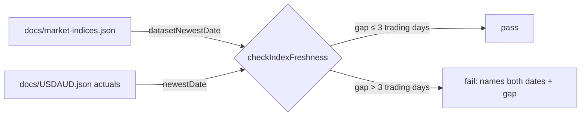

## Summary

Adds an automated **freshness guard** so the benchmark indices can't silently
lag the actuals again (the undetected ~8-day staleness behind #234). A new
assertion in `tests/market_indices_test.ts` compares the newest date in
`docs/market-indices.json` against the newest date in the actuals
(`docs/USDAUD.json`) and fails when the indices lag by more than
`FRESHNESS_TOLERANCE_TRADING_DAYS` (3) trading days. The gap is counted in
**trading days** (weekends skipped), so the acceptable one-trading-day
end-of-day publishing lag — and an intervening public holiday — never raises a
false alarm. When the guard trips it emits an actionable message naming **both**
newest dates and the gap. Closes #239.

Part of milestone #234; sequenced after #237 (data refreshed) and #238 (daily
refresh sustained). The committed data is currently fresh (indices to
`2026-06-18`, actuals to `2026-06-19` → 1 trading-day gap), so the new check
passes today.

New pure, unit-tested helpers in `scripts/fetch_market_indices.ts`:

- `tradingDayGap(from, to)` — trading days (Mon–Fri) elapsed after `from` up to
  and including `to`; non-positive ranges are 0.
- `datasetNewestDate(dataset)` — newest date across every index in the file.
- `checkIndexFreshness(indicesNewest, actualsNewest, tolerance?)` — the guard;
  returns `{ ok, gap, indicesNewest, actualsNewest, reason? }`.
- `FRESHNESS_TOLERANCE_TRADING_DAYS = 3`.

## Evidence

Backend/CLI-only change — no web interface to screenshot. Verified via the Deno
test suite and the full `./quality.sh` gate (all green).

```
deno test --allow-read tests/market_indices_test.ts
ok | 31 passed | 0 failed

deno test --allow-read tests/*.ts
ok | 423 passed (55 steps) | 0 failed
```



## Test Plan

Added to `tests/market_indices_test.ts`:

- `datasetNewestDate - newest date across every index` — max across indices;
  empty dataset and empty series yield `""`.
- `tradingDayGap - identical or backwards dates are zero` — level/ahead/empty.
- `tradingDayGap - one trading day end-of-day lag` — Thu→Fri = 1.
- `tradingDayGap - skips weekends` — Fri→Mon = 1; Fri→Fri = 5.
- `checkIndexFreshness - one-day lag passes within tolerance`.
- `checkIndexFreshness - indices level with the actuals pass`.
- `checkIndexFreshness - a weekend gap does not false-alarm`.
- `checkIndexFreshness - stale indices fail with an actionable message` —
  asserts the message names both dates and the gap (acceptance criterion 1).
- `checkIndexFreshness - tolerance boundary` — 3 trading days passes, 4 fails.
- `committed indices are fresh against the committed actuals` — the real guard
  over the committed data files (acceptance criterion 2: fresh data passes).
