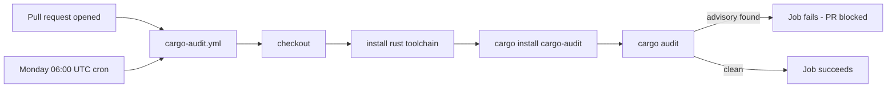

# Add Cargo Security Audit workflow

## Summary

Added a dedicated `.github/workflows/cargo-audit.yml` GitHub Actions
workflow that runs `cargo audit` against the Rust dependency graph on
every pull request and on a weekly schedule (Mondays 06:00 UTC). This
catches newly disclosed RustSec advisories against existing
dependencies even when no PR is open. Closes #24.

The existing `ci.yml` already invokes `cargo audit` inside its larger
test job, but a separate, narrowly-scoped workflow with read-only
`contents` permission is the recommended pattern from the workflow
sync — it runs independently of the heavier CI build and provides a
clear signal on the PR.

## Evidence

This is a CI/workflow change with no UI. Verification:

- New Deno test suite `tests/cargo_audit_workflow_test.ts` parses the
  workflow as YAML and asserts:
  - File exists and `name` is `Cargo Audit`.
  - Triggers include `pull_request` and a `schedule` cron entry.
  - Top-level `permissions.contents` is `read`.
  - The `audit` job is `ubuntu-latest`, installs `cargo-audit`, and
    runs `cargo audit`.
  - Every `uses:` reference is pinned to a 40-character commit SHA
    (supply-chain rule).
- All 6 tests pass:

  ```text
  running 6 tests from ./tests/cargo_audit_workflow_test.ts
  ok | 6 passed | 0 failed
  ```

### Workflow at a glance



## Test Plan

- Added `tests/cargo_audit_workflow_test.ts` with 6 cases covering
  workflow presence, YAML validity, triggers, permissions, audit job
  steps, and SHA pinning.
- `deno test --allow-read tests/cargo_audit_workflow_test.ts` — passes.
- `deno fmt`, `deno lint`, `deno check` — all clean on the new file.
- `bash -n` against every `*.sh` in the repo — clean.

Pre-existing failures in `tests/markdown_lint_workflow_test.ts`
(markdownlint-cli2 not installed in this environment) and
`tests/schw_projection_test.ts` (SCHW projection numerics) are
unrelated to this change.
